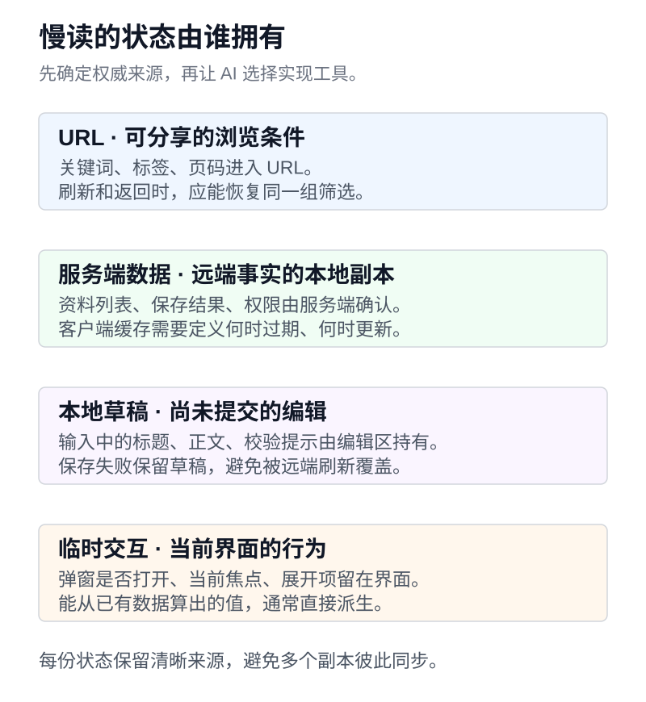

完成第三课后，你会得到一页可验收的原型。准备接入真实后端时，AI 很容易一次生成路由、全局状态、请求库和登录页面。每部分都有代码，仍然要回答几个会影响后续工作的决定。公开文章怎样被访问，用户的收藏放在哪里，编辑到一半的文字会不会被后台刷新覆盖。

这节课的产物是一份简短的架构决定，以及慢读的数据与状态归属表。你需要知道自己的部署条件和 API 能力，可以把已有项目交给 AI 检查。不了解的条件先写成待确认事项，不用先猜一套技术栈。

打开[静态界面基线](/tutorials/backend-to-platform/03-css/index.html)与[示例数据](/tutorials/backend-to-platform/resources.json)，用它们说明产品内容。它们本身不含登录和真实 API。本课提出的是后续应用设计，[模板文件](/tutorials/backend-to-platform/prompts.md)可以用于自己的选型讨论。[源码包](/tutorials/backend-to-platform/source.zip)仍保留无框架基线，方便比较新增复杂度。

本文对照了 React 官方的项目创建和状态设计文档，以及 web.dev 的渲染方式说明。下面围绕同一个资料库作取舍，建议只在写明的条件下成立。

## 先把两类页面分开

慢读可能包含一个公开的产品介绍页，也可能让用户公开分享某份阅读清单。访问者打开这些地址时，希望立刻看到标题、简介和正文，分享链接还需要稳定的页面信息。

登录后的收藏工作台不同。内容因用户而异，搜索、批量操作和编辑发生得更频繁，也没有把私人收藏交给搜索引擎收录的需求。

| 页面任务                   | 需要先确认的条件                   | 本课倾向                                     |
| -------------------------- | ---------------------------------- | -------------------------------------------- |
| 产品介绍、教程、更新日志   | 内容更新频率，是否能在发布时生成   | 预先生成 HTML，按需添加交互                  |
| 公开分享的阅读清单         | 内容新鲜度要求，公开撤回多久生效   | 能接受再生成延迟时预生成，否则评估按请求渲染 |
| 登录后的个人工作台         | 已有 API、首次加载成本、托管能力   | 可以采用客户端渲染，单独解决请求与状态       |
| 高度依赖首次请求数据的页面 | 服务端运行环境、缓存隔离、接口耗时 | 评估服务端渲染及实际首屏收益                 |

先按页面作决定，整个产品不必只用一种渲染方式。SSG 在构建或预生成阶段准备 HTML，SSR 通常在请求到来时由服务端生成 HTML，CSR 让浏览器执行 JavaScript 生成或更新界面。SSR 页面仍然可以加载客户端代码接管交互，预生成页面也可以有搜索和按钮。[web.dev 渲染方式说明](https://web.dev/articles/rendering-on-the-web)

实时性要求同样要写具体。公开资料修改后，允许等下次发布，还是必须立即更新；用户撤回分享后，旧缓存还能存在多久。这些答案决定预生成和缓存是否合适，框架名称不会替你回答。

SSR 也会增加要排查的路径。首屏等待可能来自服务端接口，HTML 到达后还有脚本下载与交互初始化。让 AI 通过实际请求时序比较候选方案，不能仅凭「SSR 更快」作结论。Astro 的按需渲染文档展示了按路由保留预生成或切换服务端执行的做法，同时说明了运行适配器的需要。[Astro 按需渲染](https://docs.astro.build/en/guides/on-demand-rendering/)

## 先比较任务与现有条件

后端开发者常问 React 和 Vue 该选谁。在一篇相关求助里，提问者既希望看到自己后端工作的界面成果，也希望页面漂亮；回复者给出的框架建议差异很大。对慢读，我们把这些偏好还原成可核实的项目条件。[后端开发者的框架选择讨论](https://www.v2ex.com/t/1094241)

| 当前条件                               | 优先验证的方案                     | 接受之前要检查什么                           |
| -------------------------------------- | ---------------------------------- | -------------------------------------------- |
| 已有 Vue 或 React 工程、组件库和维护者 | 沿用现有栈完成一页业务             | 路由、表单和发布流程能否复用                 |
| 后端已经生成 HTML，只需补少量交互      | 局部增强现有页面                   | 是否确实需要客户端路由和整页应用             |
| 新建资料工作台，已有独立 API           | 对比团队可维护的 Vue 或 React 方案 | 表格、表单、状态管理和测试需要新增多少工作   |
| 公开内容多，交互少                     | 预生成页面并按需增强               | 更新时效、分享元信息和交互脚本成本           |
| 产品明确需要 Web、App 或小程序         | 先验证一个关键跨端流程             | 组件能否复用，设备能力与发布流程是否满足需求 |

这是课程的决策顺序。Vue 官方列出了独立脚本、单页应用和服务端渲染等用法，后端已有模板时可以从局部增强开始；React 官方建议新应用从框架开始，同时允许根据约束选择其他创建方式。两份文档都不能替你决定团队能维护哪种方案。[Vue 的使用方式](https://vuejs.org/guide/extras/ways-of-using-vue.html)、[创建 React 应用](https://react.dev/learn/creating-a-react-app)

让 AI 实现一个相同的关键流程，例如展示三条资料、编辑一条标题并处理保存失败。比较代码组织、已有组件复用、依赖变化和部署成本。只有原型、没有真实 API 时，把保存行为标为模拟，不要把两张截图当作正式应用的选型证据。

## 什么时候选择 React 与 Vite

为后续练习先设定一组明确条件。慢读已有独立 HTTP API，本轮只做登录后的工作台，团队愿意使用 React，前端部署在静态托管上。列表搜索和编辑需要较多客户端交互。在这些条件下，React、TypeScript 和 Vite 可以作为一个候选实现。

同时把代价写出来。Vite 提供开发与构建能力，从基础 React 模板开始，路由、数据获取、缓存和错误恢复仍需要选择与整合。React 官方对新应用推荐从框架开始，也保留了因约束或学习目标从构建工具开始的路径。[创建 React 应用](https://react.dev/learn/creating-a-react-app)、[从头创建 React 应用](https://react.dev/learn/build-a-react-app-from-scratch)

如果原项目已经使用成熟的 React 框架，复用它往往比另起 Vite 应用省事。若产品主要发布文章，只有少量交互，也可以继续使用已有静态站点方案。公开内容与复杂工作台结合时，需要比较统一框架和分别部署的维护成本，别只统计第一天生成了多少文件。

部署限制必须进入 prompt。本博客的 GitHub Pages 发布静态文件，本身不运行你的 SSR 服务。选择需要服务端执行的方案，就要同时给出对应运行环境。客户端路由还要检查直接打开深层地址与刷新是否成立，开发服务器的回退行为不能代表最终托管平台。[GitHub Pages 的托管方式](https://docs.github.com/en/pages/getting-started-with-github-pages/what-is-github-pages)

AI 可以调研官方资料、读取项目依赖、做小型验证并推荐方案。你提供真实约束，检查推荐是否把尚未具备的后端或部署能力当作现成条件。得到有依据的建议后再委托实施，省去后面补基础设施的意外工作。

## 让 AI 写一份能被推翻的架构决定

ADR 是 Architecture Decision Record，用来记录一次架构选择及其理由。不需要写成厚文档。对慢读，下面这段提示词足以启动一次具体讨论。

```text
请为慢读的第一版真实应用起草一份简短 ADR，先研究与比较，暂不迁移项目。

已知产品范围
公开介绍页主要是稳定内容，登录后的资料工作台需要搜索、筛选与编辑。
目前已有独立 HTTP API 这一项请先核实；没有相关文件时标记为待确认。
仓库中的 resources.json 只是固定示例，不代表真实接口已经存在。
读取当前 README、依赖、路由、部署配置和有关 API 的材料，列出你的依据。

需要比较的决定
按公开页面与私有工作台分别比较 SSG、SSR、CSR 的适用条件。
至少给出沿用当前栈和一个有理由的替代方案，不为凑数罗列所有框架。
结合团队经验、已有组件、关键交互和托管条件比较，不按框架热度直接下结论。
如果建议 React + Vite，解释路由、数据缓存和部署回退由谁提供。
如果建议 SSR，说明服务端在哪里运行，用户数据怎样隔离，缓存如何失效。

ADR 内容
记录已确认约束、未确认假设、最终建议和不选择其他方案的具体原因。
列出依赖变化、运行成本，以及一种足以让当前决定失效的未来需求。
区分文档支持的事实、你的推断、需要实验的数据，附少量官方来源。
对首屏或性能的比较先设计同条件实验，没有实测就不要给百分比结论。

状态设计
画出 URL 条件、服务端资料、编辑草稿和临时界面状态的归属。
说明刷新、后退、后台重新获取和用户退出时，每类状态如何变化。
给出需要我作出的少量关键决定，以及你建议的默认行为。
最后提出一个最小验证任务，用来检验推荐方案最不确定的部分。
```

读这份 ADR 时，先看它有没有承认未知项。若结论依赖「现有 API 支持分页」，就让 AI 找出契约或请求证据。若说切换框架能把首屏缩短一半，却没有相同数据、设备和网络条件的对照，这个数字不能用于选型。

本课可以选择一个很小的验证任务。让候选方案展示同一份三条资料，直接打开详情 URL，再刷新一次；另测一次模拟 API 失败。先确认部署和数据路径能走通，再扩大界面范围。

## 状态存在哪里，要按寿命和归属决定

后端开发者很熟悉数据记录，但界面里有很多东西不属于那条记录。搜索框刚输入的半个词、尚未提交的标题、弹窗是否展开，都可能只在当前页面存在。

慢读可以从下面这张表开始。它是工作台的设计建议，最终需要和产品行为一起确认。

| 状态                           | 建议归属           | 为什么放在这里                       |
| ------------------------------ | ------------------ | ------------------------------------ |
| 已确认的关键词、状态筛选、页码 | URL                | 可以刷新恢复、前进后退和复制地址     |
| 搜索框正在输入的内容           | 搜索组件           | 尚未提交，不必每个按键都改变历史记录 |
| 服务端返回的资料与总数         | 查询层或框架数据层 | 与查询条件绑定，负责重新获取和失效   |
| 正在编辑的标题、标签           | 编辑表单的草稿     | 用户提交前允许与服务端版本不同       |
| 菜单开关、当前提示             | 最近的相关组件     | 只影响局部交互，通常无需持久化       |
| 当前用户身份显示               | 会话读取结果       | 用于界面展示，权限仍由服务端判断     |



图中按状态的归属分开保存，提交、刷新和退出时再按约定交换或清除。

例如用户输入 `React` 后按搜索，URL 才更新成相应的查询条件。点状态筛选可以新增一条历史记录；若选择边输入边搜索，应另定替换历史还是新增历史，避免后退键逐字回放。查询条件中不要放令牌、私密草稿或其他不该出现在地址栏的内容。

URL 也属于外部输入。`page=-1`、未知的 `status`、重复参数都需要明确处理。AI 可以实现解析与默认值，你要先决定哪些情况回退、哪些显示错误。`URLSearchParams` 提供查询字符串读写能力，业务语义仍由应用定义。[MDN URLSearchParams](https://developer.mozilla.org/en-US/docs/Web/API/URLSearchParams)

## 少存一份需要同步的数据

审查 AI 生成的 React 页面时，可以先找这类情况。

```text
保存完整 items
保存由 items 和筛选条件得到的 filteredItems
再保存 filteredItems 的数量
用几个 Effect 在这些变量之间同步
```

这段是审查练习，描述一种设计，不代表当前示例采用了它。若列表全部在本地，筛选结果和数量通常可以从已有数据计算。把它们独立保存，会多出同步次序和漏更新的风险。React 官方建议避免矛盾、冗余和重复状态。[React 状态结构](https://react.dev/learn/choosing-the-state-structure)

先看数据来源，再下结论。服务端分页时，`total` 可能是整个查询的匹配条数，当前页的 `items.length` 只表示已返回多少条，两个值不能互换。让 AI 删除「冗余状态」前，必须说明它是怎样推导出来的。

另一个信号是用很多 Effect 把本地变量互相抄来抄去。Effect 适合与外部系统同步，用户点击引起的提交通常可以放在相应事件流程里。渲染期间能得到的筛选结果，也不必为了生成它再触发一次状态更新。[React 关于不必要 Effect 的说明](https://react.dev/learn/you-might-not-need-an-effect)

可以这样要求审查。

```text
请审查当前资料列表的状态设计，先列清每份状态的来源、拥有者和更新时机。
寻找可以从现有数据计算的重复状态，以及用 Effect 互相复制变量的地方。
不要把服务端分页 total 当作当前 items.length，也不要把编辑草稿当作冗余缓存。
给出一个实际可复现的错误情境，再提出最小调整。
验证搜索条件改变、浏览器后退和数据重新获取时，页面仍显示同一组条件对应的结果。
```

## 草稿需要保护，缓存需要更新

用户把标题改了一半，此时窗口重新获得焦点，查询层拉回最新资料。如果 AI 用「每次服务端数据变化都重置表单」的办法同步，未提交文字就可能被覆盖。

这里需要一个产品决定。本课建议打开编辑器时用服务端记录建立草稿；已有修改时，后台刷新不直接覆盖草稿。提交成功再采用服务端结果，并刷新相关查询。若多人可能同时编辑，还要讨论版本号或条件更新，明确冲突时怎样处理。

**草稿与服务端数据允许暂时不同。** 用户点取消或提交时，再执行约定的转换。离开页面是否提醒、是否保存在本地、退出账号是否清除，也应写进任务。它们都能交给 AI 实现，判断依据来自你希望保留多久、让谁能看到。

采用请求库也没有结束这些决定。查询键需要覆盖会改变返回值的条件，通常包括关键词、筛选和分页；用户变化时还要避免复用上一个用户的数据。保存资料后哪些列表需要失效，取决于资料是否改变了标签、状态或排序。缓存库提供机制，应用定义这些关系。

## 类型检查与权限检查各自在边界发生

一份接口类型能帮助 AI 写代码，却不能保证网络响应满足它。`response.json()` 后加 `as Resource[]` 只是在告诉 TypeScript 采用这个类型，运行时不会因此验证字段。[TypeScript 关于类型断言](https://www.typescriptlang.org/docs/handbook/2/everyday-types.html#type-assertions)

让 AI 在数据进入应用时解析必要字段，并明确失败策略。缺少 `title`、`tags` 变成字符串、`status` 出现未知值时，是拒绝整份响应，还是跳过单条并提示数据问题，都要写清楚。不要把解析失败悄悄替换成空列表，再显示「还没有收藏」。那会把服务故障解释成用户没有数据。

前端可以隐藏没有权限的按钮，帮助用户理解可用操作。后端仍要在每次请求上验证身份、资源归属和对应操作权限。篡改记录 ID 后能否读取别人的收藏，不能靠按钮是否显示来判断。[OWASP 授权检查指南](https://cheatsheetseries.owasp.org/cheatsheets/Authorization_Cheat_Sheet.html)

把这两种边界都列入验收。前端注入一份错误响应，看能否得到明确错误；接口测试更换资源 ID，确认服务端不会返回其他用户的数据。没有真实认证接口时，记录「尚未验证服务端授权」，不要让一个模拟登录页面承担这个结论。

## 本课验收

你应该能交出一页 ADR，说明当前选择成立的条件，以及未来哪种需求会要求重新评估。状态归属表要写到具体字段，不能只写「统一状态管理」。

再让 AI 审查三个场景。刷新带筛选条件的地址，确认条件可以恢复；编辑中触发后台重新获取，草稿应按约定保留；返回格式错误的数据，页面应给出错误反馈。记录它实际检查过的代码和运行结果，缺少后端的部分继续保留为未验证项。

将 ADR、状态归属和验证范围写入[工作簿的第四课](/tutorials/backend-to-platform/workbook.md)。只有设计稿时记录设计结论，已有应用时再附运行证据。下一课用可重放的故障练习验证状态更新。
