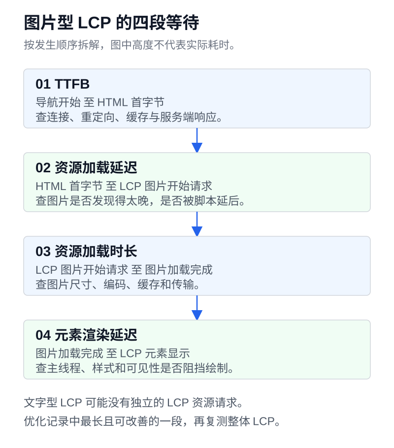

“帮我优化前端性能”范围太大。AI 可以压图片、加缓存，也可以给每个组件套一层 `memo`。我们要指定需要改善的用户操作，并要求它留下能支持结论的测量记录。

这一讲继续使用慢读。[实验页](/tutorials/backend-to-platform/lab/index.html)提供同步和分批计算，方便观察主线程忙碌时页面的反应；[静态基线](/tutorials/backend-to-platform/03-css/index.html)用于检查初始加载。源码见[下载包](/tutorials/backend-to-platform/source.zip)，优化请求模板见[提示词文件](/tutorials/backend-to-platform/prompts.md)。

当前资料库只有三条固定资料，不能据此判断大列表的实际性能。文中的阈值来自 web.dev，具体实验结果由你的设备产生，我们不预填一组“优化前后”的成绩。

## 先选一段用户操作，再确定测什么

慢读至少有三段值得单独记录的使用过程。

| 使用过程             | 用户关心的结果                     | 可用的测量                           |
| -------------------- | ---------------------------------- | ------------------------------------ |
| 首次打开资料库       | 主要内容多久可见，页面是否跳动     | LCP、CLS、资源瀑布                   |
| 输入关键词并选择资料 | 输入有无迟滞，点击是否及时反馈     | 交互录制、主线程任务、INP            |
| 搜索后等待完整结果   | 结果何时稳定显示，是否属于当前查询 | 自定义业务耗时、请求时序、正确性检查 |

INP 关注交互到下一次绘制的响应速度。一次点击之后，后台请求多久完成，是另一项业务耗时。页面可以及时显示加载状态，但服务器仍然要花时间返回结果；这两件事需要分别记录。[web.dev 的 INP 定义](https://web.dev/articles/inp)

开始录制前，把环境写下来。至少包括提交版本、生产构建方式、设备与浏览器版本、视口、CPU 和网络限速、数据规模、缓存条件。固定测试时的电源状态，关闭会争抢资源的无关程序。开发服务器上的热更新和额外检查会影响结果，正式比较要使用生产构建。

冷缓存首次访问和热缓存再次访问分别跑。切换网络档位之后，基线也要在同一档位重新测；不要把一次真机结果与另一次桌面模拟结果放进同一组比较。

## 真实用户指标和本地录制，各自回答一部分问题

Core Web Vitals 当前包含下面三项。表中的“良好”要按真实访问的第 75 百分位，也就是 p75 评估，并把移动端与桌面端分开统计。

| 指标 | 主要观察什么             | 良好阈值 |
| ---- | ------------------------ | -------- |
| LCP  | 视口中主要内容的呈现时间 | ≤ 2.5s   |
| INP  | 页面交互的响应情况       | ≤ 200ms  |
| CLS  | 意外布局偏移的累计程度   | ≤ 0.1    |

三项各自达到对应阈值，才算通过这一组评估。CLS 没有毫秒单位。没有交互的访问也可能没有 INP，缺失值不能补成零。指标口径与设备分类见 [Web Vitals 官方说明](https://web.dev/articles/vitals)。

真实用户数据来自 RUM，也就是页面上的真实用户监测，或符合条件的网站在 CrUX 中的汇总。它能反映不同设备与实际操作。查看报告时还要确认是当前 URL 的数据，还是整个来源站点的数据。小站没有足够公开样本时，应明确“缺少真实用户数据”，继续做本地诊断，不能宣称已经通过线上 p75。

实验室数据用于复现和定位。Chrome Performance 可以记录你执行的一段交互；Lighthouse 常规导航测试侧重一次加载，没有完整的真实用户操作过程。它的 TBT 是实验室阻塞时间指标，可以帮助发现响应性风险，不能替代 INP。一次本地录制也不代表线上用户的分布。[web.dev 的实验室交互诊断说明](https://web.dev/articles/manually-diagnose-slow-interactions-in-the-lab)

本课先在 Performance 中录一次加载，再单独录一次“输入关键词、点击资料”的操作。保留原始 trace，用它核对 AI 声称的阻塞位置。[Chrome 的性能录制指南](https://developer.chrome.com/docs/devtools/performance)

## 把 LCP 拆成四段，找到时间花在哪里

在 Performance 中选中 LCP 对应的元素，再看它依赖的请求。慢读静态页以文字为主，实际 LCP 元素要由工具确认。下面以需要下载图片的 LCP 为例，拆解从导航到绘制的过程。

| 阶段         | 起止位置                       | 优先核对的证据                         |
| ------------ | ------------------------------ | -------------------------------------- |
| TTFB         | 导航开始到 HTML 响应首字节     | 重定向、连接与服务端等待               |
| 资源加载延迟 | HTML 首字节到 LCP 资源开始请求 | 资源何时被发现，有无脚本或接口串行等待 |
| 资源加载时长 | LCP 资源开始请求到下载完成     | 传输体积、缓存和网络条件               |
| 元素渲染延迟 | 资源可用到 LCP 元素绘制        | 主线程任务、阻塞样式、字体与显示条件   |



图中展示先后顺序，各段长度不代表实际耗时。

系统字体呈现的文字可能不需要单独下载 LCP 资源，对应的资源阶段可以为零。TTFB 也包含到服务器途中的开销，不能直接当作后端处理时间。[web.dev 的 LCP 分段方法](https://web.dev/articles/optimize-lcp)

假设后续给慢读加了资料封面，这张封面成为 LCP。若瀑布图显示它要等一大段 JavaScript 执行后才开始请求，先处理资源发现太晚的问题。只压缩文件体积，会缩短下载阶段，前面的等待仍然存在。

请求已经早早完成，画面却很晚出现，就继续检查它是否被加载状态隐藏，以及主线程是否一直在忙。让 AI 写出“我认为这一段时间会减少”的假设，再改一处实现，录制相同过程验证。四段的变化要一起看，时间也可能从下载阶段转移到渲染等待阶段。

## 用同一份计算，观察主线程怎样影响操作

打开实验页的性能区域，保持标签页在前台，选定同一计算量，再依次运行“运行同步计算”和“运行分批计算”。两种模式执行同一份整数校验和计算，页面显示总耗时、最长工作片段和校验和，还会比较两种结果是否一致。改变计算量后，需要重新运行两种模式。

同步模式把工作集中在一个执行过程里。分批模式大约工作 8ms 后通过 `setTimeout` 把后续工作安排到另一个任务，让浏览器有机会处理其他工作。运行期间可以试着点击“点我计数”，同时观察页面的心跳次数。

不要预设分批一定让总耗时更短。调度有开销，分批的目标是减少连续占用主线程的时间，让页面有机会响应。先比较校验和，确认工作没有少做；再看最长片段、计数按钮的反应和 Performance 录制。心跳次数还受总运行时间影响，不能单独用次数多少给方案排优劣。

实验页面用 `performance.now()` 计时，总耗时包含分批等待，不包含启动前留给页面绘制的等待；最长片段只测计算函数的执行区间。它们都不能直接叫 INP，也不能替代浏览器记录的长任务。

浏览器把超过 50ms 的主线程任务称为长任务。任务执行时会占用主线程，其他工作需要等待；50ms 是诊断阈值，短于它也不意味着每一帧都来得及完成。实践中应按目标设备继续缩短关键片段。`await Promise.resolve()` 只切到微任务，不能可靠地给渲染和输入让出机会。分任务或合适的调度 API 才能改变这种连续占用。[web.dev 的长任务优化指南](https://web.dev/articles/optimize-long-tasks)

如果真实录制显示慢读在每次输入时遍历大量资料，先分清耗时发生在筛选计算，还是几千张卡片的 DOM 更新与布局。计算昂贵可以考虑减少重复工作，必要时放进 Worker；DOM 过多可以分页，或在需求合适时做虚拟列表。虚拟列表还要验证焦点、键盘导航与辅助技术，不能只看滚动变快。

给函数加上 `async` 不会把同步循环搬离主线程。大量计算仍在当前线程执行，Worker 才涉及另一种执行环境，数据传递也有成本。[MDN 对 async 函数执行方式的说明](https://developer.mozilla.org/en-US/docs/Web/JavaScript/Reference/Statements/async_function)

## 图片、字体和 JavaScript，按证据决定先改谁

下面这些改法各有适用条件。让 AI 先指出当前记录支持哪一行，再选择行动。

| 证据                         | 可以尝试的修改                                           | 要回看什么                                   |
| ---------------------------- | -------------------------------------------------------- | -------------------------------------------- |
| 图片传输占首屏时间的大头     | 提供符合显示尺寸的图片，使用合适格式与响应式资源         | 图像质量、实际下载尺寸、LCP 阶段变化         |
| LCP 图片发现或调度过晚       | 让它能被初始 HTML 发现，必要时提高关键资源优先级         | 请求开始时间，是否挤占其他关键资源           |
| 字体下载阻塞文字或替换后跳动 | 减少字重和字符范围，选择合适 font-display 与回退字体度量 | 文字可见时间、字体替换后的 CLS               |
| 大量脚本在首屏下载和执行     | 按路由或功能拆分，推迟暂不需要的编辑器和图表             | 初始 JS 传输、执行时间、首次使用该功能的等待 |
| 图片或异步内容出现时页面位移 | 预留宽高或合理比例，保留稳定的内容区域                   | Layout Shift 记录中的受影响元素              |

LCP 图片不应随意懒加载，屏幕外的非关键图片才适合延后。为每个资源都提高优先级，也无法表达哪个更重要。字体使用 `swap` 能减少文字不可见的等待，但回退字体与目标字体的尺寸差异仍可能带来偏移。[字体优化建议](https://web.dev/articles/font-best-practices)、[CLS 调优说明](https://web.dev/articles/optimize-cls)

拆包要看用户过程。慢读的可选编辑器可以等用户进入编辑功能后加载，搜索框却不能在用户按下第一个键时才等待一串依赖。每次延后资源，都要补测第一次使用那项功能的体验。[web.dev 的 JavaScript 拆分指南](https://web.dev/articles/reduce-javascript-payloads-with-code-splitting)

## React 的 memo 要能说出省了哪次工作

如果后续用 React 实现慢读，输入卡顿时先录制，再打开 React 的分析工具，查看哪些组件渲染、耗时在哪里。输入状态放在过高层级、Effect 引发连续更新，都会让小操作影响很大的组件树。

`memo` 尝试跳过 props 没变的组件渲染，组件自己的状态或读取的 context 变化时仍会渲染。`useMemo` 缓存依赖未变时的计算结果。若每次都传入新对象，或者搜索关键词本来就每次变化，缓存能省下多少需要实际验证。它们不会修复慢 API，也不会消除所有布局工作。

先修正确性，再讨论缓存。自定义比较函数也要付出比较成本，并保证没有忽略会改变行为的输入。用了 React Compiler 的项目还应先确认已有自动优化，避免堆重复措施。[React 的 memo 参考](https://react.dev/reference/react/memo)、[useMemo 的适用条件](https://react.dev/reference/react/useMemo)

## 保留前后记录，给 AI 一个可检查的交付要求

同一设备、同一网络条件和同一份数据，优化前后各执行相同流程至少五次，保留每次原始结果，为每个指标分别计算中位数。五次是这份练习的操作约定，不能据此估计真实用户 p75。条件允许时交替运行两个版本，减少热机、温度变化等时间因素的影响。遇到异常的一次，保留记录并查原因，不要只挑最好看的数值。

下面的记录表故意留空，测完再填。

| 项目                         | 优化前 | 优化后 |
| ---------------------------- | ------ | ------ |
| 提交版本与构建方式           | 待记录 | 待记录 |
| 设备、浏览器、限速和缓存状态 | 待记录 | 待记录 |
| 场景、数据规模和操作步骤     | 待记录 | 待记录 |
| 五次原始测量与中位数         | 待记录 | 待记录 |
| trace 文件或报告位置         | 待记录 | 待记录 |
| 正确性与交互验收             | 待记录 | 待记录 |

还可以给慢读订一个项目预算。例如在约定网络下，列表页初始传输的压缩后 JavaScript 不超过 100KiB，某个非关键功能新增依赖超过 20KiB 就触发人工检查。这是教学用的项目预算，绝非通用标准，也不能替代 CWV。确定口径时要写明路由、压缩方式与测量边界。

把下面的提示词与原始记录一起交给 AI。

```text
你负责慢读资料库的一次性能改进。请保留现有功能，找出证据支持的瓶颈，
实施最小有效修改，并用同条件的前后测量证明结果。

场景与材料
- 用户操作流程填写在这里
- 当前提交、生产构建命令和目标设备填写在这里
- 数据规模、网络与CPU限速、缓存条件填写在这里
- 附Lighthouse报告、Performance trace或真实用户监测摘要
- 写明指标来自lab还是field，缺少的数据写未取得
- 附项目预算及其测量口径，没有预算则先提一份有理由的建议

执行方法
1. 先复测基线，按影响与证据强弱排序候选原因。
2. LCP问题拆开四个阶段，交互问题定位到具体任务、渲染或布局。
3. 说明拟改哪一处、预期改变什么指标，以及可能转移到哪里的新成本。
4. 优先完成一项可归因的修改，再按同一过程复测。
5. 优化前后各跑至少五次，保留原始值并比较中位数。
6. 复查搜索正确性、结果一致性、错误恢复、键盘操作与窄屏。

限制
- 不得删功能、少算数据或隐藏内容来换更好数字
- 不得把TBT、普通函数耗时或实验心跳当成INP
- 没有真实用户数据就不能声称线上p75达标
- 不批量添加memo、预加载或缓存，不随意改框架和引入依赖
- 没有测量依据的建议标为假设，不编造提升百分比

交付内容
- 瓶颈证据、修改说明与影响范围
- 完整环境、原始记录、中位数和报告文件
- 性能收益与代价，以及正确性检查结果
- 未解决的问题、未执行的测试与回滚方法
```

如果两组结果接近波动范围，就写“本次未证明有稳定改进”，保留记录或撤销改动。一次优化结束时，读者应该能够重跑同一过程，得到足以支持判断的证据。
