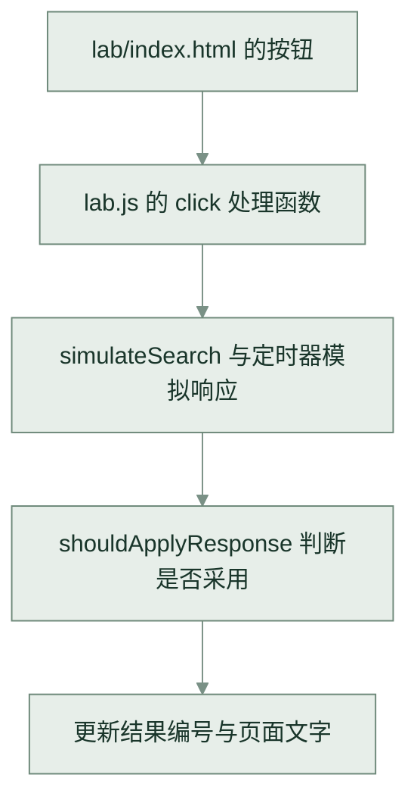

AI 给了你一套页面，下一次改需求时，你能指出应该从哪个文件开始吗？这一课要做出一份工程地图和一份失败记录，让你能沿着用户操作找到代码，也能告诉 AI 到底卡在了哪一步。需要的条件是会用终端、能读基本代码，并准备一个能读取项目文件的 AI 编程工具。

我查了两条 V2EX 讨论。2025 年 4 月的提问者想借助 LLM 做网页小工具，却连生成的代码也改不动，只能反复让模型迭代。另一位后端开发者在 2024 年 9 月列出了版本不匹配、别名飘红、TS 检查和 lint 配置等问题。这些具体困难值得放进第一课。[AI 生成后改不动的困惑](https://www.v2ex.com/t/1124398)、[后端学前端的工程问题](https://www.v2ex.com/t/1077205)

本课用「慢读」资料库作教学项目。先打开[交互实验室](/tutorials/backend-to-platform/lab/index.html)，再[下载示例](/tutorials/backend-to-platform/source.zip)。示例是为课程编写的验收材料，接下来练的是接手方法，不声称它来自一次真实的 AI 交付。

## 先确认手里是什么工程

解压后，把 AI 的工作目录设为包含 `README.md` 与 `resources.json` 的 `backend-to-platform` 目录。博客仓库中的对应位置是 `public/tutorials/backend-to-platform`。下面的路径都相对于这个示例目录。

| 文件                                     | 职责与能力范围                                 |
| ---------------------------------------- | ---------------------------------------------- |
| `index.html`                             | 工具箱入口，链接到各个练习，没有应用路由器     |
| `02-html/index.html`                     | 静态资料列表与原生表单，没有动态搜索           |
| `03-css/index.html`、`03-css/styles.css` | 同一份内容与响应式样式，没有框架组件           |
| `resources.json`                         | 三条资料的数据样本，尚无加载到静态页面的逻辑   |
| `lab/index.html`、`lab/styles.css`       | 两个实验的界面，没有真实业务 API               |
| `lab/lab.js`                             | 事件、响应模拟、计算与页面更新，不持久保存数据 |

这个目录没有 `package.json`、锁文件或 TypeScript 配置，不需要安装 npm 依赖。博客自身有另一套构建工程，下载包没有带上它。在安装了 Python 3 的机器上，从示例目录运行下面的命令。

```sh
python3 -m http.server 8080 --bind 127.0.0.1
```

浏览器访问 `http://127.0.0.1:8080/lab/index.html`。看到实验标题和可点击按钮后，再查看 Console 是否报错。终端显示服务已启动，只能证明进程开始监听，脚本是否加载还得看浏览器。按 `Ctrl+C` 可以停止服务。

如果提示找不到 `python3`，先解决本机 Python 环境；端口被占用则换成 `8081`，浏览器地址也一起改。返回 404 时，检查终端的工作目录和 URL 对应的文件，先别改页面代码。

## Prompt 一，只读接手调查

把下面这段交给工具，让它先交出可以核对的地图。自己有 AI 生成的项目时，把第一段替换成真实目录和目标页面即可。

```text
请只读调查当前工程，帮助一位有后端经验的开发者接手。
当前材料是慢读课程下载包，工作目录应包含 README.md、resources.json、lab 和 03-css。
这轮不修改文件，不安装依赖，不启动进程，不根据常见模板补造缺失文件。

先确认工作目录，阅读项目说明与约定，再找页面入口和引用关系。
如果存在 package.json，读取 scripts、依赖、packageManager、engines，结合锁文件、版本文件和 CI 配置判断运行方式。
如果这些文件不存在，明确写出，并根据实际文件说明怎样运行。

以实验室的“一键复现竞态”按钮为目标，从页面元素追到事件处理函数，再追到数据来源、状态变化和页面更新。
说明数据来自真实 HTTP、内存、定时器模拟还是静态内容。没找到的环节标记为未知。
对于 React 或 Vue 工程，额外寻找路由到页面组件的关系、组件状态与请求封装，但只报告真实存在的文件。

输出一份工程地图，包含入口、启动条件、关键文件及职责、操作调用链和未知项。
每个关键判断附文件路径与符号名，工具支持时给行号。
最后给我三个可以自行打开文件核对的问题，以及下一步最小验证动作。
把读代码得到的推断和实际执行结果分开，未运行的检查不能写成通过。
```

检查报告里的文件能否打开，函数能否搜到。若它声称列表通过 `fetch` 加载 `resources.json`，对照静态页面就能发现错误。三条资料是手写在 HTML 里的；表单提交只改变 URL 查询参数，页面仍返回同一份列表。

## 沿着一次点击读下去

打开 `lab/index.html`，找到 `id="run-race"` 的按钮，再到 `lab/lab.js` 搜索 `run-race`。不用从文件第一行逐句解释，先沿着这次操作读。



点击处理函数先禁用按钮、清空日志，再调用 `simulateSearch`。HTML 搜索计划延迟 900 ms，80 ms 后发起的 React 搜索计划延迟 200 ms。这里全靠 `setTimeout` 模拟，没有搜索 API。Network 能看见加载 HTML、CSS 和脚本的请求，点击后不会多出两条搜索请求。

接着看三个变量。`latestRequestId` 记录最新请求，`displayedRequestId` 记录页面采用了哪个结果，`completed` 负责判断两个回调是否结束。它们属于本次点击处理函数内部；`raceRunning` 在外层，避免实验运行中重复开始。

最后找到 `shouldApplyResponse` 和 `textContent`。前者决定是否采用响应，后者把结果写进页面。故障模式允许旧结果覆盖新结果，修复模式只采用编号与最新请求相同的响应。切换两种模式，核对页面日志与你读到的条件是否一致。计划延迟和实际耗时可能不同，记录浏览器实际显示的时间。

如果换成框架工程，这条追踪顺序仍然能用。先找路由对应的页面组件，再找点击处理函数，沿着请求封装走到状态更新，最后看组件如何读取状态。只读这一条操作经过的文件，遇到关联再扩大范围。

## 已有框架项目时，先对齐运行条件

下面这一节用于你自己的 npm、React 或 Vue 工程，慢读下载包可以直接跳到下一节。不要为了跟练给示例新增构建配置。

先读 `package.json` 的 `scripts`，确认启动命令是否真叫 `dev`，以及它有没有关联的前置脚本。开发服务、构建、类型检查和 lint 是不同检查，项目可能把它们串在一起。阅读命令再执行，尤其要留意 `--fix` 这类会改文件的参数。

依赖声明给出允许范围，锁文件记录具体解析结果。结合 `packageManager`、锁文件与 CI 中的命令选择包管理器，存在多份锁文件就查清项目约定。对于使用 npm 且已有有效锁文件的工程，`npm ci` 会按锁文件安装；声明与锁文件不一致时会报错，它不会替你更新锁文件，也会移除已有的 `node_modules`。因此要先留住失败信息，再判断是否需要重装。[npm ci 文档](https://docs.npmjs.com/cli/v11/commands/npm-ci/)

记录 `node --version` 和包管理器版本，对照项目的 `engines`、`.nvmrc` 或 `.node-version`，再看对应版本的构建工具要求。当前 Vite 入门文档要求 Node.js 20.19+ 或 22.12+，部分模板要求更高。已有项目应以它实际使用的版本为准，升级到最新版本会改变调查条件。[Vite 运行要求](https://vite.dev/guide/)

| 看见的现象                      | 下一步查哪里                                             |
| ------------------------------- | -------------------------------------------------------- |
| 缺少脚本或找不到 `package.json` | 当前目录、工作区子项目、真实的 `scripts`                 |
| 安装时依赖冲突                  | 完整冲突链、Node 与包管理器版本、锁文件和项目配置        |
| `@/…` 导入无法解析              | 目标文件及大小写、实际生效的 TS 配置、构建工具的别名解析 |
| 页面能开，TS 仍报错             | 单独运行项目已有的类型检查，保留错误代码和文件位置       |
| lint 报错或自动改了许多文件     | 使用的规则配置、命令参数、改动差异                       |

`@` 不是浏览器内置的目录缩写。TypeScript 的 `paths` 描述导入如何解析，本身不会改写输出路径，运行或打包的一端也得认识这条映射。Vite 可以配置别名，具体项目也可能使用路径解析功能或插件，先看实际版本与配置。[TypeScript paths](https://www.typescriptlang.org/tsconfig/paths.html)、[Vite 别名配置](https://vite.dev/config/shared-options.html#resolve-alias)

页面能运行也不能替代类型检查。Vite 自身转换 TS 文件时不做类型检查，项目需通过自己的检查命令或插件补上。让 AI 给类型报错加一个 `any`，会改变检查能发现的问题；先追踪值来自哪里、是否可能为空，再决定怎样改类型或处理数据。[Vite 的 TypeScript 支持](https://vite.dev/guide/features.html#typescript)

## Prompt 二，带证据的启动失败定位

一次只处理当前阻塞。复制原始报错时保留第一处失败、相关调用栈和最终退出信息，不要只截最后一行。把下面方括号里的内容换成实测记录，没拿到的信息写「未采集」。

```text
请定位当前工程的启动或访问失败，先调查，再做最小修复。

工程与目标页面
[工作目录、工程类型、预期访问的完整 URL]
环境
[操作系统、Node 与包管理器版本；静态示例则写 Python 版本]
执行经过
[按顺序列出原始命令、各自工作目录、退出码或进程是否仍运行]
失败证据
[原始终端报错、浏览器 Console 错误、失败请求 URL 与状态码]
已经尝试的操作
[实际改动及结果，没有就写没有]

先根据真实文件判断问题属于目录、环境、依赖、构建、浏览器加载还是业务执行。
列出最可能的两个原因，每个原因写明现有证据和能区分它们的下一步检查。
工具可以执行检查时先复现，不能访问终端或浏览器时明确限制，给我可执行的采集步骤。

确认原因后，修复范围只覆盖这个阻塞，说明修改前后差异与回退方式。
不要为消除报错删除锁文件、批量升级依赖、更换框架，或关闭类型检查与 lint 规则。
如果修复必须涉及这些变化，先说明依据、影响和可选方案，等待我选择。

复测原来的命令和目标页面，记录命令、退出结果及浏览器证据。
最后分开列出已确认原因、已执行修复、已验证结果与未验证项。
没有执行过的测试不能写成通过，启动成功也不能写成功能全部通过。
```

## 交付两份能复查的记录

把工程地图保存为自己的学习笔记，至少写清实验入口、脚本来源、竞态操作调用链，以及这份示例没有真实搜索请求。再挑一个节点打开源码，核对 AI 给的依据。

可以直接复制[交付工作簿](/tutorials/backend-to-platform/workbook.md)，从第一课开始填写，后面五课继续使用这份记录。

失败记录应包含环境、命令、预期与实际、证据、原因和复测结果。如果启动一路顺利，可以做一个明确的人为练习，访问不存在的 `/lab/missing.html`，记录 404，再改回 `/lab/index.html`。注明故障来自故意输错 URL，不要把它写成程序缺陷，也不要为了修复它新建一个页面。

拿着地图进入[第二课的界面选择与布局练习](/blog/backend-to-platform-interface)。接下来要判断什么页面适合慢读，以及怎样把界面要求交给 AI。
