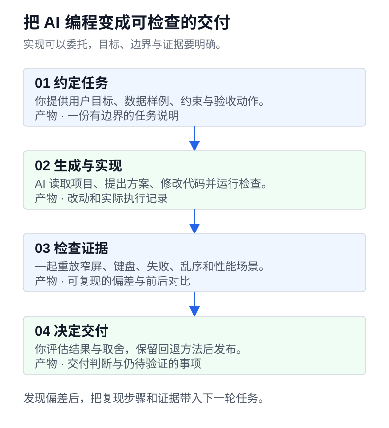

让 AI 生成一个资料列表，通常很快就能得到一页像样的界面。接上真实数据后，问题才逐渐露出来。搜索框显示新的关键词，列表却被旧请求覆盖；桌面截图很整齐，长标题到了手机上把页面撑宽；接口只用了几十毫秒，点击按钮还是感觉卡。

这套课面向已经能开发后端、准备借助 AI 交付前端产品的程序员。我们继续做一个叫**慢读**的个人资料库，由 AI 完成主要代码实现，读者负责定义需求、提供上下文、选择方案、定位问题和检查结果。第一阶段聚焦 Web，之后再扩展桌面与移动端。

**性能调优是必修内容，第四课已经提供正文和实验。** 当前可以阅读导读与四课，也可以先打开[实战工具箱](/tutorials/backend-to-platform/index.html)，体验会出错的搜索和会阻塞页面的计算。

## 这套课要补什么

你不必从头逐行抄写 HTML、CSS，再等到最后一章才用 AI。开始时就让 AI 读项目、生成界面和补实现。遇到一个具体问题，再补足判断它所需的浏览器知识。

基础知识仍有用途。发现页面横向溢出，需要读懂最终尺寸与布局约束；发现请求成功但列表错误，需要区分网络响应与界面状态。学习深度以能检查、能解释、能验收为准。要系统补语法，可以按需查 [MDN Curriculum](https://developer.mozilla.org/en-US/curriculum/)中的对应模块。

AI 能参与分析和选型，也能使用工具运行测试。课程关注的是交付中仍需要你承担的判断。谁会用产品、允许付出多少维护成本、哪种体验值得优先优化，以及一次修改是否达到了目标，都需要明确的上下文和证据。

| 后端经验         | 到前端要做出的判断                               | 可以交给 AI 的具体工作               |
| ---------------- | ------------------------------------------------ | ------------------------------------ |
| 接口契约与状态码 | 加载、空结果、失败、权限过期分别给用户什么反馈   | 按状态表实现界面，补失败用例         |
| 服务边界与部署   | 哪些页面需要预渲染，私有工作台是否适合客户端渲染 | 比较候选方案，列出部署和迁移代价     |
| 并发与一致性     | 哪次搜索有权更新当前列表，保存失败后怎样恢复     | 构造乱序响应，修复竞态并重放         |
| 监控与压测       | 用户等的是网络、主线程计算，还是布局绘制         | 读取性能记录，实施有依据的局部优化   |
| 代码审查与发布   | 功能是否可用，哪些检查尚未完成，失败后怎样回退   | 运行构建和关键流程，汇总真实检查结果 |

## 已经可以学习的四课

每课围绕一次实际委托展开，包含决策依据、可复制 prompt、常见错误和验收动作。原有前三课的链接继续可用，内容已经按 AI 开发流程重写。

| 章节                                                                        | 你要解决的问题                                 | 本课产物                                      |
| --------------------------------------------------------------------------- | ---------------------------------------------- | --------------------------------------------- |
| [01 · 把需求写成 AI 能交付的前端任务](/blog/backend-to-platform-01-browser) | 为什么“做得好看一点”总要反复返工               | 一份有数据、状态、约束与验收标准的开发 prompt |
| [02 · 架构选型与状态边界](/blog/backend-to-platform-02-html)                | 该选什么渲染方式，筛选、草稿和远端数据放在哪里 | 一份选型记录和状态归属表                      |
| [03 · AI 写的页面出错了，怎样定位和验收](/blog/backend-to-platform-03-css)  | 怎么给 AI 足够的证据，让它修到原因所在         | 一份最小复现、修复委托和回归检查结果          |
| [04 · 用测量推动前端性能调优](/blog/backend-to-platform-04-performance)     | 页面卡在哪里，一次优化到底改善了什么           | 一份同条件的前后测量记录与取舍说明            |



图里的每一步都有可以检查的产物。下一轮 prompt 应该带上上一轮发现的具体偏差，例如请求编号、溢出的元素或性能记录中的任务。

## 高质量 prompt 是一份可执行的工作说明

“你是一位资深前端工程师”提供不了接口约束，也无法告诉 AI 保存失败后该保留什么。对慢读来说，一个有用的任务至少要交代这些信息。

| 信息       | 慢读里的写法                                                       |
| ---------- | ------------------------------------------------------------------ |
| 用户与目标 | 用户在手机上查找已收藏的资料，能用标题关键词找到并打开原文         |
| 项目上下文 | 先读取现有目录、依赖、路由、样式约定和运行命令，再提出改动范围     |
| 数据与状态 | 附实际字段及样例，定义加载、空列表、失败、重试与连续搜索行为       |
| 视觉要求   | 主次层级、内容密度、参考页面中值得沿用的规则、窄屏布局与长文本行为 |
| 技术约束   | 沿用现有技术栈，新增依赖说明用途，不为一个列表引入整套状态管理     |
| 验收证据   | 指定操作步骤、预期结果与检查环境，未执行的检查单独列出             |

第一课有完整任务文本。[Prompt 模板文件](/tutorials/backend-to-platform/prompts.md)另外整理了实现、架构、排错和性能四类委托，可以下载到自己的项目中修改。模板要填入实际文件与条件，保留未知项，让 AI 先调查这些未知项。

这种组织方式借鉴了 [GitHub 的提示词指导](https://docs.github.com/en/copilot/concepts/prompting/prompt-engineering)中提供具体上下文、输入输出示例和拆分复杂任务的建议。教程中的任务与验收要求围绕慢读重新编写，可以用于能读取代码的不同编程助手。

## 从哪里开始动手

[实战工具箱](/tutorials/backend-to-platform/index.html)包含两种材料。

**验收基线**保留了[语义 HTML 页面](/tutorials/backend-to-platform/02-html/index.html)和[响应式页面](/tutorials/backend-to-platform/03-css/index.html)。用它们练习检查标签、键盘操作、长标题和窄屏表现。这两份页面的内容写在 HTML 中，`resources.json` 只展示数据契约。原生表单会改变地址栏，尚未实现列表筛选。

**交互实验**放在[故障与性能实验室](/tutorials/backend-to-platform/lab/index.html)。搜索实验通过本地定时器模拟响应乱序，可以对照故障版和修复版。计算实验对比同步执行与分批让出主线程，展示当前设备实际测出的耗时。实验不依赖真实后端，计时结果也不等同于真实用户的 INP。

想把任务交给自己的 AI 助手，可以[下载全部示例和模板](/tutorials/backend-to-platform/source.zip)，解压后打开项目目录。已有 Python 3 时，可在包含 `README.md` 的目录运行本地预览。

```sh
python3 -m http.server 8080 --bind 127.0.0.1
```

打开 `http://127.0.0.1:8080/index.html`。也可以使用编辑器的静态预览服务。先阅读示例说明，再让 AI 在独立练习目录中实现自己的版本，留下原版用于比较。

## 怎样使用现有前端路线

[roadmap.sh 的前端路线](https://roadmap.sh/frontend)用来检查遗漏的能力，学习顺序按问题重新安排。看到路线里的 HTML、CSS、JavaScript、状态管理和性能，不必把每个节点都变成一段手写代码训练。

| 路线中的知识         | 在 AI 开发中怎样学习                                         |
| -------------------- | ------------------------------------------------------------ |
| HTML、可访问性       | 审查 AI 生成的页面是否能用键盘操作，控件是否有正确名称与语义 |
| CSS、响应式布局      | 用长文本和窄屏复现问题，要求 AI 提供计算样式与尺寸依据       |
| JavaScript、异步请求 | 设计乱序、失败和重复操作场景，检查状态提交是否正确           |
| 框架、路由、状态     | 先写出需求与状态归属，再评价 AI 建议增加的工具               |
| 测试、性能、部署     | 执行关键用户流程，读取记录，比较修改前后并保留回退办法       |

## 后续扩展计划

下面这些主题尚未写成独立章节。前四课已经覆盖的判断方法，会在更完整的产品中继续使用。

| 计划主题             | 要解决的问题                                                               |
| -------------------- | -------------------------------------------------------------------------- |
| API 集成与运行时边界 | 数据校验、缓存失效、分页、乐观更新与错误恢复                               |
| 登录、权限与发布     | 会话过期、服务端鉴权、部署路径、观测与回退                                 |
| 复杂交互与质量保障   | 编辑草稿、焦点管理、端到端测试与视觉回归                                   |
| 桌面端选型           | 本地文件、离线数据、系统权限和安装更新，按需求评估 Tauri 等方案            |
| 移动端选型           | 触摸、分享入口、设备能力和发布流程，按需求评估 React Native 与 Expo 等方案 |

全平台阶段会分别判断哪些业务逻辑可以复用、哪些交互必须适配。当前先完成 Web 的交付判断。打开[第一课](/blog/backend-to-platform-01-browser)，给 AI 一份可以验证结果的任务。
