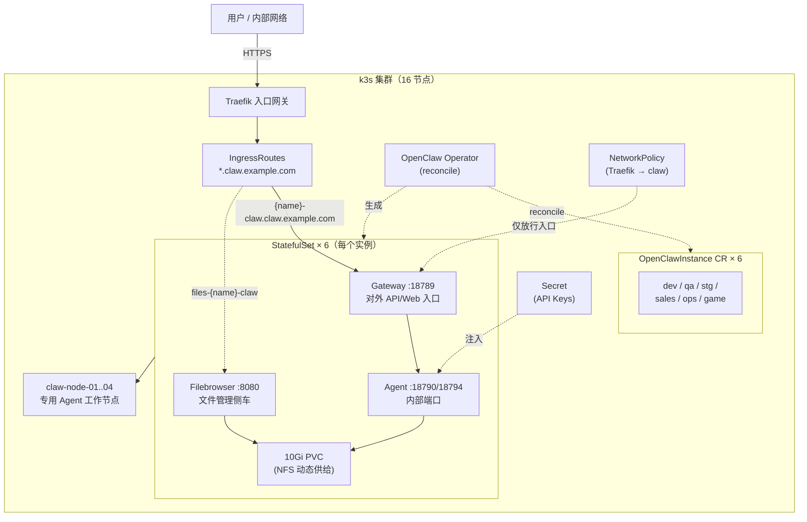

> 当你要同时运行十几个相互隔离的 AI Agent 实例，每个实例有自己的会话、工作目录、模型配置和技能包时，怎么管？

> 本文介绍一套基于 **OpenClaw Operator + CRD** 的集群化部署方案：一个集群、一个 Operator、一份可重复的实例模板，N 个彼此隔离的 Agent。所有实例名、域名、IP 均为示意。

---

## 问题：多 Agent 实例管理的本质困难

单机跑一个 Agent 很愉快：装好环境、配好模型、开聊。但当你需要按业务线、按环境（开发/测试/预发）各跑一个独立 Agent 时，困难不是"多跑几个进程"，而是以下五个本质问题：

1. **配置重复与漂移**：每个实例都要环境变量、模型配置、技能包、密钥。手工配一遍，两遍，三遍——总有某个实例的配置和别人不一样，而且没人知道差在哪。
2. **隔离**：会话、密钥、技能包不能互相污染。一个实例崩了不能拖垮另一个。
3. **有状态**：Agent 的会话历史、工作目录、技能数据必须跨重启保留。而进程一旦重启，默认什么都留不下。
4. **网络暴露面**：每个实例都要对外提供服务，但内部端口不应全网可达。开多了端口，攻击面线性增长。
5. **资源争夺**：一个 Agent 的突发负载可能吃满整台机器，饿死邻居。

这篇文章的核心论点是：**这五个问题，恰好是 Kubernetes 二十年来解决过的五个问题**。所以答案不是发明新工具，而是把 Agent 实例映射到 K8s 的原语上——用一个自定义资源类型（CRD）+ 控制器（Operator）把"Agent 实例"变成 K8s 的一等公民。

## 核心技术一：声明式实例（CRD）—— 配置漂移的解药

### 问题

多个实例的配置散落在各处的部署脚本、配置文件、文档里。要回答"某个实例现在的配置到底是什么"都很困难，更别说保证所有实例一致。

### 技术

定义一个新的资源类型 `OpenClawInstance`，一个实例就是一份 YAML：

```yaml
apiVersion: openclaw.rocks/v1alpha1
kind: OpenClawInstance
metadata:
  name: dev-claw
  namespace: default
spec:
  plugins:
    - internal-im-plugin        # 内部 IM 平台插件
  image:
    tag: "2026.3.28"
  envFrom:
    - secretRef: { name: claw-api-keys }
  config:
    raw:
      models.providers.internal-gw
      agents.defaults.model
        primary: internal-gw/claude-sonnet-4-6
      session.scope: per-sender
  resources:                    # 500m CPU / 2Gi 请求,4 CPU / 4Gi 上限
  storage:
    persistence: { enabled: true, size: 10Gi }
```

"新增一个实例"变成"提交一份 YAML"，配置进 Git 即可版本化、审计、回滚。

### 为什么 K8s 能解决

K8s 解决配置漂移靠的不是"约束"，而是**声明式 + 收敛循环**这一整套机制：

- **期望态与实际态分离**：用户只描述"我想要什么"（期望态），集群负责把"现在是什么"（实际态）收敛过去。收敛动作由控制器持续执行，而不是一次性脚本——脚本只保证"执行的那一刻"是对的，控制器保证"任何时刻"都是对的。
- **etcd 是唯一事实源**：所有期望态持久化在 etcd 中，天然具备版本化、Watch 通知、一致性保证。你不需要自己实现"配置存哪、怎么同步、并发怎么写"。
- **API 服务器统一入口**：无论谁（人、CI、另一个控制器）修改资源，都走同一个经过鉴权、校验的 API——不存在"绕过去直接改文件"的旁路。

## 核心技术二：Operator 模式 —— 把"Agent 实例"变成一等公民

### 问题

一个 Agent 实例不是一个进程，而是一组关联资源：StatefulSet（工作负载）+ Service（服务发现）+ Ingress（对外入口）+ Secret（密钥）+ PVC（存储）+ NetworkPolicy（隔离）。用脚本逐个创建这些资源，脚本会随实例数量增长变得无法维护，且无法感知资源之间的约束关系（比如"改了配置就要重启"）。

### 技术

**Operator = CRD + 控制器**。CRD 负责"声明"，控制器负责"收敛"：

- 用户提交 `OpenClawInstance` CR → 控制器读取期望态
- 控制器把 CR 翻译成 StatefulSet / Service / PVC 等底层资源（模板化生成）
- 控制器持续对比"CR 期望"与"底层资源实际"，发现差异就修正（reconcile loop）

日常操作被简化到极点：`make deploy` 应用全部实例，`make restart` 滚动重启，`make status` 查看状态——所有实例的状态（Running/Ready）集中在 CR 上可见。

### 为什么 K8s 能解决

Operator 模式是 K8s **可扩展性设计的核心**：

- **CRD 是 API 扩展点**：K8s 内核只有 Pod/Service/Deployment 等通用原语，但通过 CRD 可以注册任意业务资源类型，且与原生资源享受同等对待（watch、鉴权、存储、版本管理）。你不需要 fork K8s 内核来支持"Agent 实例"这种新资源。
- **控制器模式即"平台操作系统"**：K8s 本身就是大量控制器（kube-controller-manager）协作的结果，你的 Operator 只是往这个体系里再注册一个控制器。自愈、重试、幂等这些分布式系统难题，控制器框架已经解决——你只需要写"把期望态翻译成实际态"的业务逻辑。
- **模板化生成的幂等性**：控制器按模板生成资源，天然幂等——重复执行不会产生重复资源，这解决"脚本跑两遍就乱套"的经典问题。

## 核心技术三：StatefulSet + PVC —— 有状态应用的答案

### 问题

Agent 是有状态的：会话历史、工作目录、技能数据。两个硬性要求：

1. 重启（升级、崩溃、滚动更新）后**数据不丢**
2. 每次重启后实例的身份（网络地址）**保持稳定**——否则下游客户端无法继续连接

### 技术

每个实例一个 StatefulSet + 一个 10Gi PVC（NFS 动态供给）：

- 稳定网络标识：实例的 Service 名不变
- 稳定存储绑定：PVC 与实例一一对应，重启后重新挂载同一块卷
- 文件侧车（filebrowser）：提供 Web 方式访问实例工作目录

### 为什么 K8s 能解决

有状态是分布式系统里最难的问题，K8s 用两个抽象解决：

- **StatefulSet**：相比 Deployment，它为每个副本提供**稳定的网络标识**（`{name}-{ordinal}`）和**稳定的存储绑定**（按序号挂载对应 PVC）。滚动更新按序进行（0→1→2…），天然支持"先升级主实例再升级从属"这类有状态语义。
- **PVC 把"存储"和"存储实现"解耦**：应用只声明"我要 10Gi 持久化存储"，由 StorageClass 动态供给（这里是 NFS）——迁移到不同的存储后端（Ceph、云盘）不需要改应用代码，只改 StorageClass。这解决"数据存哪、扩容怎么办"这类每个有状态应用都要重新发明一遍的问题。

## 核心技术四：Ingress + NetworkPolicy —— 最小暴露面

### 问题

每个实例都要对外提供服务，但网络暴露是有代价的：暴露的端口越多，攻击面越大。需要"只开该开的门"，且实例内部端口（agent 通信端口）不应全网可达。

### 技术

- **统一入口**：所有实例走同一个 Traefik 网关，通过 IngressRoute 按主机名路由到对应实例；每个实例两个子域名（主入口 + 文件浏览器），挂载统一证书
- **微分段**：NetworkPolicy 仅放行入口网关到实例内部端口的流量，实例之间、实例与集群内其他命名空间之间默认封闭

### 为什么 K8s 能解决

K8s 的网络模型是"三层抽象"的产物，每一层解决一个问题：

- **Service**：提供稳定的虚拟 IP + 负载均衡，把"Pod 地址会变"这个事实藏起来。应用之间通过 Service 名通信，而不是 IP。
- **Ingress/IngressRoute**：把"七层路由"从应用里抽出来。域名、TLS 证书、路径路由全部声明在资源对象里，而不是散落在各服务的代码中。
- **NetworkPolicy**：K8s 的微分段模型——基于标签选择器声明"谁可以访问谁"，而不是维护 IP 白名单。实例加标签，策略按标签匹配，新增实例自动被既有策略覆盖，不需要手写规则。

## 核心技术五：资源配额与调度 —— 控制资源争夺

### 问题

多个实例共享节点时，一个实例的突发负载可能吃满 CPU/内存，饿死邻居；而所有实例挤在业务节点上，还会和业务负载互相干扰。

### 技术

- **每实例独立配额**：`requests: 500m CPU / 2Gi`、`limits: 4 CPU / 4Gi`——请求量决定调度，上限防止失控
- **专用节点**：实例固定调度到 4 台 claw 专用节点，与业务负载物理隔离

### 为什么 K8s 能解决

资源管理是 K8s 调度器的本职工作：

- **requests/limits 是资源契约**：`requests` 告诉调度器"这个实例至少要这么多"，调度器在放置时保证节点不超卖；`limits` 是运行时上限（CPU 限流、内存 OOM 阈值），防止单个实例失控。
- **调度器是全局优化器**：调度是一个"把 N 个实例放到 M 个节点"的约束满足问题，K8s 调度器（kube-scheduler）内置了资源拟合、节点亲和、污点容忍等机制——把实例钉在专用节点只需要一个 `nodeSelector`，这是"手动管理进程"时代完全不具备的能力。
- **控制平面与数据平面分离**：调度决策在控制平面（API + 调度器）完成，执行在节点（kubelet）完成，天然支持"改配置不重启实例"（原地更新）和"实例漂移"（节点故障自动重调度）。

## 实例拓扑全景



## 优势总结：每一项都对应一个被解决的问题

| 优势 | 对应的核心技术 | 解决的问题 |
|---|---|---|
| 声明式、可版本化、可审计 | CRD + kustomize | 配置漂移 |
| 新增实例 = 一份 YAML，分钟级上线 | Operator 模板化生成 | 重复配置、手动编排 |
| 实例间升级、重启、故障互不影响 | 独立 StatefulSet + 命名空间 | 隔离 |
| 重启不丢会话、不丢工作区 | StatefulSet + PVC | 有状态 |
| 网络最小暴露面 | Ingress + NetworkPolicy | 攻击面膨胀 |
| 资源可控、不互相饿死 | requests/limits + 专用节点 | 资源争夺 |
| 统一入口、统一证书 | Traefik + 单一域名体系 | 入口边界混乱 |
| 一键 install/deploy/restart/status | Makefile 封装 | 操作标准化 |

## 已知问题与改进方向

这套方案不是银弹，改进方向同样清晰：

| 优先级 | 问题 | 建议 |
|---|---|---|
| 高 | API Key 明文存放（含仓库内） | 迁至 Vault / Sealed Secrets——K8s 的 Secret 默认只是 base64，不是加密 |
| 中 | 手动 `kubectl apply`，无自动收敛 | 引入 ArgoCD / Flux 做 GitOps——把"配置进 Git"升级为"Git 自动驱动集群" |
| 中 | 无自动弹性 | 引入 HPA 或为实例预留节点资源 |
| 低 | 证书人工维护 | 接入 cert-manager 自动续期 |

## 复用指南:别人怎么把这套架构搬到自己的场景

这套架构的最大特点就是**可复制**——它不是一个定制到无法移植的系统,而是一组模板 + 一个控制器。不需要任何现有基础设施,从本地开始半小时内跑通。

### 从零开始:本地先跑通(约 30 分钟)

```bash
# 0. 本地起一个 k3s 集群(一条命令,自带 Traefik 入口 + 本地存储,零配置)
k3d cluster create clawpond

# 0.5 下载一键脚本(或直接从文章配套仓库获取)
curl -fsSL -o clawpond-new.sh \
  https://gist.githubusercontent.com/tsonglew/a281693548c2b527f6b143ba477d9f7e/raw/f5ec86ebf81b49b65451fa46438fd242074c21db/clawpond-new.sh
chmod +x clawpond-new.sh

# 1. 安装 operator(一次性)
helm install openclaw-operator oci://ghcr.io/openclaw-rocks/charts/openclaw-operator \
    --namespace openclaw-operator-system --create-namespace

# 2. 创建第一个实例(--local 模式:通用 OpenAI 兼容 API,无任何内部依赖)
./clawpond-new.sh --local --name my-claw --api-key sk-xxx --apply

# 3. 本地访问:把域名解析到本地入口
echo "127.0.0.1 my-claw.claw.local" | sudo tee -a /etc/hosts
# 浏览器打开 https://my-claw.claw.local(本地自签证书,浏览器提示时点"继续访问")
```

`clawpond-new.sh` 会自动完成:生成实例清单(CRD,含入口域名、文件侧车、资源配额)→ 追加最小暴露面 NetworkPolicy → 注册进 kustomization → `--apply` 直接上线。全程不碰编辑器,重复执行有幂等保护。

验证清单:

```bash
kubectl get openclawinstances -n default   # 实例状态应为 Running
kubectl get pods -n default | grep my-claw # Pod 就绪
```

### 搬到生产:把 local 换掉,其余不变

本地跑通后,迁移到生产集群的改动量比想象中小——**架构不变,变的只是配置来源**:

| 项 | 本地(--local) | 生产 |
|---|---|---|
| 集群 | k3d 单节点 | 多节点 k3s 或任何 K8s 发行版 |
| 模型 API | `--api-key` 直接注入 | 换内部网关,或迁到 Vault/Sealed Secrets 注入 |
| 域名 | `claw.local`(改 hosts) | 你的正式域名 + cert-manager 自动签发 |
| 技能包 | 不挂载 | ConfigMap 注入(common + 业务线两级组织) |
| 存储 | local-path(自带) | 你的 StorageClass(NFS/Ceph/云盘,PVC 抽象切换零成本) |
| 命令 | `./clawpond-new.sh --local --name ...` | `./clawpond-new.sh --name ...`(内部模式,自动挂内部插件/技能包) |

### 三个容易踩的坑

1. **Secret 不是加密**:K8s 的 Secret 默认只是 base64 编码,会随 Git 泄漏。生产环境务必迁到 Vault / Sealed Secrets / External Secrets。
2. **一个实例一个 PVC,不要共享**:共享存储会瞬间摧毁实例间的隔离性——这正是"每个实例独立 PVC"存在的意义。
3. **NetworkPolicy 要逐实例核对**:模板生成后,验证"实例内部端口只能被入口网关访问",可以用 `kubectl exec` 从另一个命名空间测试连通性。

### 什么时候这套方案不合适

- **只要 1~2 个实例**:直接 Docker Compose 或单机跑,引入 K8s 是过度设计
- **实例要共享热数据**:如果多个 agent 必须读写同一份实时数据,StatefulSet 的"实例隔离"模型反而不方便,考虑共享数据库 + 无状态 worker
- **没有 K8s 运维能力**:这套方案的收益全部建立在 K8s 之上,如果团队没人会排障集群问题,收益会被运维成本抵消

---

## 结语

回头看，这套架构的核心决策只有一条：**当"管理多个 Agent 实例"这件事反复出现时，不要写脚本，把它固化成资源类型**。

剩下的所有细节——状态绑定、网络隔离、资源调度、配置收敛——都是 Kubernetes 用十年时间解决过的问题，你要做的只是把 Agent 实例正确地映射到它的原语上。这比从零发明一套 Agent 编排系统，节省的不仅是时间，还有那些只有踩过坑才知道的分布式系统细节。

如果你也在用 Kubernetes 管理多个 Agent 实例，这套"CRD + Operator + StatefulSet + 专用节点"的组合值得参考。
