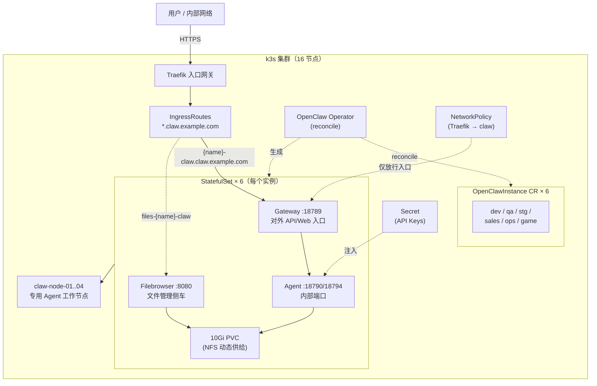

> 当你要同时运行十几个相互隔离的 AI Agent 实例，每个实例有自己的会话、工作目录、模型配置和技能包时，怎么管？

> 本文介绍一套基于 **OpenClaw Operator + CRD** 的集群化部署方案：一个集群、一个 Operator、一份可重复的实例模板，N 个彼此隔离的 Agent。所有实例名、域名、IP 均为示意。

---

## 背景：Agent 多了之后，问题就来了

单机跑一个 Agent 很愉快：装好环境、配好模型、开聊。但当你需要按业务线、按环境（开发/测试/预发）各跑一个独立 Agent 时，问题开始冒出来：

- 每个实例都要一套环境，**重复配置**散落在各处
- 实例之间需要**隔离**——会话、密钥、技能包不能互相污染
- 升级、重启、故障要**互不影响**
- 资源占用要**可控**，不能一个 Agent 吃满整台机器
- 新加一个实例应该是**模板化复制**，而不是从头再来

这套方案的答案很简单：把 Agent 实例当成 Kubernetes 里的**一等公民资源**来声明。

## 总体架构



一句话总结：**把"跑一个 Agent"这件事，从运维操作变成声明式资源配置。**

## 核心设计：Operator + CRD 的声明式模式

### 为什么是 Operator

Kubernetes 的控制器模式天然适合"管理有状态、有生命周期的工作负载"。Operator 做的事情是：

1. 定义新的资源类型（CRD）：`OpenClawInstance` —— 声明"我想要一个这样的 Agent 实例"
2. 持续 reconcile：用户声明期望态（镜像、资源、存储、模型配置），operator 负责把集群实际状态收敛到期望态

新增一个实例 = 提交一个 CR，而不是手工建 Deployment/Service/Ingress/Secret。

### 实例模板长什么样

以 dev 环境为例（示意，字段已脱敏）：

```yaml
apiVersion: openclaw.rocks/v1alpha1
kind: OpenClawInstance
metadata:
  name: dev-claw
  namespace: default
spec:
  plugins:
    - internal-im-plugin        # 内部 IM 平台插件
  image:
    tag: "2026.3.28"
  envFrom:
    - secretRef: { name: claw-api-keys }   # 共享密钥
  env:
    - name: TZ                          # Asia/Shanghai
    - name: FILES_BASE_URL              # 文件服务地址
  config:
    raw:                                # 模型供应商 + agent 默认配置
      models.providers.internal-gw
      agents.defaults.model
        primary: internal-gw/claude-sonnet-4-6
      session.scope: per-sender         # 会话按发送者隔离
  resources:                            # 500m CPU / 2Gi 请求,4 CPU / 4Gi 上限
  storage:
    persistence: { enabled: true, size: 10Gi }
```

几个值得注意的设计点：

- **实例名即环境语义**：dev / qa / stg / sales / ops / game，一眼看出这个 Agent 服务于谁
- **共享密钥 + 实例级覆盖**：API Key 统一从 Secret 注入，模型配置、技能包按实例差异化
- **会话按发送者隔离**：同一实例内不同用户互不可见对方会话
- **技能包按环境挂载**：common 技能全员共享，业务线技能只挂给对应实例

## 网络与安全：双域名 + 最小暴露面

每个实例暴露 **两个子域名**，全部走 Traefik IngressRoute：

| 域名 | 后端 | 用途 |
|---|---|---|
| `{name}-claw.claw.example.com` | `{name}-claw:18789` | 实例主入口（API / Web） |
| `files-{name}-claw.claw.example.com` | `{name}-claw-files:8080` | 文件浏览器 |

所有 HTTPS 路由挂载统一证书，边界清晰。

真正的安全重点在**最小暴露面**：Operator 默认只允许同命名空间访问，这里再补充一条 NetworkPolicy——仅放行入口网关到实例的 `18790 / 18794 / 8080` 端口。效果是：

- 外部流量只能经 Traefik 进入主入口
- 实例内部端口对集群内其他命名空间**默认封闭**
- 每个实例单独一条策略，互不干扰

## 存储与状态：重启不丢的会话

Agent 是有状态应用——会话历史、工作目录、技能数据都得活着。方案是：

- 每个实例 **10Gi 持久化卷**，NFS 动态供给
- **StatefulSet** 保证稳定网络标识与稳定存储绑定
- 文件侧车（filebrowser）提供 Web 方式访问实例工作目录，随时查看/下载 Agent 产生的文件

升级镜像、滚动重启，对话历史和工作区原样保留。

## 运维工具链：所有操作收敛到一条 Makefile

日常操作全部封装成一条命令：

```
make install-operator   # 安装 operator(一次性)
make deploy             # 声明式部署全部实例(server-side apply)
make restart            # 滚动重启所有实例
make status             # 实例 / Pod / Ingress 状态一览
make logs INSTANCE=dev  # 查看指定实例日志
make shell INSTANCE=dev # 进入指定实例容器
```

实例清单由 **kustomize** 统一管理，支持 `--server-side` 声明式应用，避免并发写冲突。新同学上手不需要懂每个 K8s 对象——`make deploy` 就够了。

## 优势总结

**部署侧**

1. **声明式、可版本化、可审计**：实例全部以 CR + kustomize 描述，进 Git 即实现配置即代码
2. **低成本横向扩展**：新增一个 Agent 实例 = 新增一个 CR + 一个 IngressRoute + 一条 NetworkPolicy，分钟级上线
3. **统一管控面**：实例状态集中在 CR 上可见，符合"声明期望态"的 K8s 哲学

**运行侧**

4. **多环境/多业务隔离**：dev / qa / stg / sales / ops / game 各自独立，升级、重启、故障互不影响
5. **资源可控**：每实例独立的 request/limit，防止单个 Agent 吃满节点；专用节点避免与业务负载争抢
6. **状态持久**：StatefulSet + PVC，对话历史与工作区跨重启保留
7. **可观测**：operator 暴露 metrics，与既有监控、LLM 链路追踪生态打通

**运维侧**

8. **操作标准化**：Makefile 一键 install/deploy/restart/status/logs/shell，降低上手门槛和误操作风险
9. **基础设施无缝复用**：NFS、Traefik、cert-manager、监控全部复用既有组件
10. **流量入口统一收敛**：所有实例走同一个入口网关 + 统一证书域，边界清晰，便于后续加 WAF / 网关策略

## 已知问题与下一步

这套方案不是银弹，文档里也诚实地列了改进方向：

| 优先级 | 问题 | 建议 |
|---|---|---|
| 高 | API Key 明文存放（含仓库内） | 迁至 Vault / Sealed Secrets |
| 中 | 手动 `kubectl apply`，无自动收敛 | 引入 ArgoCD / Flux 做 GitOps |
| 中 | 无自动弹性 | 引入 HPA 或为实例预留节点资源 |
| 低 | 证书人工维护 | 接入 cert-manager 自动续期 |

---

如果你也在用 Kubernetes 管理多个 Agent 实例，这套"Operator + CRD + StatefulSet + 专用节点"的组合值得参考。核心思想其实很朴素：**当某种运维模式反复出现时，就把它固化成资源类型**——剩下的交给控制器。
