在 Composio 的高难度任务评测里，模型统一使用 DeepSeek V4-Flash。仅仅把 harness 从 OpenCode 换成 Pi，成功率就提高了 20%

第三方评测项目 modeltest 里，同一台机器、同一个思考级别，V4-Pro 在 DeepSeek Harness，也就是下文简称的 DSH 极简预设里，两次拿到 99 分和 96 分。换成标准预设，只剩 91 分

同一个模型，换一个 harness，甚至只换一个预设，成绩就能差出一个档次。harness 很大程度上决定了模型究竟能兑现多少能力

---

# harness 要做哪些事

harness 干的事情，是把一个模型接进真实生产环境里。一轮对话中，它要处理四件事

- 管理给模型看的上下文

- 拼成完整请求发给模型

- 执行模型要调用的工具

- 决定这些工具可以碰到什么

每一层还要面对三个问题

- 实现能不能换掉

- 发生的事情能不能查

- 这一轮到底算不算完成

下面这张图标出了它们之间的位置关系

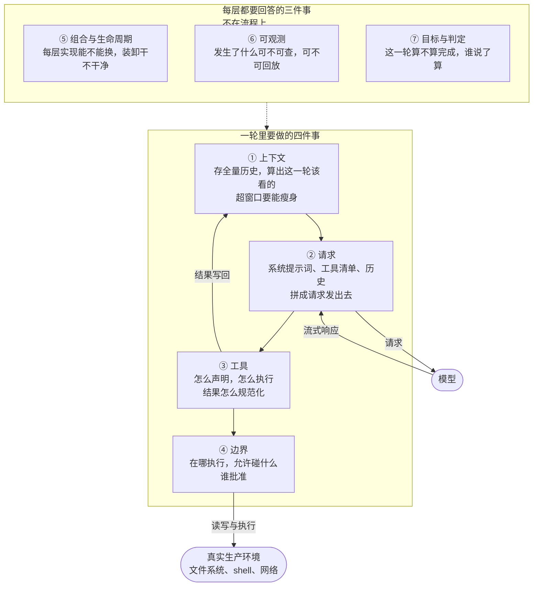

每个 harness 都要处理这七件事，区别只在于怎么处理。下面就是 DeepSeek Harness\(DSH\) 给出的答案。

---

# 上下文篇

这一篇管模型看到什么、忘掉什么

## 决策一：会话存成只增不改的事件流


### 解决什么

这个决策解决的是两个问题:

- agent 出了岔子之后无法复盘。更深一层的原因，是模型曾经看到过什么，没有被当成事实保存下来

- 会话历史既要永远不改，才能支持复盘、审计和分叉，又必须能够压缩，不然长任务迟早会撑满上下文窗口

### DSH 做了什么

DSH 把模型看到过的所有内容都写进一份**只增不改**的会话日志。官方术语叫 **session event log**，界面上叫**轨迹 Trajectory**

系统提示词、思维链、每次工具调用和返回、子 agent 调度、上下文注入，全部在里面。恢复、分叉、检索和回放，共用同一条事件流

### 为什么能解决

这份日志是唯一事实来源。模型最终看到什么，是从日志算出来的，而不是把某份可变历史当成事实

上下文需要瘦身时，系统只向后追加一条声明遮蔽范围的事件，旧事件一个都不动。压缩做了多少次，事实层始终保留全集

复盘可以调出某个 seq，审计可以逐条核对，分叉可以重放到指定位置。三件事共用同一份数据，不需要再维护一套可变历史

### 核心机制

这一层表面上是在存日志，真正做的却是**一份日志加两条投影路径**

一条投给模型，一条投给人。两条路径的规则不一样。下面四个节点，正好对应后面的四个小节

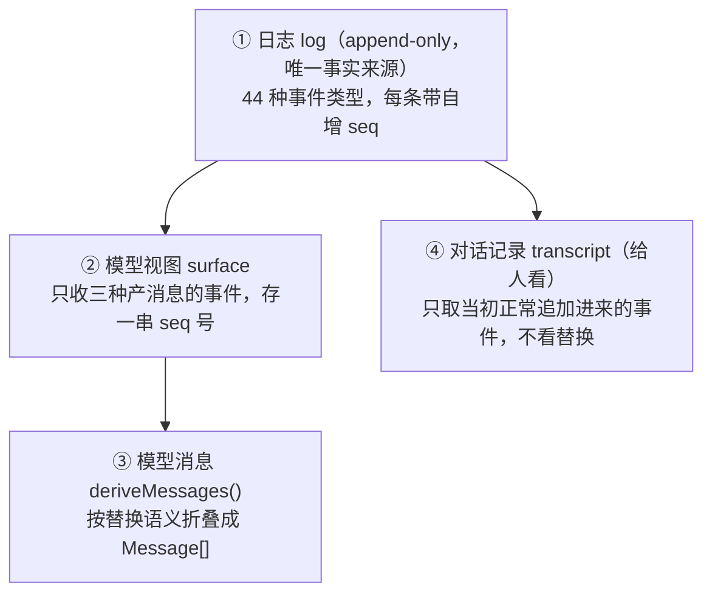

给模型的是 ① → ② → ③，给人看的是 ① → ④

#### 日志

每条日志事件追加进会话日志时，都会得到一个自增的 seq 号。日志采用 append-only 方式，永远不改写

源码里一共定义了 44 种事件类型，挑几类来看

- **对话边界**：`turn/start`、`turn/end`、`step/start`、`step/end`。turn 包住用户一句话到回复完成的整个过程，step 是其中一次模型调用加工具执行。一个 turn 可以包含多个 step

- **对话本身**：`user/message`、`assistant/chunk`、`assistant/message`、`tool/call`、`tool/result`。它们记录模型和用户真正说了什么、做了什么。`assistant/chunk` 记录思维链，`tool/call` 和 `tool/result` 记录工具调用与返回

- **模型请求**：`request/context`、`request/header`。实际发给模型的请求，系统提示词和上下文注入，都在这里留下记录

- **编排**：`subagent/descriptor` 记录子 agent 的身份。事件会落在子 agent 自己的日志里，因此派活关系也能查到

剩下的事件分别属于沙箱模式、审批、待办、目标和压缩等子系统。仓库里的 `docs/persistence-catalog.md` 是从源码生成的完整清单，每条事件都标记了它是否进入 surface，还是只进 log

这里有个坑最好提前避开。`agent/*` 是另一个事件域，`agent/created` 之类的事件属于运行时实时事件，用来观察和拦截正在进行的工作，**不会进日志**

看到 `agent/` 开头，不要顺手把它当成持久事件

#### 模型视图

模型视图在 DSH 源码里叫 surface，指模型实际收到的消息。只有三种会**产生 LLM 消息**的事件可以进入模型视图

- `user/message`

- `assistant/message`

- `tool/result`

`assistant/chunk` 是 token 级回放素材，边界事件也不产生消息，因此都不会进入模型视图

模型视图本身很轻，只保存一串 seq 号和一个计数器

```typescript
interface SessionSurface {
  readonly nodes: readonly number[]    // 模型可见顺序的 seq 号
  readonly replaceGeneration: number   // 替换过几次，可以当模型视图的版本号用
}
```

#### 模型消息，关键在替换而不是删除

上下文必须能够压缩，日志又必须只增不改。DSH 的处理方式是：压缩时不碰旧事件，只追加一条替换事件，说明自己遮蔽了哪一段

替换事件带着 `surfaceOp` 标记进入模型视图。`append` 表示正常追加，`{ op: 'replace' }` 表示替换前面的一段内容

假设 seq5 到 seq8 被 seq9 的替换事件遮蔽

| 日志 seq | 事件 | 模型视图，压缩前 | 模型视图，压缩后 | 模型收到的 Message |
| --- | --- | --- | --- | --- |
| seq1 | `user/message` | 在 | 在 | ① user |
| seq2 | `assistant/message` | 在 | 在 | ② assistant，带上 seq3 的 tool_use |
| seq3 | `tool/call` | 进不来 | 进不来 | 并进 ② |
| seq4 | `tool/result` | 在 | 在 | ③ 工具结果 |
| seq5 | `user/message` | 在 | 被 seq9 遮蔽 | 无 |
| seq6 | `assistant/message` | 在 | 被 seq9 遮蔽 | 无 |
| seq7 | `tool/call` | 进不来 | 进不来 | 无 |
| seq8 | `tool/result` | 在 | 被 seq9 遮蔽 | 无 |
| seq9 | `user/message`，`surfaceOp` 替换 seq5-8 | 还没落盘 | 在 | ④ 摘要 user |

模型视图里的 `nodes` 会从 `[1, 2, 4, 5, 6, 8]` 变成 `[1, 2, 4, 9]`，`replaceGeneration` 从 0 变成 1

日志里的九条事件，一条都没动。压缩做的全部事情，就是在末尾追加 seq9。这就是替换，不是删除

seq3 和 seq7 从头到尾都没进入视图，因为 `tool/call` 不产出独立消息，那次调用挂在 seq2 的 assistant 消息上

代码上可以理解成两个入口加一次折叠

会话运行时，视图就在内存里。来一条新事件，`SurfaceManager` 直接在现有视图上更新，并检查这条事件是否接在视图末尾，不需要回头重算

重启和分叉走另一条路径。内存状态不存在时，系统通过 `foldSurface(events)` 从头重放整份日志，重新算出同一个视图

重启，是进程退出后从磁盘日志重建内存状态。分叉，则是从某个 seq 复制出一条独立分支。两者都建立在同一套折叠逻辑上

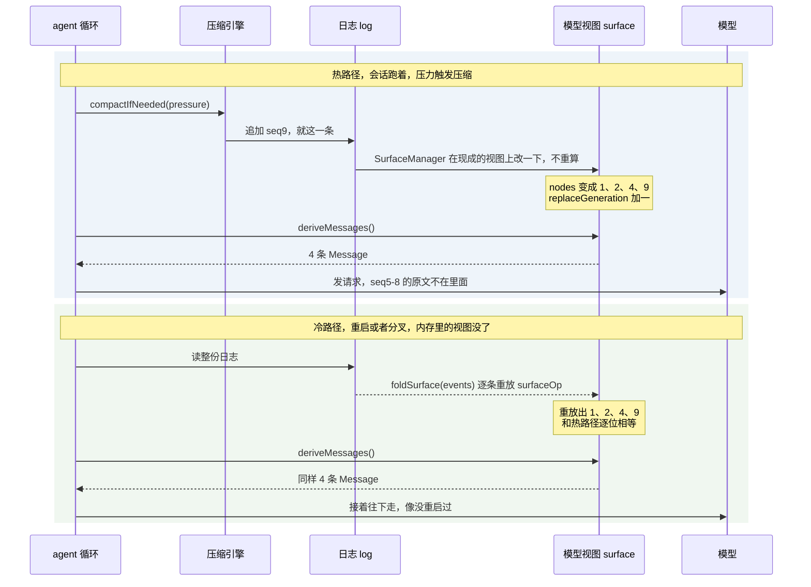

两条入口必须得到同一个 `nodes`。这是这一层最值得拿来断言的等价性，用属性测试可以挡住不少模型视图 bug

这就是“只增不改”和“上下文必须能压缩”同时成立的办法。日志不需要原地修改，也不用额外复制一份可变历史

#### 对话记录，和模型视图分开投影

`dsh-session` 里 `isAppendSurfaceEvent` 的注释写得很直白

> The model-visible surface deliberately shadows replaced ranges, so it is the wrong source for a human transcript — a landed replacement would erase conversation the user already saw. Append-origin events are that transcript's durable source material; replacement copies stay model-only.

换句话说，给人看的对话记录 transcript，只认当初正常追加进来的事件。替换副本只属于模型视图，人看到的历史不会因为压缩而被抹掉

这也是两条投影路径必须分开的原因。模型那条路径需要遮蔽被替换的范围，人看的那条路径不能遮蔽。很多 harness 只做了一条，压缩之后用户往上翻，前面的对话就不见了

DSH 的这份日志同时支撑四件事

- 调试时复盘模型到底看到了什么

- 审计时逐条核对发生过什么

- 训练侧拿真实失败轨迹做分析材料

- 产品侧基于同一份数据做分叉和回放

### 附论，要不要单独做长期记忆

这一节不是四条投影路径之一，更像是决策一自然推出来的问题

既然日志就是记忆，还要不要再做一套长期记忆子系统


> Pi 作者 Mario Zechner: “写代码不需要记忆，代码库就是 source of truth，没必要在它上面再维护一层信息。传统做法是写文档，文档一周就过时，没人读，让 agent 每次从零探索代码库的当前状态才是正路”

DSH 和 Pi 在这件事上选了同一个答案，**不建独立的记忆子系统**

理由不只是省事。在代码库之上再维护一层记忆，维护的往往是一份注定会过期的副本。过期记忆比没有记忆更危险，它会让 agent 拿着旧结论去改新代码，却没有任何信号提醒它重新读取当前状态

真正需要跨会话保留的东西，各自有现成载体

- 会话日志本身就是记忆，重放就是回忆

- AGENTS.md 和 CLAUDE.md 会在会话启动时自动注入，并且跟着代码进入版本控制

- 目标和阶段由 goal 栈持久化

这三样都不需要向量库，也不需要额外设计过期管理

Claude Code 走的是另一条路。CLAUDE.md 有五层分级，另外靠压缩摘要和子 agent 分担上下文。同样没有独立的向量记忆

几家产品在这个问题上的分歧，可能比想象中小。谁都没有真正做一套万能的长期记忆

判断自己该不该做，可以问两个问题

- 任务是否需要跨会话的个性化状态。个人助手需要记住家庭成员信息，这类场景就属于真记忆

- 要记的东西是否有一个会自己更新的载体。代码库、版本控制里的文件、持久化的目标栈都算

如果有这样的载体，就别在它上面再存一份副本。那份副本的过期时间，往往就是你下一次改代码的时间

### 代价

只增不改的另一面，是只增不减。长会话的日志体积和检索成本需要单独治理，这一层没有免费的垃圾回收

事件格式一旦发布，后面改动就意味着迁移全部历史，早期设计得保守一些会更省事

投影逻辑也会逐渐长成新的复杂度中心。日志越干净，“从日志算出模型该看什么”的代码就越重

---

## 决策二：把上下文压缩抽成可换的引擎


### 解决什么

长任务总会把上下文推到上限。压缩逻辑如果直接写进 agent loop，既换不了，也不好测试

### DSH 做了什么

DSH 把压缩逻辑从 Agent Loop 中抽出来，单独做成 CompactionEngine。官方文档把它定义成一条**能力 seam**，和 shell 处于同一级别

seam 可以理解成能整层拆开的边界。接口、实现和消费方分别成包，彼此不直接引用，想换一层时不用连着改两边

### 为什么能解决

核心只规定触发条件、输入输出和事件记录。阈值、保留比例、摘要模型，都交给 Provider

换 Provider 不需要修改 agent 循环。压缩过程也会完整落事件，压掉多少 token、摘要由哪个模型生成，都能从日志里查到。那一次摘要请求，还可以由日志和代码重放

压缩也因此变成了可选能力。不挂这个插件，agent 仍然可以继续运行

### 核心机制

#### 关键组件

DSH 的拆包方式很值得看。四个角色各自一个包，彼此不直接 import

- **接口**，只规定契约和服务名

- **实现**，策略全部放在这里

- **命令入口**，供人手动触发

- **可选剪枝器**

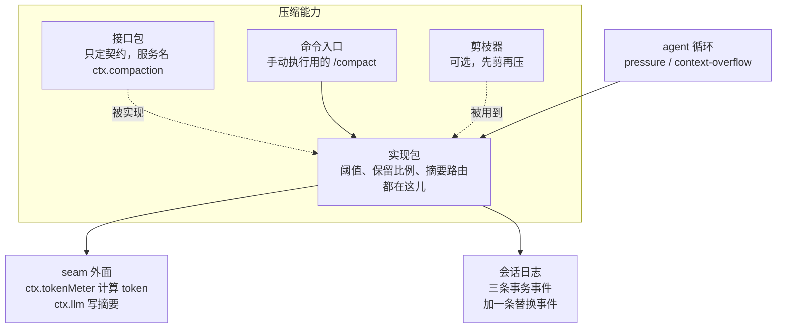

`ctx.` 开头的都是服务名。插件之间通过名字找到彼此，不靠 `import` 互相引用。谁提供、谁消费，由配置决定

这里有两点特别关键

- agent 循环和命令入口都只认 `ctx.compaction` 这个名字。谁实现了这个名字，它们就调用谁。换掉实现，两边一行都不用改

- `tokenMeter` 和 `ctx.llm` 画在框外，说明它们属于别的 seam。压缩只是消费方，计算 token 和生成摘要不由压缩自己负责

自研时可以参考这种四角色拆分。它保证的性质是：想换压缩策略，只需要动实现包，接口、命令和剪枝器都不用动

#### 接口定了什么

引擎接口只有三个动作

- `compactIfNeeded(trigger)` 由 agent 循环自动调用，`trigger` 有两种取值

  - `pressure`：请求发出之前，模型视图当前估算 token 数到达阈值。`ctx.tokenMeter` 会根据折叠后的模型视图，也就是模型下一条实际会收到的全部内容，以及模型上下文窗口来计算

  - `context-overflow`：请求发出之后，完整请求，也就是系统提示词、工具定义、全部历史和新消息加在一起，超过模型上下文窗口，被模型用溢出错误退回

- `compactNow()` 是手动入口，`/compact` 走它，也负责轮次之间的空闲维护。没有可压内容时返回 null，不向日志写入任何东西

- `compactRegion(start, end)` 压指定区间，两端必须落在工具调用和结果已经配对平衡的位置。`compactIfNeeded` 选好范围后，真正负责执行的仍然是它

#### 官方实现怎么压

官方实现是 `dsh-compaction-basic`。一次压缩大致经过这条路径

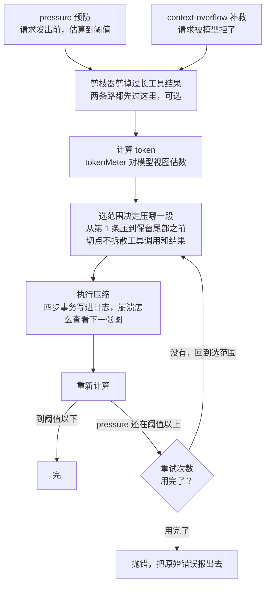

顺着一次压缩往下看，它需要回答三个问题

- **什么时候动手**。压力达到 `thresholdRatio` 才压，默认值是 0.8

- **保留多少原文**。尾部 `retainRatio` 不参与摘要，默认值是 0.16。这条只对 `pressure` 生效，`context-overflow` 会把保留量传成 0，直接压到底

- **谁来写摘要**。`summarizationProvider` 和 `summarizationModel` 可以路由到任意模型，想用便宜的小模型生成摘要，只改这两项

**剪枝器**要放在选范围之前。剪完以后重新计算一次，token 已经够用，就不必生成摘要

剪枝不是删除，使用的仍然是同一套替换语义，因此决策一里的那张表对剪枝同样成立

很多时候，剪枝比压缩本身更有用。长任务的上下文，很少是被对话撑爆的，更多时候是被一次 `cat` 或者一次全仓库 grep 撑爆的。几百 KB 的内容一次性进了窗口，压缩引擎甚至还没有机会触发

DSH 的默认参数可以当成一个起点：单条工具结果超过 8192 字符才开始处理，处理时保留头部 4096 字符和尾部 1024 字符，中间替换成省略标记，另外再用 65536 字节的上限兜底

**选范围**就是决定这次压哪一段，最后得到两个 seq

- 从最后一条往前累计 token，攒够尾部预算，也就是 `retainRatio` 默认的窗口 16%，把这条线定为尾部起点

- 检查这条线是否切断了一对工具调用和结果。若切断，就继续往前挪，直到所有配对都完整

- 从第 1 条压到这条线，区间里的内容全部交给摘要

`pressure` 一轮压不到阈值以下时，会重新选范围再压

#### 怎么记，崩了怎么查

一次压缩是一个事务。DSH 把它拆成四步写进日志

- `compaction/start` 先落盘并拿锁

- 调模型生成摘要

- 写入 `compaction/summary` 和替换事件

- `compaction/end` 释放锁

中途崩溃时，日志会留下一个有 start、没有 end 的遗留锁。这个状态可以被检测出来，系统不会误以为压缩已经完成

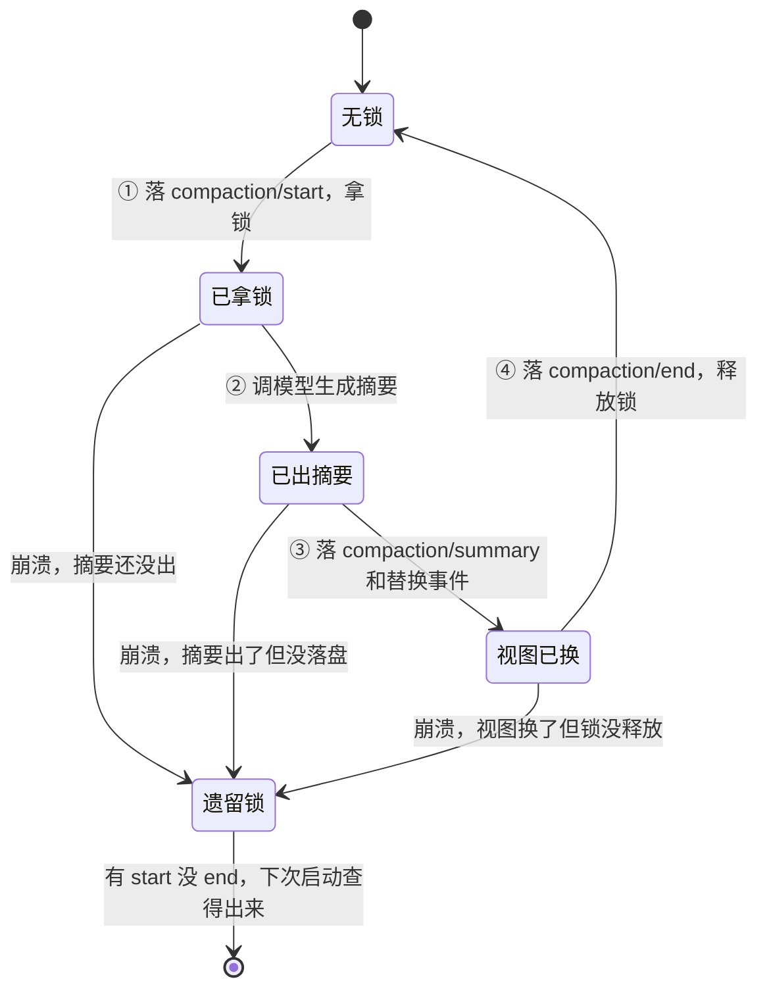

三条崩溃路径最后都指向遗留锁，但日志能够分辨它们。start 后面跟着什么事件，就是系统停在哪一步的证据。恢复时不需要猜“到底换没换”

有两处分工容易混在一起

- **摘要和替换不是同一件事**。`compaction/summary` 只写日志，不进入模型视图。真正替换旧对话的是带 `surfaceOp` 的 `user/message`，遮蔽范围记录在它的 `shadowedRange` 和 `shadowedSeqs` 里

- **可重建性也落在日志上**。`compaction/summary` 记录 provider、model、maxTokens、usage 和完整原始输出。因此那一次摘要请求可以通过日志和代码重放，哪个模型写了摘要，始终有据可查

失败路径也是封闭的。`compactNow` 的失败类别只有六种：`busy`、`cancelled`、`changed`、`summary`、`commit`、`persistence`

调用方可以穷举处理。其中 `changed` 和 `summary` 不会改变模型视图，`commit` 可能停在部分变更之后，`persistence` 表示变更已经闭合，但 flush 失败

#### 和 Pi、Claude Code 比

放在 Pi 和 Claude Code 旁边看，三家走的是三条路

| 维度 | DSH | Pi | Claude Code |
| --- | --- | --- | --- |
| 触发 | pressure，默认 0.8，加 overflow 两种 | contextTokens 超 window 减 16,384 预留即触发 | 自动，接近上限，用户不可见 |
| 策略归属 | Provider 可换，basic 管阈值、保留、摘要路由 | 扩展可完全接管 session_before_compact | 系统内定，PreCompact 钩子只能拦不能换 |
| 切断与保留 | retainRatio 0.16 尾部原文加 tool-pairing 平衡 | keepRecentTokens 两万，四类合法切断点，超长 turn 拆双摘要 | 不透明 |
| 摘要模型 | summarizationProvider 和 Model 可路由 | 扩展里自己挑，常用便宜小模型 | 系统定 |
| 记录 | 三条事务事件加一条替换事件，摘要请求可重建 | CompactionEntry 记 firstKeptEntryId、tokensBefore、usage、文件清单 | 摘要注入上下文，过程不可见 |
| 手动 | /compact | /compact 可带 focus 指令 | /compact |

**Pi 的设计里**，合法切断位置只有 user、assistant、BashExecution 和自定义消息四类，永远不能在 tool result 处切断。工具调用和结果必须待在一起，否则发给模型的消息序列里会出现悬空调用

Pi 还会把带标签的序列化对话交给摘要模型，避免摘要模型把待总结的历史误当成正在继续的对话

**DSH 对应的是 tool-pairing 的平衡配对**，但判断方式不同。Pi 按事件类型划白名单，DSH 按配对计算平衡

扫描模型视图时，工具调用加一，工具结果减一。切点处未闭合的调用数为 0，才算合法

DSH 不使用白名单也有它的原因。替换事件会改变模型视图里的位置，按类型判断容易失效，只看有没有悬空配对更稳

同一个场景，两种判断方式如下

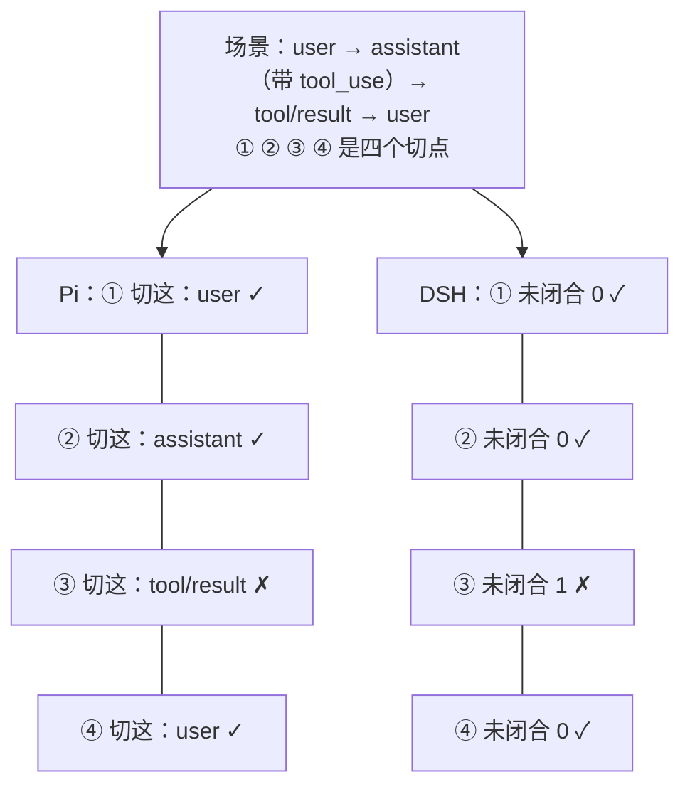

两行结论一样，依据不一样

**Pi 读的是切点处的类型，DSH 读的是切点处的配对计数**

对自研者来说，DSH 这条路的好处很具体。压缩全程都有事件可审计，出了问题可以查到哪个模型写了摘要、压掉了多少 token。这是 Pi 的 hook 和 Claude Code 的黑箱都做不到的

### 代价

多一层抽象，就多一套契约。想写自己的 Compaction Provider，得先把输入输出格式搞清楚

触发策略和摘要策略放在同一个 Provider 里，想只换触发、不换摘要，就得自己再拆一层

压缩引擎是上下文最敏感的组件。参数调坏一次，模型可能多读几万 token，也可能丢掉关键历史。回归测试不能只看短对话，最终还是得靠长任务实测

---

## 决策三：把系统提示词和工具清单当接口管


### 解决什么

系统提示词和工具清单的内容，会明显影响模型发挥。可很多 harness 把它们当成随时可以往里塞东西的自由文本

Claude Code 的提示词超过 1 万 tokens，说明、工具和各种上下文都可以往里叠。问题是，很少有人对整体内容负责

### DSH 做了什么

DSH 把系统提示词和工具清单当接口来管理。内容固化进 preset，修改需要通过快照测试，同时保留一份不加额外内容的裸配置，用来跑分

### 为什么能解决

把**系统提示词**和**工具清单**当成接口，实际是在照顾两件事

**能力**

内容如果偏离模型训练时熟悉的样子，模型就得先花力气适应 harness，再开始干活

**账单**

同一段固定内容，也是每轮请求的缓存前缀。只要它和上一轮逐字节一致，服务端就可以复用

### 核心机制

#### 三家怎么对待这块内容

|  | 系统提示词 | 怎么管 |
| --- | --- | --- |
| DSH | minimal 只有一句话 | preset 固化，快照测试锁内容，`includeRuntimeContext: false` 关运行时上下文 |
| Pi | 不足 1k tokens | 用工程协议约束：启动时把日期、当前目录锁进环境摘要，提示词里不再有会动的字段；历史只往后加，不重写不重排；摘要用 temperature 0 加哈希缓存，同样输入永远同样输出，压完前缀不变；规划模型和执行模型各跑各的会话，各管各的前缀 |
| Claude Code | 1w+ tokens | 用户改不了，前缀围绕 Anthropic 模型设计 |

DSH 和 Pi 都尽量把这两样做小，只是路径不同

Pi 依靠项目外面的工程协议。换一个 harness，这套协议得重新搭

DSH 则把“小”直接做进结构里。preset 就是接口，快照测试保证没人能随手改坏

Claude Code 正好相反，内容最大，用户也改不了

极简模式的 `config/agent-presets/minimal/agent.cordis.yml` 预设如下

```yaml
- id: persona
  name: '@deepseek-ai/dsh-persona'
  config:
    text: You are a helpful software engineer assistant.
    complete: true
    includeRuntimeContext: false
```

整个系统提示词只有这一句。`complete: true` 表示它已经是完整提示词，后续的组装监听器不能再往里面加文字

`includeRuntimeContext: false` 会关闭运行时上下文快照

同一个文件头部的注释还写着，这个预设只包含持久 `bash` 和 `str_replace_editor` 两个工具，压缩功能也被关闭

配套快照测试的名字直接叫 `sends the exact RL prompt and schemas`，发给模型的就是训练时那套提示词和工具格式

#### 能力账，提分

modeltest 的对照实验里有一组受控数据

| 配置 | 环境 | 运行次数与分数 |
| --- | --- | --- |
| DSH minimal | WSL / max | 跑 2 次，99、96 |
| DSH standard | WSL / max | 跑 1 次，91 |

**能够确定的是**：minimal 和 standard 相差 8 分，而区别只在系统提示词和工具清单的内容

两组实验使用同一台机器、同一个思考级别和同一个操作系统

#### 账单，省钱

DeepSeek 的缓存按前缀匹配

每轮请求开头的系统提示词、工具定义和历史对话，只要与上一轮一致，服务端就直接复用，只计算新增部分

前缀里只要放进一个会变化的字段，后面整段内容都可能重新计算

命中率也不需要猜。每次响应的用量字段里都有 `prompt_cache_hit_tokens` 和 `prompt_cache_miss_tokens`

前者除以两者之和，就是这一轮的命中率。DSH 会把命中 token 数放进自己的统计里

自研时接入这个指标并不贵。读取两个字段、算一个比例，大概十行代码。挂成实时曲线后，前缀一旦被污染，现场就能看到变化，不必等到月底再看账单

反面例子是 Claude Code。它的工具列表会受到 MCP server 影响，列表一旦重排，整个前缀都可能变化

permafrost 的实测里，命中率从 71% 掉到 33%

### 代价

把提示词和工具 schema 当接口管理，意味着每次改动都要跑一轮回归，迭代速度会直接慢下来

给跑分保留一份裸配置，也意味着长期维护两套配置和两条测试路径

还要留意一点：这些收益绑定在特定模型上。换模型，或者模型升级换代，原来的优化可能全部失效

---

# 运行时篇

这一篇管运行时怎么搭，以及为什么可以热插拔

这几个决策是连着的

- 决策四把内核拆空

- 决策五处理拆开之后的副作用回收

- 决策六处理插件变多之后的依赖调度

合起来，正好构成一个插件的完整生命周期

## 决策四：agent 循环也是插件


### 解决什么

框架写到后面，最容易遇到的问题就是：哪些东西应该写死，哪些东西应该拆成插件

主流 harness 往往先写一个庞大的核心，把 agent 循环、上下文管理和执行器都放进去，扩展只能挂在外面

Claude Code 的 MCP、skills 和 hooks 都属于外挂。外挂可以给核心加能力，却换不掉核心本身

### DSH 做了什么

DSH 反过来做

内核只留下插件加载、卸载和依赖解析，不保留业务逻辑。模型适配器、工具注册表、会话日志、沙箱、agent 循环和 UI，全都做成插件

这个内核叫 **Cordis**，提供三样东西

- 一棵带作用域的 Context 树

- 一套服务注册和依赖注入机制

- 一个可逆的副作用系统

### 为什么能解决

“改不动”的根源，是核心和扩展并不对等。扩展只能加，不能换，遇到核心假设不对时，只能绕着它修补

内核不再包含业务逻辑后，也就没有需要绕开的东西。换循环、换存储、换沙箱，都变成改配置

官方预设因此只是四份插件清单。增加第五种运行时，不需要重新写 TypeScript，复制一个目录，再改 YAML 就可以

### 核心机制

内核只做三件事：加载插件、卸载插件和解析依赖

插件可以是函数、类，或者带 `apply` 方法的对象。接入时导出 `name`、`inject`、`provide` 和 `Config`，Cordis 会在依赖就绪后调用 `apply(ctx)`

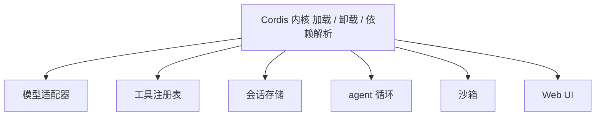

换 agent 循环不用动内核，改配置即可

官方预设就是四份插件清单。极简模式只挂两个工具，`dsh-tool-bash-persistent` 和 `dsh-tool-str-replace-editor`，标准模式挂 14 个工具插件

如果要自定义运行时，就自己组合一份插件清单

插件之间不直接互相引用，而是通过 Context 上的服务名通信。每个插件在 `apply(ctx)` 里 `provide` 自己的服务，再用 `inject` 声明需要的服务

依赖就绪后插件才启动。服务被替换时，相关插件会重新加载

换实现、换循环和换存储，都只需要动配置及对应实现包，不必修改消费方

### 代价

抽象层变高之后，YAML 加插件树的上手成本会超过命令行工具。官方也明确说过，预览期可能存在破坏性变更

TypeScript 运行时的性能，也不如 Rust 单体

还有一个不太容易提前发现的问题。一切皆插件，意味着一切都带着版本

主进程和插件目录各装一份 `@deepseek-ai/*` 时，跨副本的模块单例可能失配。我自己就遇到过一次，工具管线因此整条崩掉

---

## 决策五：让副作用自带撤销键


### 解决什么

插件反复装卸时，只要漏掉一个副作用，就会留下一个泄漏点。热插拔怎样保证干净，是这一步要解决的问题

VSCode 可以算一个反面例子。[**A Programming Paradigm for Spatiotemporal Composability**](https://github.com/cordiverse/paper) 引用了它 2026 年 6 月的市场数据：下载量前一百的扩展里，有 87 个无法在运行时卸载

`deactivate` 钩子确实存在，可它只在宿主进程退出时执行一次，无法承担热卸载

### DSH 做了什么

DSH 把撤销动作放进注册动作里

所有注册都从同一个入口 `ctx.effect` 进入，注册时同时交出撤销方法

### 为什么能解决

副作用漏回收，根源通常是**注册**和**撤销**分散在两个地方。改了注册，忘了改撤销，而编译器看不见这个“忘了”

让同一个调用同时交出注册和撤销，容易遗漏的位置就消失了

### 核心机制

Cordis 注册副作用的标准写法是 `ctx.effect`

回调里做注册，同时交出撤销函数。运行时会把撤销函数收进插件自己的处置列表，卸载时按照注册的逆序执行

DSH 更习惯用生成器写法，边做边交

```typescript
export function apply(ctx: Context) {
  ctx.effect(function* () {
    const timer = setInterval(tick, 1000)
    yield () => clearInterval(timer) // 每完成一步，立刻交出这一步的撤销
  }, 'my-plugin.timer')
}
```

第二个参数是诊断标签。排查某个实例还挂着哪些 effect 时，这个标签很有用

Cordis 自己也这么使用，`ctx.provide('sessions')` 的 effect 标签直接是 `ctx.provide("sessions")`

多步初始化使用生成器，真正的原因在失败路径

如果第三步失败，前两步已经交出的撤销会立即被收走。已经完成的步骤会精确回滚，后面的步骤不需要处理

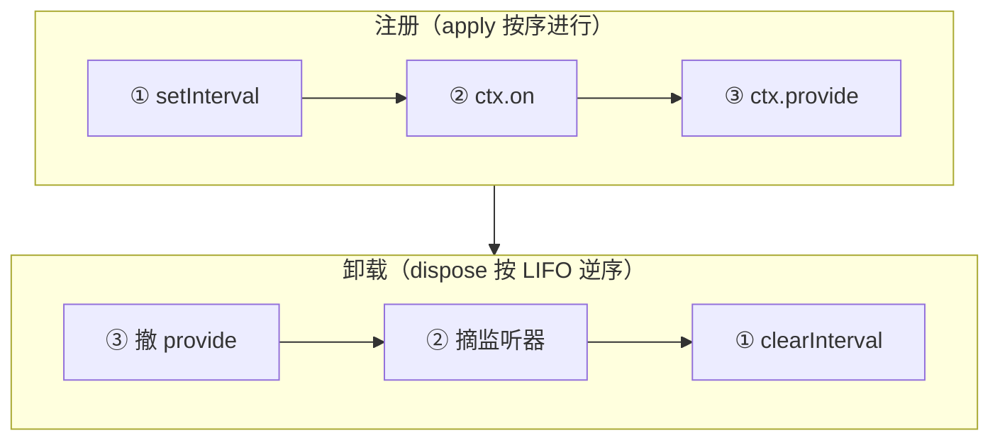

还有两个细节值得留意

- 撤销登记在发起注册的插件实例上，注册表持有方不用替别人清理

- 服务撤销时，先通知消费方并等它们停止，再撤掉自己。这个顺序写在 provide 的撤销函数里

**定时器、监听器、订阅和资源句柄**，全部从这一个入口走

论文把这套机制形式化成可逆效应。每次上下文变换都有对应的逆变换，运行时负责跟踪，组件移除时就把上下文恢复回来

这条经验可以直接变成自研 API 的纪律。凡是注册型接口，包括 register、listen 和 subscribe，都强制接收或者返回一个 cleanup

DSH 在框架层立了一条硬约定：所有注册都经过 `ctx.effect`，连 provide 服务和 `ctx.on` 事件，内部也不例外

### 代价

每个注册型 API 都要维护一条撤销分支，写的时候基本是双倍工作量

Cordis 的处置列表支持异步撤销，卸载因此变成一个可以等待、也可能失败的操作。卸载路径需要单独测试，测试成本自然会上去

最麻烦的是，漏掉一个副作用通常不会立刻报错。它可能等到下一次热重载，才以幽灵监听器的形式出现

因此，这个约束写进类型系统，比写在文档里更管用。否则漏着漏着，系统就会回到 VSCode 的处境

---

## 决策六：声明式定义依赖


### 解决什么

插件多起来之后，启动顺序会变成一件麻烦事

常见做法是把初始化顺序写进代码。A 要等 B 先启动，C 要在 D 之前停止。顺序一旦散落在各处，新增一个插件就得回头改一串启动逻辑

VSCode 在这方面也提供了一个反面样本。它有 `extensionDependencies`，可以声明扩展之间的依赖，可下载量前一百的扩展里，只有 **7 个**声明了对非内置扩展的依赖

原因未必是开发者懒，更可能是 API 没有提供足够好的结构化契约

它提供的互操作方式 `vscode.extensions.getExtension(...).exports` 默认返回 `any`，依赖方拿不到经过检查的接口。即使想依赖，也没有可靠的契约可以依赖

### DSH 做了什么

DSH 不排启动顺序，改成声明依赖

插件在头部写 `inject`，列出需要的服务。剩下的调度工作交给运行时

### 为什么能解决

顺序编程真正麻烦的地方，是这份顺序变成了**隐式的全局知识**

它散落在启动代码中。不把代码全部读一遍，就不知道谁该先启动，也不容易局部修改

声明式依赖把这份信息放回每个插件自己的头部。每个插件只需要说清楚自己要什么，不必知道整个系统的全局顺序

增加插件时，也就不必回头修改启动代码

### 核心机制

核心原则只有一句

**插件只说自己需要什么，不管自己什么时候启动**

启动、卸载和重载的时机，都由运行时根据依赖状态决定

#### 调度规则

- 声明的服务全部就绪后，才启动插件

- 依赖的服务消失后，先卸载这个插件

- 依赖的服务从头到尾都没有出现，插件就一直不启动

写起来只是在插件头部列一行 `inject`

```typescript
export const name = 'session-export'
export const inject = ['sessions']

export function apply(ctx: Context) {
  // 能走到这里，说明 sessions 一定已经就绪，不用自己判空、不用自己等
  const sessions = ctx.sessions
  ctx.on('session/event', (session, event) => exportTurn(session, event))
}
```

#### 依赖变化之后，运行时会主动做事

这一层最大的价值，是依赖变化之后运行时会替你调整

| 发生了什么 | 运行时怎么做 |
| --- | --- |
| 依赖的服务消失了 | 把插件退回未启动状态 |
| 依赖换了实现，比如 shell 从 bash 换成 pwsh | 卸载，然后重跑一遍 `apply` |
| 注册表里换了一个条目，比如换个搜索 provider | 什么都不做，消费方下次调用自然落到新条目 |

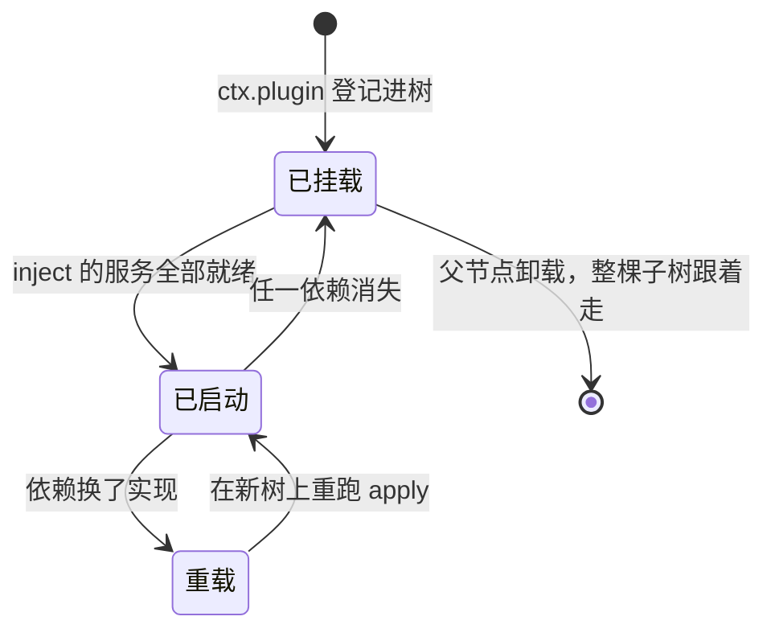

> 论文把这个机制叫**反应式共效应**，和决策五的**可逆效应**是一对。它把动态可组合性拆成两个维度
>
> - 时间维度问：组件移除时，它的副作用能不能完整撤销
>
> - 空间维度问：组件之间的依赖能不能结构化声明和解析
>
> 决策五填时间那一半，决策六填空间那一半。两节看起来是两个独立技巧，放在一起看，其实是同一个问题的两个面

### 代价

重载不是免费的。替换一个实现，会打断所有依赖它的插件里正在运行的东西

Cordis 选择重新执行 `apply`，而不是热替换对象。它用连续性换了正确性

依赖图写错时，插件可能静默不启动。这比直接抛异常更难查，因为日志里可能什么都没有

启动顺序不可预测也会带来一个副作用：日志的时间顺序不能直接当作因果顺序

排查问题时，需要看 fiber 树，而不只是 `tail -f`

fiber 就是每次挂载产生的插件实例，也是生命周期状态机的主体

---

## 一个插件的完整一生

决策四、五、六，覆盖了一个插件从挂载到卸载的完整过程

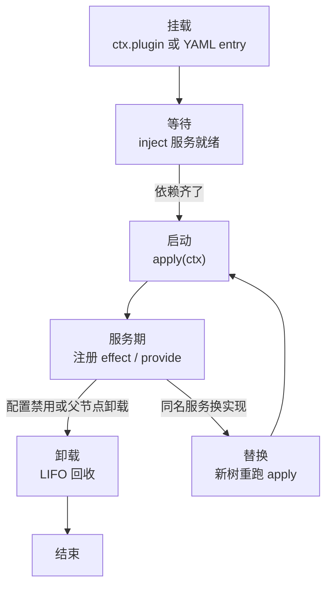

- 挂载。`ctx.plugin` 或 YAML 里的 entry 让 fiber 上树，插件代码还没有开始运行

- 等待。fiber 按 inject 声明等待服务，服务没齐时，它会继续挂在树上

- 启动。依赖齐了，函数插件运行 `apply(ctx, config)`，类插件则通过 `new` 创建对象，构造函数就是启动代码

- 服务期。apply 里通过 `ctx.effect` 注册副作用，通过 provide 占用服务名，其他插件从这时起才能读到它

- 卸载。配置禁用或父节点卸载后，处置列表按 LIFO 回收，先停消费方，再撤提供方

- 替换。同名服务换实现时，旧 fiber 走卸载路径，声明依赖它的插件在新树上重新执行 apply

这里面，等待和卸载由框架负责，启动和服务期由插件作者负责，中间没有隐藏的魔法

这条时间线也解释了三个决策为什么要放在一起看

- 只做决策四，会得到一堆装得上、卸不干净的插件

- 只做决策五，会得到干净，却仍然需要手动排顺序的插件

三条都具备，才真正有热插拔

---

# 安全篇

这一篇管边界划在哪里，以及谁拥有最终决定权

## 决策七：沙箱做成插件


### 解决什么

模型要运行代码，安全边界该怎么划，才能既拦得住，又能根据场景切换

### DSH 做了什么

DSH 把沙箱做成插件

升级阶梯、会话级策略覆盖、执行后端和消费方接入，分别处于不同层级

连 Codex 写死在内核里的 Landlock 启动器，在 DSH 里也只是一个可以卸掉、换掉的普通插件

### 为什么能解决

“能随场景换”依靠插件位置

审不可信代码时，可以选择内核级隔离。日常开发需要按路径谈判，可以使用应用层钩子。切换隔离方案，只需要改一行 YAML，而不是修改一个分支

“拦得住”则不是插件结构本身能够保证的，它取决于具体实现。DSH 发布第二天就公开了四个漏洞，后面会看到这些代价

### 核心机制

几家产品对安全边界的选择并不一样

- Codex 把沙箱做到内核层，macOS 使用 Seatbelt，Linux 使用 Landlock 加 seccomp。模型执行危险操作时，系统调用层面就会拦住，代价是权限基本只有允许和拒绝两种

- Claude Code 在应用层实现权限模式和钩子，粒度更细，可以按工具和路径区分，代价是策略与 agent 位于同一个进程

- Pi 没有权限系统。作者 Mario Zechner 认为权限弹窗会制造疲劳，用户最后往往一路点击允许，不如默认全开。要保护宿主机，就把整个 agent 放进 Docker

沙箱需要回答三个问题

- 允许什么

- 当前是什么模式

- 在哪里执行

DSH 把这三个问题拆成**契约**、**策略**和**实现**三层，再加上一组消费方

| 角色 | 回答的问题 | 里面有什么 | 换掉它要动什么 |
| --- | --- | --- | --- |
| 契约 | 允许什么 | 三级升级阶梯，read-only 只能升 workspace-write 和 danger-full-access；升级必须带 justification 走 fail-closed 审批，等不到同意就算拒绝；拒绝标记统一在这里 | 改规则，全局生效 |
| 策略 | 现在什么模式 | 会话级模式覆盖，切换落 `sandbox/mode` 日志事件；每次调用都带上当前模式和工作区根 | 只改会话级行为 |
| 实现 | 在哪里执行 | 本机执行、Windows ACL、内核级 Landlock 各一份 | 只换执行方式 |
| 消费方 | 接入 | 按 shell 与文件系统分别接入，对工具完全透明 | 什么都不用动 |

三个问题各归各的层，改动就只碰一层，其他层不用跟着改

消费方甚至不知道沙箱存在。换隔离方案，只需要改一行 YAML，不必修改业务代码

对照 Codex 就很容易看出这个拆法的分量

Codex 把三个问题合并进一个内核，权限只有允许和拒绝两种。DSH 拆开之后，连内核级 Landlock 实现也只是可以卸掉、换掉的普通插件，社区已经出现了多个替代后端

**这一层可能是全文最值得借鉴的结构之一**

安全需求大概率会变，而三层拆开之后，每次变化只碰一层

工具管线在执行前后各留一个事件，`tools/pre-execute` 和 `tools/post-execute`，中间是 `tools/execute`

另外，`ctx.tools.guard()` 会注册一个守卫 `guard`。它是工具调用的门卫

模型每次调工具，管线在 `pre-execute` 之后、真正执行之前询问它。守卫根据策略决定放行、拒绝，或者要求升级

```typescript
guard(guard: ToolGuard): () => void
```

拿一个具体场景来看

模型先读文件，再改文件。第一次调用处于 read-only 模式内，直接放行。第二次操作超出当前模式，进入升级审批

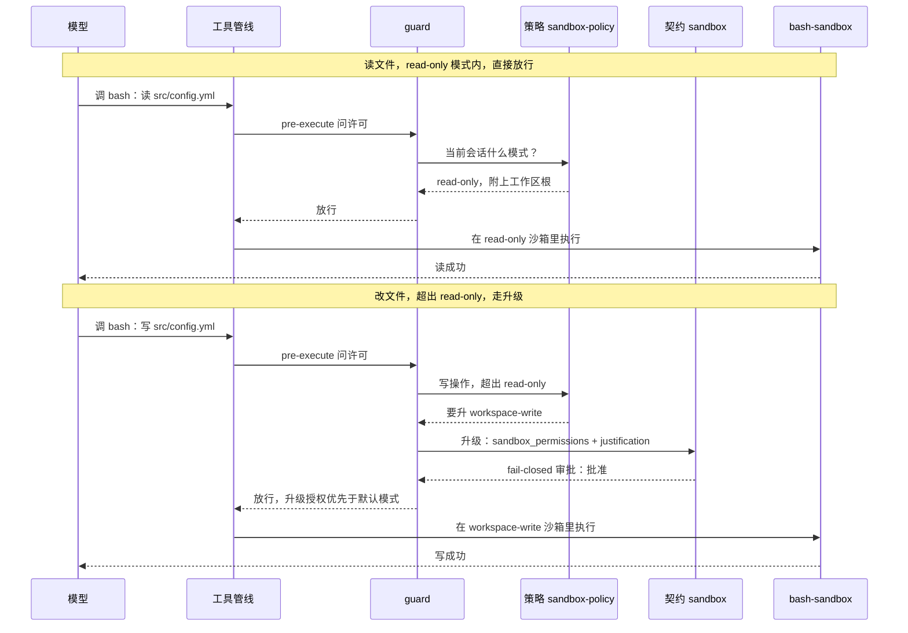

这条链路走完，七个包各自的位置就清楚了

沙箱不是一堵始终存在的墙。模式在每次调用时确定，隔离也跟着每次执行走

### 代价

这套设计既是结构承诺，也是它的两个弱点

- **可替换意味着没有唯一的威胁模型**。每换一套隔离方案，都要重新审计。这个成本很真实：发布第二天，社区就公开了四个漏洞的实录。read-only 被证明可以全盘读取，动态插件可以逃逸 vm 直达宿主进程，审批升级没有绑定具体命令，workflow 工具可以绕过沙箱模式。面对半可信模型，每一层边界都需要按照“可能被诱导”的假设重新审视

- **可配置意味着配置也可能把安全机制关掉**。DSH 的 [postmortem 0002](https://github.com/deepseek-ai/deepseek-harness/blob/47f943859bef60e4160492346772ded9b24f765a/docs/postmortem/0002-js-expression-disabled-filesystem-tools.zh.md) 就栽在这里。它使用 `disabled: !!js <表达式>` 条件启用文件系统插件，但 Cordis 只会对插件 config 求值，`disabled` 字段并不求值。结果是每个插件都被永久禁用，却没有任何报错，快照测试也照常通过，直到七个场景全部得到 `UNKNOWN_TOOL` 才发现问题

---

## 决策八：凭据只存引用，审批默认拒绝


### 解决什么

这一节回答两个问题

密钥放在哪里，才不容易泄漏

危险操作到底由谁决定

两件事放在同一个决策里，是因为它们在 DSH 里属于同一个安全面

沙箱负责隔离，审批负责授权，凭据负责 secrets 的流通。三块都做成可替换接口

### DSH 做了什么

密钥不会直接写进配置。配置里只放一个名字，真正的值交给 Provider

审批也不是随便问一句。每次请求都会留下成对的审计事件，结果只有四种

### 为什么能解决

配置和日志里从来没有密钥值，想泄露也没有现成的值可泄露

审批默认采用“没有等到同意，就按拒绝处理”的规则。没人值守时，系统会停下来，不会自行放行。这就是 fail-closed

### 核心机制

#### 凭据

凭据这条约定很简单：**配置里只写引用**

比如 `DEEPSEEK_API_KEY` 这样的名字，真正的值由 Provider 管理，每次使用时现取

换 key 不需要重启插件，配置和日志里也看不到真实值

还有一条全局规则：**空串等于没有配置**

它永远不会被当成一把真正的密钥

#### 审批

每次审批都有一个 ApprovalRequestId，将 `approval/asked` 和 `approval/decided` 两个事件绑成一对

结果只有四种：`allowed-once`、`rejected`、`cancelled`、`unavailable`

`allowed-once` 是一次性授权，用完就失效

调用方遇到 `unavailable` 时，按拒绝处理

**等不到回答，就当作不同意**

这个封闭结果集让审批可以测试、可以审计。配合决策七里的 guard 注册，安全策略的注册与撤销也都通过 effect 完成

两条机制在运行时串成一条链

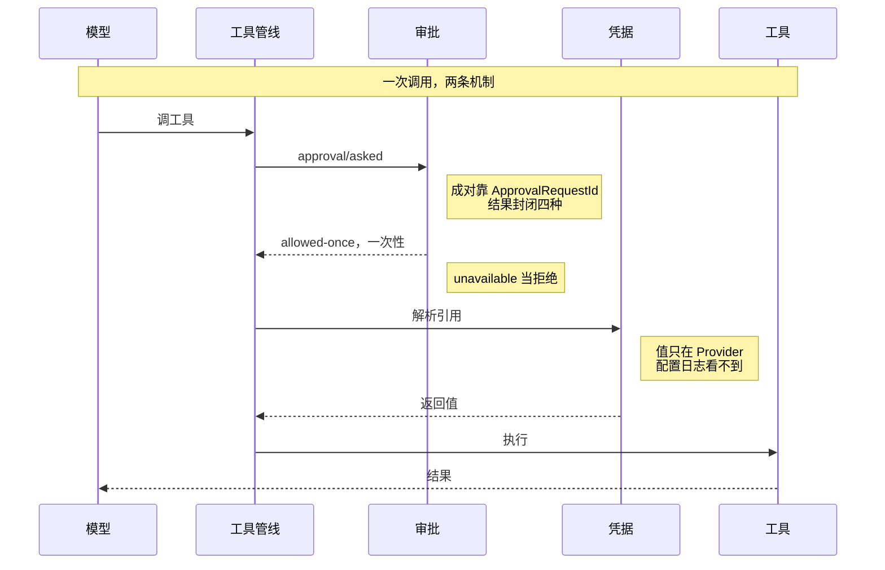

### 代价

引用模型要求所有配置入口都改成“先引用、再解析”两步

原来直接读取环境变量的旧代码，需要重新改写

审批结果集是封闭的，不能随手增加自定义状态。想实现“这次允许，以后也记住”，需要在外层再包一层

fail-closed 的代价也很明确：没人值守时，所有需要授权的新操作都会停下来

自动化场景需要提前想清楚，哪些路径可以走预设

---

# 自进化篇

这一篇管怎么让系统安全地改自己

这里只有一个决策，因为“让模型改自己的运行时”在 DSH 里并不是一个独立模块，而是前三篇机制的一次合流

- 回滚能力直接来自决策五的可逆效应

- 目标持久化直接建立在决策一的事件流上

## 决策九：自进化建立在可回滚之上


### 解决什么

让模型修改自己的运行时，怎样保证改坏后还能回滚

一个会持续修改自身组件的运行时，如果每次改动都要重启，进程里的状态会全部丢失，正在执行的任务也会反复中断

更麻烦的是，一次失败的自我修改，可能把用来恢复自己的机制一起改坏

### DSH 做了什么

DSH 分成三层

| 层 | 是什么 | 作用 |
| --- | --- | --- |
| 可逆效应 | 决策五的 `ctx.effect` | 撤销只是一次卸载，不需要重启，进程状态不丢失，保证改动可以干净撤掉 |
| 创造模式 | `cordis` 预设，桌面端界面上叫 **Creator mode** | 模型修改 YAML 里的插件行，而不是直接改代码，让模型可以在运行中的环境里检查插件、尝试加载和卸载 |
| 目标栈 | 每次变更落一条 `goal/change` 持久事件 | 把目标与阶段记录成持久事件，撤销之后仍然知道自己在做什么、跑到了哪一轮，可以继续工作 |

### 为什么能解决

自我修改被压到配置层，实际改的是 YAML 数据

插件的装卸交给 Loader，撤销交给 effect。改坏之后，代价被限制成一次卸载，不必重启，进程里的状态也不会丢

### 核心机制

整个回路可以这样看

改配置，装上，判断改对没有。对，就留下。不对，就整套撤掉

拿一个具体场景来说：模型在创造模式里给自己加一个 web 搜索工具

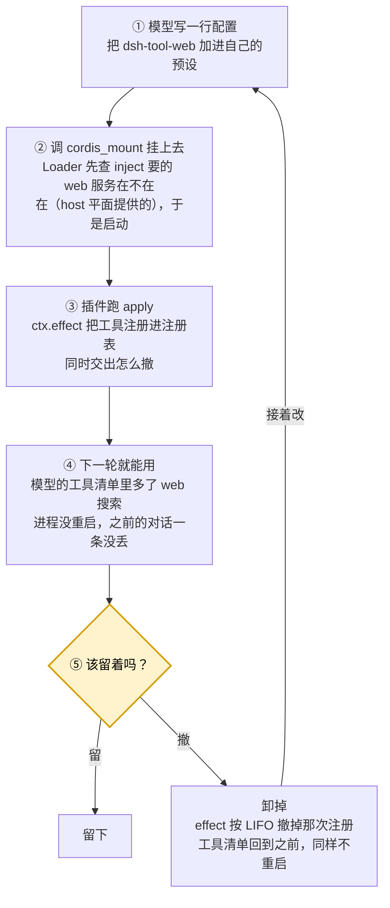

这条路径上有三处值得留意

Loader 会先检查依赖，而 `web` 服务留在 host 平面，工具行则放在预设里。这正好展示了“模型可以改什么”的实际边界

插件执行 `apply` 时，撤销登记就是决策五里的那套机制

从工具出现到决定是否保留，中间没有任何重启。之前的对话历史和正在执行的任务都还在

这就是把自我修改压到配置层的全部好处

#### 模型能改什么，结构里划死了

让模型改自己，先要决定哪些东西它不能碰

DSH 把所有插件行分成两堆，官方称为两个**平面 plane**

|  | 放什么 | 谁能改 |
| --- | --- | --- |
| **host 平面** | 跨会话共享的东西：持久化存储、沙箱与审批栈、模型路由、子 agent 注册表，以及目标机制本身 | 只有人 |
| **agent 预设** | 单个会话自己贡献出去的东西：工具清单、persona、提示词片段 | 创造模式里模型可以写 |

划分标准只有一条，写在预设注释里

**凡是要向别人提供服务的行，归 host 平面。只影响自己这个会话的内容，才可以放进预设**

拿 goal 举个例子

目标机制整个在 host 平面。目标存在哪里、轮次怎么计算、`/goal` 命令怎么响应，模型一行都不能改

预设层能决定的只有一件事：这个 agent 的工具清单里要不要放 goal 工具

分工也就清楚了

**模型可以申报“我完成了”，却不能修改“什么条件才算完成”，也不能删掉已经记录下来的目标**

这条判据可以直接拿去做自研设计

#### 谁来判断该不该留下

| 谁在判 | 判什么 | 能判出来的 | 判不出来的 |
| --- | --- | --- | --- |
| Loader 与依赖解析 | 配置装不装得上 | YAML 语法错误、同名服务重复 provide 会直接报错 | 依赖不齐时插件静默不启动；配置字段没有被求值也不报错 |
| 干活的 agent 自己 | 目标算不算完成。没有门槛，只有提示词里一句 Mark complete only when the objective is actually achieved | 它愿意承认的失败 | 它不愿意承认的失败 |
| 人 | 值不值得留下 | 什么都能判，前提是他真的去看了 | 没人值守时等于没有这一层 |

#### 结构没管住的两处

创造模式给了模型一个 `cordis_mount` 工具，用来把刚写好的 composition 挂到正在运行的插件树上

Cordis 配置允许写 `!!js` 表达式，这些表达式会在加载时由宿主进程求值

因此，“模型写一份 YAML，再调用 `cordis_mount` 挂上去“这件事，实际效果是**让模型写的一段 JavaScript 在 harness 进程里执行**

看上去像改配置，做的却是执行代码

官方的信任声明，正是针对这一点。这里有两层风险

- **这段 JavaScript 运行在 harness 自己的进程里，绕过了决策七的沙箱**。模型如果想读取 `~/.ssh/id_rsa`，通过 bash 工具时要先过 guard，要检查当前是否为 read-only，超出模式还要走审批升级。换成写进 `!!js` 表达式再挂载，这条检查链就不在路径上了。这个执行环境确实有一个沙箱，可官方注释也明确说，它不是安全边界，只隔离全局对象，保护的是诚实代码。决策七代价里公开的四个漏洞，其中一条就是动态插件逃逸 vm 直达宿主进程，这个风险已经发生过

- **它写出的内容会留在磁盘上，之后的会话可能把它当配置文件加载**。创造模式的产出是一个预设目录 `~/.dsh/.agent-presets/<id>/`，里面有一份 `agent.cordis.yml`。周一，会话 A 让 agent 起草了一份预设，之后会话 A 关闭。周四，同事在会话 B 中挂载这个预设，Loader 按照插件行一项项加载，里面的 `!!js` 也会一起求值，中间没有再次询问这份 YAML 到底写了什么。会话 A 里的 shell 级权限，到会话 B 看起来已经变成了一个普通配置文件。光隔离会话还不够，落盘预设在被别人挂载前，仍然需要人工检查

### 代价

按上面的两层风险看，创造模式等于把 shell 级权限交给了模型

这不是调几个参数就能收紧的东西，隔离会话也只挡住了一半

撤销一个坏配置很容易，撤销一个已经被写坏的文件就难得多。effect 管不到进程外的世界

goal 栈带来的持久轮次上限也有代价

它让长任务能够续下去，也让一个已经跑偏的目标可能继续很久。上限计算的是轮数，不是 token、时间和费用

**可逆性只保证机制干净，不保证语义正确**

决策七里提过的 postmortem 0002，就是这个结论的实例

它走的是上面那张图里的同一条回路，编号也对应得上，只是每一步都偏了一点

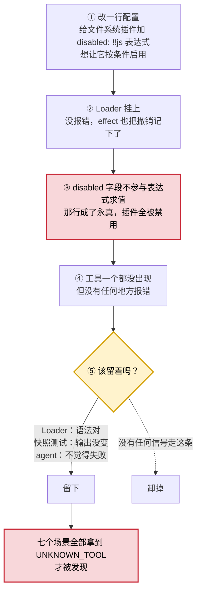

两张图的前四步形状几乎一样，差别都在最后那个判断点

成功那次，是人确认它确实有效，于是留下

这一次，三个可能发现问题的地方都亮了绿灯，而且每一个都没有违反自己的职责

Loader 只管配置语法，语法确实正确

快照测试只断言输出没有变化，输出确实没有变化

agent 只申报自己认为的失败，它确实不觉得失败

撤销路径始终存在，effect 早就记下了怎么撤

失败的不是回滚能力，而是没有任何信号告诉系统应该走回滚

这次改动是开发时人改的，不是模型改的。但回路完全相同，判断点对人和模型一样脆弱

这一节的代价，可以压缩成一句话

**可组合性给你的是撤销能力，不是正确性**

---

# 决策之外，实现层面的机制

上面九条是架构决策。下面几条属于实现层面的机制

## 事件分发不止一种语义

多数人写扩展点时，会从一个 `emit` 开始。很快就会发现，需求并不只有“通知”这一种

有些钩子需要修改数据，有些需要拦住流程，还有些需要等待所有监听器完成

Cordis 把 `ctx.events` 的七个方法混入到 `ctx` 上，其中五个负责分发，两个负责注册

| 方法 | 语义 | 什么时候用 |
| --- | --- | --- |
| `emit` | 触发即返回，不等结果 | 通知类，没人关心返回值 |
| `parallel` | 并发跑完所有监听器再返回 | 要全部完成，顺序无关 |
| `serial` | 顺序执行，一个接一个 | 有副作用顺序要求 |
| `bail` | 顺序执行，谁先返回非空就停 | 责任链，第一个能处理的接管 |
| `waterfall` | 顺序执行，上一个返回值交给下一个 | 需要逐层改写数据 |
| `on` / `once` | 注册与一次性注册 | 内部就是 `ctx.effect`，跟插件一起卸载 |

`bail` 和 `waterfall` 是其中最能拉开差距的两个

审批、路由和权限判断适合用 `bail`

提示词组装、消息改写和配置合并适合用 `waterfall`

Cordis 自己的服务解析，就运行在 `waterfall('internal/get')` 上

只有 `emit` 的事件系统，最后很容易退化成一堆口头约定

比如，“这个监听器必须在那个监听器之后注册”

分发语义不够，顺序耦合就会从代码里转移到文档里

---

## 工具定义的结构

DSH 的 `defineTool` 把一个工具拆成几块

```typescript
defineTool({
  name: 'greet',
  description: 'Greet someone by name.',   // 发给模型的说明
  parameters: { /* 逐属性 schema，编译成隐式开放对象根 */ },
  output: {
    schema: { type: 'string' },            // 对每个成功返回值强校验
    render: (args, value) => [{ type: 'text', text: value }],
    presentationMeta: (args, value) => ({ /* 可重放的展示元数据 */ }),
  },
  timeoutMs: 30_000,                       // 协作式超时预算
  isConcurrencySafe: args => true,         // 纯分类器，能否并入并行组
  async execute(args, exec) { /* 干活本体，exec 带取消信号与嵌套信息 */ },
})
```

这里有三个设计点

- **执行和呈现分开**。`execute` 返回规范值，`render` 是纯函数，把规范值投影成模型看到的内容块。回放轨迹时，不必重新运行工具

  - 比如读文件工具，`execute` 从磁盘读出 `{ path, content }`，`render` 决定模型看到什么。content 超过 4096 字符时，就截断并加省略号。回放轨迹只需要把保存下来的规范值交给 `render`，不必再次读取磁盘。同一个规范值还可以投影出两种样子，给模型看截断版，给人看全文

- **输出有 schema 且强校验**。即便返回值被策略替换，也要经过同一个 schema。这堵住了“守卫改写返回值，导致下游类型崩掉”的问题

  - 比如决策七里的 guard 在放行时可能改写返回值，把工作区真实路径替换成沙箱别名。改写后的值仍然要经过 output schema。该是 string 的内容一旦变成其他类型，就会当场报错，而不是让下一个工具拿着坏对象继续运行

- **并发安全需要声明**。`isConcurrencySafe` 是一个纯分类器，调度器根据它判断本次调用能不能和兄弟调用并成一组，而不是让每个工具自己加锁

  - 比如模型同时调用 `read_file` 和 `search_files`，两个工具都声明 `isConcurrencySafe: true`，调度器就能把它们并成一组一次发出。写文件工具不作这个声明，调度器就单独发送。不使用这一层的话，每个工具都要自己写锁，而锁恰恰是最容易写错的地方

---

## agent 循环的扩展点在哪

既然循环本身是插件，就必须暴露扩展点，否则等于没有拆

官方文档用一句话定了性：事件就是扩展点

DSH 的扩展点分成三组，名字也可以直接拿去参考

- **循环级**，`agent/session-start`、`agent/pre-step`、`agent/request`、`agent/request-error`、`agent/turn-stopping`、`agent/error`、`agent/status`、`agent/created`、`agent/disposed`

- **工具级**，`tool/call`、`tool/result` 负责记录，`tools/pre-execute`、`tools/execute`、`tools/post-execute` 负责管线，`tools/list`、`tools/change` 负责注册表变化

- **会话级**，`turn/start`、`turn/end`、`step/start`、`step/end`、`session/event`、`session/projection`。压缩是一个事务，使用 `compaction/start`、`compaction/prune`、`compaction/summary`、`compaction/end`

两个地方值得单独看

**压缩被做成了有明确开始和结束的事务**

它不是一个普通函数调用，因此其他插件可以知道“现在正在压缩”，并据此让路

<strong>`agent/turn-stopping`</strong>** 说明这一轮该不该停，是一个可以由插件参与的判断**

它不是循环内部写死的一个 if

想加“测试通过之后才停”这类策略，不需要修改循环

另外还有 `agent/inbox/inserted`、`claimed`、`discarded`、`spliced` 四个事件

用户在 agent 工作过程中插话，本质上是队列语义问题。DSH 把它做成显式收件箱，而不是一个可变字段

插入、认领、丢弃和拼接，各自都有事件

自研时，这块最容易先写成“覆盖一个 pendingMessage 变量”，最后在并发条件下出问题

---

## 多 agent 共用一个进程，怎么互不干扰

一个进程里同时运行多个 agent 和子 agent，第一个问题就是注册会不会串

`dsh-scope` 给出了一条双向规则，我觉得这是整套设计里最精巧的地方之一

- **注册可见性沿父链向下继承**。子作用域可以看到祖先注册的服务

- **事件准入沿父链向上扩展**。挂在祖先作用域上的监听器，可以收到所有后代作用域的事件。反过来不行，事件只向上流，不向下泄漏

用法是 `createScope(ctx, key)` 拿到一个带标签的 `ctx`，再用 `scopeTarget(subject, key)` 创建一个只负责路由的事件载体

`key` 是只按身份比较的不透明对象

理由其实很简单

常驻的编排层可以观察它下面每一个被组合出来的 agent，而 agent 之间彼此看不见

没有这条规则，多 agent 通常只剩两种选择

要么全局广播，彼此污染

要么完全隔离，编排层什么也看不见

还有一个实现细节

作用域销毁需要等到完全静止。`fiber.dispose()` 之后，还要持续轮询 `fiber.inertia`，直到它变成 `undefined`

异步撤销加上多 agent 之后，“卸载完成”本身就变成了一个需要等待的状态

决策五的代价，在多 agent 场景里会被进一步放大

---

## 子 agent 的三种隔离级别

DSH 把子 agent 做成一条独立的能力 seam

子 agent 完成工作后，结果需要能够接回主 agent 的执行流，官方术语叫 continuation service

派出子 agent 之前，还要先想清楚一个更基础的问题

**子 agent 和父 agent 的上下文，需要隔到什么程度**

| 隔离级别 | 子 agent 看到什么 | 什么时候用 |
| --- | --- | --- |
| 共享上下文 | 和父 agent 使用同一份上下文 | 只想分工，不想重新交代背景 |
| 独立进程 | 干净的空上下文 | 担心污染父上下文，或者确实需要并行 |
| 克隆父会话 | 父会话在分叉点的完整副本 | 希望子 agent 从当前状态继续探索，却不影响主线 |

这三种都是进程内方案，也有一些变体会把 ACP、Codex 和 Claude Code 等外部协议接进来，作为子 agent 使用

选哪一级，取决于子 agent 的产出是否需要写回父上下文

需要写回，就要考虑它会带回多少 token

第三级最危险，因为它启动时就复制了一份完整历史。两边各自运行一段时间后，token 消耗也会跟着翻倍

对比来看，Claude Code 的子 agent 更像黑箱，派出去之后内部过程不可见

Pi 没有内置子 agent。要并行，只能自己 spawn 一个进程

DSH 选择了折中路线

子 agent 是插件树上的一部分，和主 agent 共用事件流和审批

再加上前面提到的作用域规则，编排层看得见每一个孩子，孩子之间却互相看不见

---

# 附赠，官方把踩过的坑写成了规则

DSH 的 docs 里有一份 defensive-patterns 文档，列出七条规则。每一条，都对应一类真实发布过，或者差点发布的缺陷

上一节的五条，是你很可能自己发明一遍的机制，属于设计题

这一节的七条，是你很可能自己踩一遍的坑，属于防御题

七条规则全部列在这里，前文已经展开的内容，在表里标出了位置

| 官方规则 | 要点 | 前文 |
| --- | --- | --- |
| 正交结果独立上报 | 超时的进程退出码可能是 0，timedOut、signal、exitCode 各报各的 |  |
| dispose 完全停稳 | 发完终止信号要等子进程真正退出，先关监听器再关进程 |  |
| 分发器隔离回调异常 | 一个坏订阅者不能饿死排在后面的监听器 |  |
| 凭据不进命令环境 | 剥掉 KEY、SECRET、TOKEN、PASSWORD 环境变量，临时文件 0700 随机名 |  |
| 配置表达式限定位置 | `!!js` 只在 config 字段求值，写进 disabled 是静默的 truthy 对象 | 决策七代价 2 |
| 服务撤销先通知消费方 | provide 的撤销函数里先让依赖方停妥，再摘掉自己，否则消费方握着已死引用 | 决策五 |
| 跨副本单例用全局符号 | 同名包在宿主和插件目录各装一份时，非全局 Symbol 会让同一个服务被认成两个 | 决策四代价 |

我读下来，这七条更像是在拆同一种东西

**“看起来成立”和“实际上成立”之间的那道缝**

退出码 0 看上去是成功，实际可能是进程被超时杀掉

发出了终止信号，看上去是停了，实际子进程还在运行

`!!js` 表达式看上去会求值，实际那个字段并不参与求值

同名 Symbol 看上去是同一个，实际却来自两个副本

每一条背后，都像是有人把未经验证的假设，当成了已经成立的事实

harness 撞上这类缝的机会，比普通软件更多一些

原因可能就在“一切皆插件”

运行时里同时存在许多互不信任、生命周期不同步、版本也可能不一致的参与者

任何一句“我以为它已经……”都可能在某个边界上变成事故

这算是决策四需要支付的账单之一

跨副本单例那条，是我自己遇到过的，值得完整说一下

宿主装的是 rc.5，插件目录被一次 `pnpm install` 提升到了 rc.6

工具管线拿着自己那份 `Symbol()`，去另一份副本的对象上取调度器，结果拿到 `undefined`，整条工具调用直接崩掉

改成 `Symbol.for` 就没有这个问题

Cordis 自己的 `Symbol.for('cordis.isolate')`，就是这样写的

配置表达式那条事故，已经在决策七的代价里讲过

这里补一条官方的后续动作

他们后来立了复盘判据：隐蔽、系统性、重新发现代价高

三条同时满足，才值得专门写一份复盘

把缺陷写成规则，再把规则挂回测试，这个习惯的收益，通常比修掉某一个 bug 更远一些

---

# 结语

读完 DSH 的九个决策点，最容易记住的可能是“一切皆插件”。可真正值得带回去的，不是这句口号，而是它背后的取舍

把 Agent Loop、会话日志、压缩、工具、沙箱和 UI 都放到可替换的边界里，换来的是组合自由，也带来了依赖、版本、回滚和审计上的额外负担。系统没有因为模块拆开就自动变得可靠，边界越多，越要认真验证每一个“我以为它已经完成”的假设

自研 harness 时，不必照着 DSH 的目录结构复刻一遍。更实际的做法，是先问清楚几个问题：模型下一轮到底看到了什么，工具结果能不能重放，插件卸载后副作用是否真的消失，权限没有得到回答时系统会不会停下来，目标完成之后又由谁来判断

这些问题没有统一答案。答案会受模型、任务、成本和风险影响

可一旦把它们写成明确的接口、事件和不变量，harness 就不再只是包着模型的一层胶水，而会成为 Agent 能力真正落地的那部分系统

DSH 这份设计最值得借鉴的地方，也许正在这里：先把那些容易被藏进循环里的决定摊到桌面上，再决定哪些东西值得做成插件，哪些东西必须留在边界里，哪些判断不能交给正在干活的 agent 自己完成

剩下的，才是实现问题