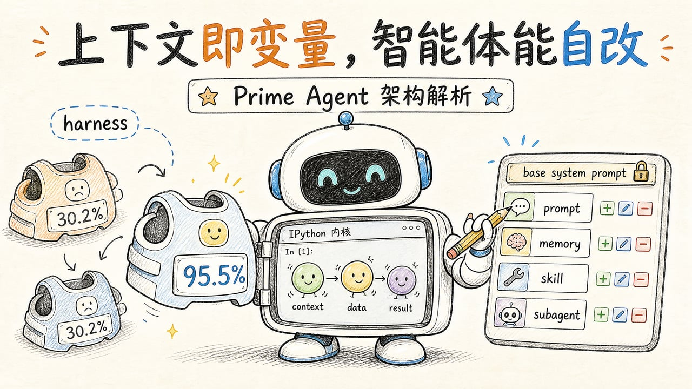
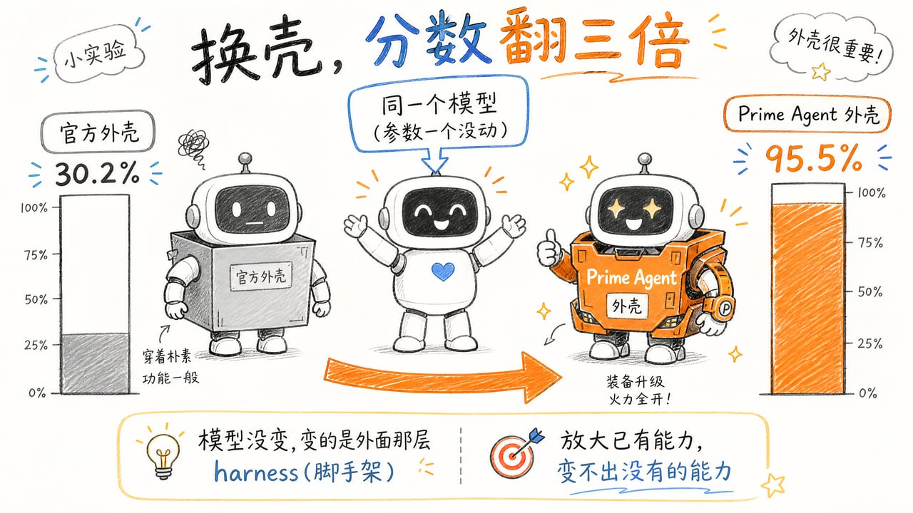
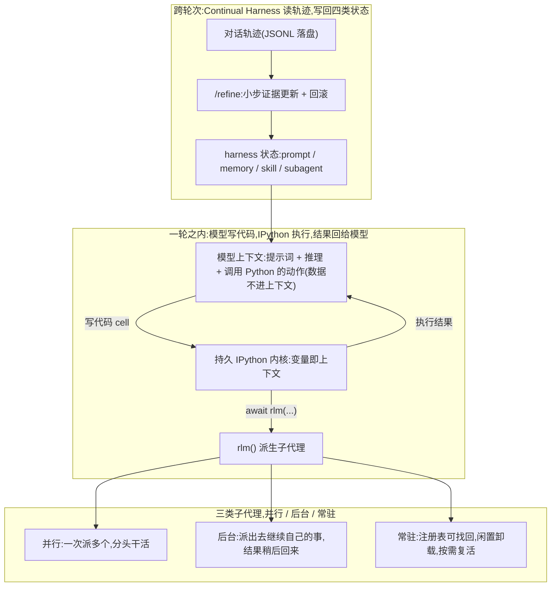
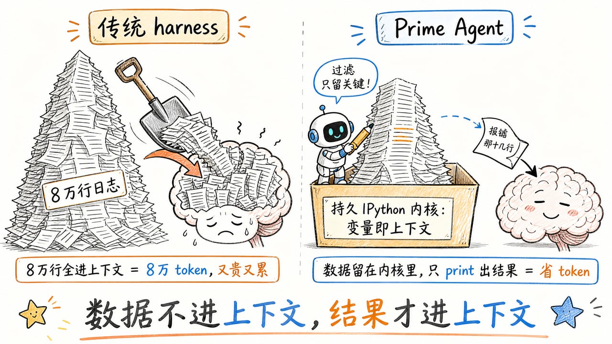
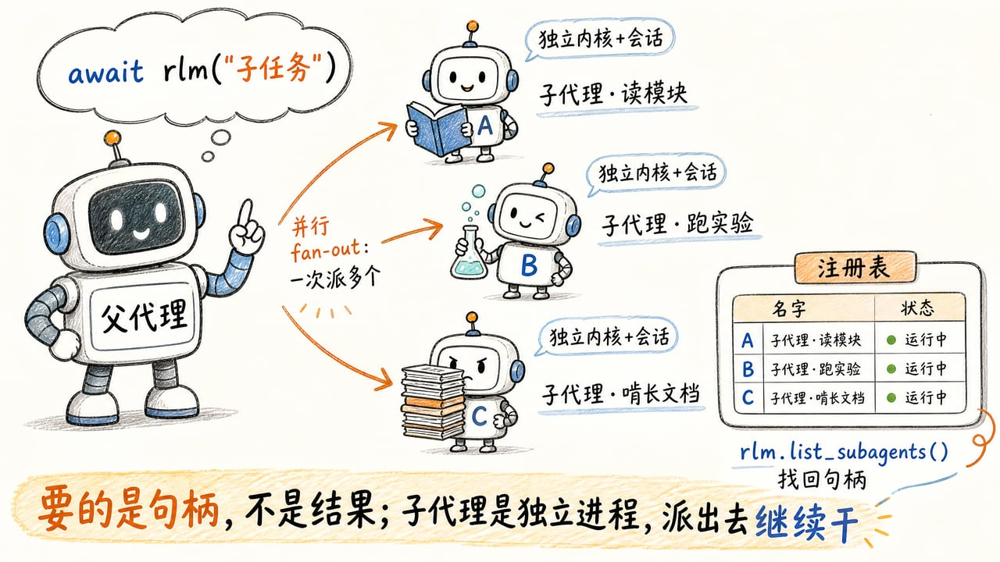
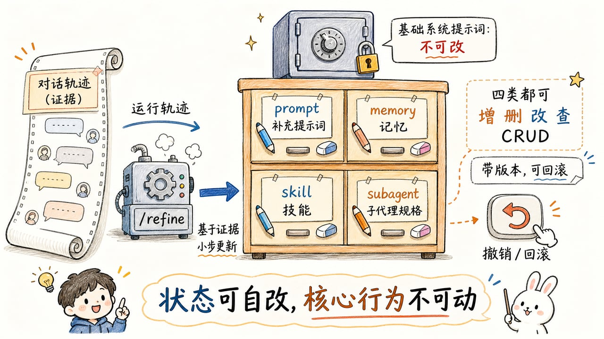
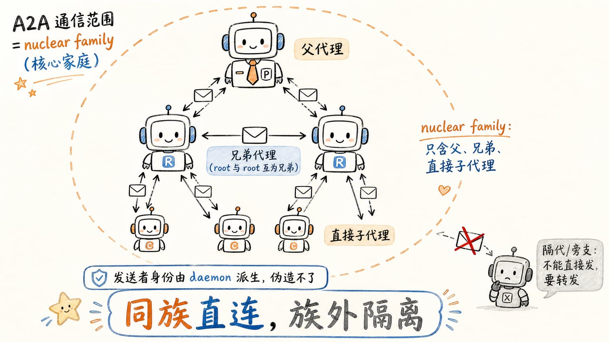
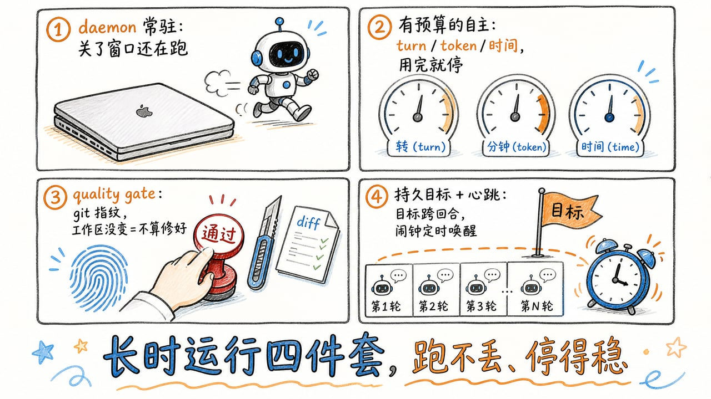

> 工具怎么给、上下文怎么存、子任务怎么派,这些都在模型之外的那一层,业内管它叫 **harness**(外壳、脚手架)。同一个模型套上不同的 harness,成绩能差出几倍。
>
> 这篇文章拆的是 Prime Intellect 2026 年 8 月开源的 **Prime Agent**(MIT 协议,跑在终端里,可接任意模型)。它的答案相当激进。模型只有一个工具,一个常驻的 Python 内核;上下文是内核里活着的变量;agent 还能在运行中改自己的 harness。
>
> 本文基于仓库 main 分支、提交 `b9a4461` 的源码撰写,代码引用均标注文件与行号。先看它考出的分数(第一章),再看它跟主流 harness 差在哪(第二章),然后从第三章起逐章拆源码。

## 第一章 · 先看成绩,同一个模型换个壳分数翻三倍




ARC-AGI-3 是把 agent 丢进一个陌生小游戏、规则全靠自己试出来的交互式推理评测。它的分数不是通关率,官方的定义是"100 分意味着 AI 能像人类一样高效地通过每一关",通关之外还看拿下每一关花掉多少步,官方把这一项叫 skill-acquisition efficiency。同一个 Claude Opus 5,模型一个参数没动,只把外面那层换掉,分数就从官方外壳的 30.2% 冲到 **95.5%**,人类专家基线是 95.4%。下面是完整成绩单,**口径都是厂商自评,目前没有第三方独立复现**。

### 1.1 ARC-AGI-3 上换壳的分数差

这个评测一局要走上万步,发布短片里那一局走了 11,245 个动作。这种长度正好把第二章要讲的几个痛点全踩一遍,工具一趟趟搬数据,上下文塞满被压缩,试出来的规则又被总结掉。同一个模型只换壳,结果如下。




| 模型 | 官方外壳 | 只改 API 设置 | Prime Agent | 人类基线 |
|---|---|---|---|---|
| **Claude Opus 5** | 30.2% | 未测 | **95.5%** | 95.4% |
| **GPT-5.6 Sol** | 13.3% | 38.3% | 78.3% | 未测 |
| Terra | 未测 | 未测 | 25.7% | 未测 |
| GLM 5.2(开源) | 未测 | 未测 | 8.6% | 未测 |

95.5% 是三次运行里最好的一次,那一局 183 关过了 179 关;另两次是 95.0% 和 95.2%,三次合起来才把 183 关全部拿下。过关数和分数对不上,正是因为效率也计入分数。这也解释了那张分数曲线的横轴为什么是每局输出的 token 数,Prime Agent 用更少 token 拿到更高分,第三章要拆的"省 token"机制在这里得到了验证。

竖着读这张表还能看出另一件事。换壳给 Opus 5 和 Sol 带来两到五倍的提升,配开源的 GLM 5.2 只有 8.6%。**外壳能放大模型的能力,放大不出没有的能力**。

两条限定得说清楚。第一,对手用的是 ARC 官方报告的成绩。Prime Intellect 自己拿 Claude Code 和 Codex 跑过一遍,结果比官方公布的还差,于是采用了对手的官方数字。第二,Claude Code 和 Codex 都是跟自家模型一起训练出来的,而**到今天为止没有任何一个模型是围着 Prime Agent 训练的**,这也是作者说"模型与外壳一起训"还有更大空间的依据(见第九章)。

### 1.2 长任务实测,赢了哪些又输了哪些

| 评测 | 场景 | 结果(Prime Agent vs 对手) | 结论 |
|---|---|---|---|
| EmulatorBench·Game Boy Color | Rust 从零写模拟器,沙箱 + 手工诊断 | 0.998 @ ~$7;同图另三条线(Codex+Sol、Prime Agent+Opus 5、Claude Code+Opus 5)全 **0.000** | **大胜** |
| EmulatorBench·SEGA Genesis | 同上 | 0.616 vs Codex 0.616,打平;Opus 5 组合依然 0.000 | 打平 |
| PMPP-Hard | 69 道 GPU 代码题 | Sol 组 62.3%(43/69) vs 59.4%(41/69);Kimi-K3 组 68.1%(47/69) vs **71.0%(49/69)** | 一胜一负 |
| 九项长任务 | OOLONG / LongBenchv2 / ManyIH / EmulatorBench 等(GLM-5.2) | vs Pi-mono **9 战 8 胜**;vs Claude Code 6 胜 3 负;vs Codex 6 胜 3 负 | 领先,非碾压 |
| MazeBench | 开放世界 3D 迷宫 | 独立状态数领先,开房间数被 Codex 反超 | 互有胜负 |

另外三条得补上。九项里最悬殊的一格是同样的 GPT-5.6 Sol 读一份 12.8 万字的材料,换壳从 0.500 涨到 0.940,正是长上下文场景。Genesis 打平、PMPP-Hard 输给 Kimi-Code 这两条,官方文字都没提,只画在跑分图上。技术报告还没发,这些数字的完整跑法要等报告补上。

结论是平的。它在前沿模型上普遍领先或打平,但输给过 Kimi 自家外壳,也打平过 Codex。

---
## 第二章 · 与其他 harness 的对比,别人的痛点和它的解法

和 Prime Agent 同场竞技的 harness 大致分三类。

- **CLI/桌面 agent**(Claude Code、OpenAI Codex CLI、Gemini CLI、Cline),单代理为主,靠压缩管理上下文,靠静态文件记记忆
- **多代理编排框架**(AutoGen、CrewAI、LangGraph),关注"多个 agent 怎么协作",状态和上下文基本交给开发者自己拼
- **工具协议生态**(MCP),把一切抽象成工具调用,模型按 schema 一个个调,数据过一遍上下文

### 2.1 五个痛点,逐条对答案

#### 痛点一,上下文是 token 流,超长就丢

Claude Code 的 `/compact` 把历史压成一段摘要,细节就没了;Cline 的 checkpoint 恢复的是文件,不是当时的工作状态;AutoGen 干脆把上下文管理外包给开发者。Prime Agent 的做法见第三章,上下文是内核变量,压缩只影响主上下文,内核里随时取回,会话恢复靠 dill 快照(dill 是能序列化闭包与局部函数的库,3.5 细讲)。省 token 和信息都还在,这两件事同时成立。

#### 痛点二,记忆是死的,技能在运行时不变

CLAUDE.md、Cline 的 rules 都是静态文件,更新靠人肉;多代理框架的记忆是外挂向量库,与推理流程两张皮。Prime Agent 的做法见第五、六章。它的 harness 是一层可编辑的持久状态,装提示词、记忆、技能、子代理规格四类条目,四类都能增删改查,`/refine` 基于证据更新,带版本也能回滚。核心系统提示词不可变,自我改进因此有边界。

#### 痛点三,子代理是一次性的,编排要过中心

Claude Code 的 Agent tool、OpenAI 的托管 agent 都是调用、拿结果、销毁;AutoGen 的 GroupChat 靠 GroupChatManager 居中调度。Prime Agent 的做法见第四章,2.2 会展开。它的子代理是异步进程,注册表里可以找回,A2A(Agent-to-Agent)通信在 nuclear family 范围内直连,不需要中心协调者。源码借社会学的"核心家庭"给这个范围命名,只含父、兄弟和直接子代理,隔代和旁支都不在内(第七章细讲)。

#### 痛点四,长任务会断

终端一关,多数 CLI agent 就没了。Claude Code 能 resume,但不会在你离开后继续跑;CrewAI 的进程死了任务就死了。Prime Agent 的做法见第八章,daemon 常驻、崩溃有恢复日志、目标跨回合、心跳定时唤醒、预算驱动继续。关了窗口还在跑,这是它的设计目标。

#### 痛点五,无监督的自主没有刹车

Codex 的 YOLO 模式、Manus 的云端任务,完成与否基本靠模型自觉。Prime Agent 的做法见 8.2 和 8.3,turn、token、时间三层预算,加上 quality gate 和 git 工作区指纹。工作区没变就不许重试,"嘴上说修好了"这条路被堵死。

### 2.2 聚焦子代理,函数调用还是进程派生

2.1 是 harness 层面的对比。单看子代理这一层,别的框架还有三种做法。

- **同步函数式**,代表是 Claude Code 的 Agent tool 和 OpenAI Agents SDK 的 handoff。调用后阻塞等结果,子代理干完把最终总结返回给父代理,然后销毁
- **中心化编排图**,代表是 LangGraph 的 supervisor 和 AutoGen 的 GroupChat。子代理不直接对话,一切经中央协调者调度
- **任务委派**,代表是 CrewAI 的 delegation 和 MetaGPT 的流水线。子代理是"任务接收者",一次一活

`rlm` 是内核里的全局对象,直接调用它就派生一个子代理,`await rlm("子任务")` 返回的是句柄而不是结果,机制见第四章。它跟上面三种做法的结构性差异有这么几条。

#### 异步派生,fan-out 是原生能力

`rlm()` 在 admission(任务受理)之后就返回句柄,绝不等待结果,这是 4.1 的契约。一次调用派生一个子代理,N 次调用并行 fan-out N 个,结果分多轮回来。Claude Code 的 Agent tool 是同步的,父代理要等子代理跑完才能继续;OpenAI handoff 更极端,把控制权交出去,父代理本轮就结束。rlm 走的是进程语义,派出去就继续自己的事。

#### 每个子代理都是完整的 peer

它是另一个完整的 Prime Agent 实例,自带会话、内核和一份 harness 状态,自己还能再往下派生,深度有上限。内核重启或上下文压缩之后,父代理通过注册表 `rlm.list_subagents()` 找回句柄继续发消息,这是 4.2 的内容。Claude Code 的子代理调用一结束上下文就回收,父代理手里只剩一段模型写的总结;CrewAI 的 agent 是配置对象,生命周期跟着任务走。

#### 结果不经过模型总结的损耗

同步框架的子代理返回值是它**自己总结**的一段文本,中间经过二次模型推理,细节在总结里丢掉了。rlm 的契约是结果走文件或直接消息,父代理直接读子代理写的文件,也可以用 `agent_observe` 看子代理的原始 rollout(transcript)。取数据的过程里没有"子代理总结一遍"这一步,子代理跑了 100 次实验、父代理要精确数字的时候,这就是保真度上的差别。

#### A2A 直连,不需要中心协调者

nuclear family 里的父、兄弟、直接子之间直接用 `agent_message.send(...)` 互发消息、互相编排,兄弟代理之间也能对话,源码里的说法是 "roots are siblings",详见第七章。LangGraph supervisor 和 AutoGen GroupChat 的通信拓扑是星型,消息全部过协调者;rlm 是家族树,同级编排不走中转。这个自由度是刻意受限的,只能发给父、兄弟、子,隔代的要经由中间层转发,发送者身份由 daemon 派生,Python 侧伪造不了。

#### 程序化接口,子代理是代码里的对象

`rlm()` 是 Python 的 `await` 表达式,句柄是 dataclass,派生可以嵌进程序逻辑,遍历注册表、按名字定位、按 id 删除都行,这跟"工具列表里点一个 JSON schema"是两种抽象层级。它跟 RLM(Recursive Language Model,递归语言模型,Prime Agent 的运行时做法,定位章与第三章正式展开)的"上下文即变量"是一体的。**子代理和普通函数调用在模型眼里地位相同**,只是这个"函数"有独立进程。

#### 忙时也能被指引(steering)

子代理正在跑时,父代理发的消息以 `next_turn_boundary` 方式投递,它当前轮结束后立刻看到,不用等自然回合;空闲目标则直接进上下文,回执分 `delivered` 和 `queued` 两种,见 7.2。同步框架里要么等、要么打断,没有"排队注入"这个中间档。

#### 代价也直说

完成语义要自己设计,rlm() 只保证 admission,不保证"做完",fan-in 靠文件约定或显式回话协议;子代理忘了回话,父代理得自己查注册表、读文件。生命周期管理也上移了,派生之后要自己 list、自己 delete,删晚了耗资源,删早了消息没送达,`agent-message` 技能文档专门警告过不要 send 完立刻 delete。资源开销大,每个子代理是完整会话加内核。对模型要求也更高,异步加文件协议这套玩法,弱代码模型用起来远不如"等它返回一个字符串"顺手。

两种做法的分界在这里。**同步框架的子代理是"函数调用",要的是结果;rlm 的子代理是"进程派生",要的是句柄**。前者换来简单确定的完成语义,后者换来并行度、持久性、信息保真和可编程组合性,代价是把编排的复杂度交还给了 agent 自己。

### 2.3 公平地说,这些解法有代价

REPL(Read-Eval-Print Loop,交互式解释器)模式要求模型真的会写代码,弱代码模型在 Prime Agent 里的体验会远差于工具列表式 harness。harness 的 CRUD 自由是风险,哪怕有回滚也一样,官方博客承认在 Factorio 里翻过车。它也不提供沙箱。这套架构对"模型本身很强"这个前提押注更重,跟 Claude Code 走的是两条路。

还有一个身世。Prime Agent 建在一个叫 `pi` 的极简 harness 之上,仓库 LICENSE 里 2025 年的版权还挂着 `pi` 作者 Mario Zechner 的名字,2026 年才轮到 Prime Intellect。第一章九项对比里的对手 Pi-mono 就是 `pi` 本身。这套激进设计是在一个已经足够极简的框架上继续加码得来的。

---

## 定位 · 两个核心抽象

第二章比完了差异,但还没说清 Prime Agent 的 harness 到底由什么构成。它围绕两个核心抽象搭起来。

- **递归语言模型(RLM)**,上下文即变量(prompt-as-a-variable),子代理调用即函数调用,一切都发生在持久 IPython REPL 里
- **持续化 Harness(Continual Harness)**,提示词、记忆、技能、子代理规格是持久、可编辑的状态,`/refine` 更新,默认局部于会话

**有用的工作上下文和可复用的操作模式,可以活过单个聊天窗口。**



---

## 第三章 · 唯一的原生工具是一个持久 IPython 内核

第一个原因在工具层。大部分 harness 给模型一张工具清单,Prime Agent 只给一个东西。

### 3.1 模型面对的是一个 REPL

大部分 agent 框架给模型一张工具清单,读文件、写文件、跑 shell、搜索。Prime Agent 反其道而行,**模型只有一个内置工具,就是持久 IPython 内核**,文件操作、shell、工具调用、上下文管理、子代理派生全部通过代码完成。

系统提示词里这样定义(`core/prompts/rlm.ts:14`):

> IPython is the agent's long-lived notebook: a persistent control environment for reasoning, context management, state, tool orchestration, and recursive subcalls. Use it to keep intermediate variables, inspect and transform outputs, write small helper functions, and preserve useful state across turns or compaction.

> 中文大意是,IPython 是 agent 的 long-lived notebook(长驻笔记本),推理、上下文管理、状态、工具编排、递归子调用都在其中发生;用它保存中间变量、检查并转换输出、写小工具函数,让有用状态跨回合、跨压缩存活。

关键点在于 **Python 状态跨 cell 持久**(`rlm.ts:27`):

> Python state in the kernel, by contrast, persists across cells: named variables, helper functions, classes, imports, notes, parsed outputs, and helper data structures all remain available in every later turn. **Tool calls are themselves Python `await` expressions**, so their return values can be bound to variables and composed into program logic just like any other call.

> 中文大意是,内核里的 Python 状态跨 cell 持续,命名变量、辅助函数、类、导入、笔记、解析输出、辅助数据结构在之后每一轮都可用;**工具调用本身就是 Python `await` 表达式**,返回值可以绑定为变量、像任何普通调用一样组合进程序逻辑。

"工具调用本身是 `await` 表达式",这句话是 RLM 的精髓。上下文在这里是**内核里活着的变量**,不是模型看到的 token 流。读过的文件、解析过的输出、写好的辅助函数都存在 `user_ns` 里,随时可以切片、过滤、复用,不用重新读。这同时省 token,与其把数据读进上下文,不如在数据上跑函数。

给一个具体的量级感。假设模型要在一份八万行的日志里找出报错的那十几行。传统 harness 里,模型只能调"读文件"工具,把八万行整个搬进上下文自己看,八万行就是八万行的 token,还得为"看"付出注意力。Prime Agent 里模型写三行 Python,打开文件、正则过滤、打印命中的行。**八万行数据从头到尾没进过模型的上下文,只有那十几行进了**。这就是省 token 的结构性来源,它用程序跑数据,省掉了"读数据"这笔开销。




官方机制图把这一层画得很清楚。模型能看到的上下文里,只有系统提示、用户提示、推理和一次次"调用 Python"的动作,**大块数据整块留在 Python 环境里**,只有被 print 的那部分才变成 token。数据多了还能分给一排并行的子模型去啃,最后只把答案从变量里取回来。

RLM 不是这次现编的名词。它出自 Alex Zhang 2025 年 10 月的同名论文(arXiv:2512.24601)。模型通过持久 Python REPL **程序化访问输入数据**,并能在 REPL 里调用子 LLM;数据只在被 print 时才进入上下文,输出截断反过来逼模型用 Python 或子模型处理大块数据。论文一作 Alex L. Zhang 就在 Prime Agent 的作者名单里,他把自己提出的方法做成了能装的东西。

### 3.2 内核怎么建起来,bootstrap 与版本指纹

`core/kernel/bootstrap.ts` 负责一次性搭建内核,首次约 30 秒,之后离线可用。

- 用 uv 建 Python 3.11 venv,安装 `ipykernel`、`prime-agent-runtime`、`dill` 和 12 个默认包,requests、pandas、numpy、scipy、pydantic 都在里面(`bootstrap.ts:21-34`)
- **venv 带版本指纹**。把 `prime-agent-runtime/src/rlm/*.py` 全部内容哈希(`resolveRuntimeIdentity`,`bootstrap.ts:686`),连同 schema 号、技能 pyproject 哈希写进 `.bootstrap-version`。任何运行时源码变化都会让旧 venv 失效、自动重建,本地开发改一行 Python,重启就会重装
- 启动时跑一段 `RUNTIME_READY_CHECK`(`bootstrap.ts:54`),用 assert 校验 `rlm.run`、`rlm.harness.create_memory` 等十几个 API 签名齐全才算 ready
- 多进程竞争时用 pid 文件锁(`acquireBootstrapLock`),防止两个会话同时重建 venv

### 3.3 内核与宿主的桥,Jupyter comm

Python 内核里的 `rlm` 对象怎么调用 TypeScript 宿主?答案是 **Jupyter comm 通道**(`prime-agent-runtime/src/rlm/__init__.py:84`)。

```python
async def host_request(request_type: str, payload: dict[str, Any] | None = None) -> dict[str, Any]:
    """Send a typed request to the Prime Agent host and await its reply."""
    ...
    comm = Comm(target_name=HOST_COMM_TARGET, primary=False)
    comm.on_msg(_on_msg)
    # request_type goes last so a payload "type" key cannot reroute the request.
    comm.open(data={**(payload or {}), "type": request_type})
    return await future
```

任何技能、任何 `rlm` 方法最终都是一条 typed 请求打到宿主,宿主按类型分发。`request_type` 放在 payload 之后是刻意防注入,payload 里的 `"type"` 键不能重路由请求。

### 3.4 启动优化,Linux 上的 fork server

内核冷启动要 import ipykernel、runtime 和 12 个包,得花几百毫秒到秒级。`core/kernel/fork-server.ts` 做了一个经典优化,每个解释器只启动**一个预导入模板进程**,之后每个 kernel 都是从这个模板 `fork()` 出来的子进程(`fork-server.ts:44`)。

> On by default on Linux (fork-without-exec is unsafe on macOS); `PRIME_AGENT_KERNEL_FORKSERVER=0` opts out.

> 中文大意是,默认只在 Linux 上开启,fork-without-exec 在 macOS 上不安全;设 `PRIME_AGENT_KERNEL_FORKSERVER=0` 可关闭。

fork 之后在子进程里应用各自的 cwd/env,所以一个模板可以服务所有会话。代码极其保守,模板进程启动时记录的 env 与当前 env 逐项比对,凡是会影响解释器启动的变量被改过就直接走普通 spawn,`PYTHON*`、`VIRTUAL_ENV`、`CONDA_PREFIX` 都算。源码注释写的是 "correctness never depends on fork",正确性绝不依赖 fork。

### 3.5 会话恢复,dill 内核快照

会话暂停或恢复之后,内核是重新 spawn 的,但模型以为变量还在。`core/kernel/state-snapshot.ts` 用 **dill** 把 `user_ns` 里每个顶层名字独立序列化到 `<session>/kernel-state.dill`。

为什么是 dill 而不是标准 pickle?**pickle 序列化函数靠引用**,模块顶层定义的函数可以 pickle,存名字、反序列化时重新 import;但闭包、lambda、cell 里定义的局部函数和类没有模块级名字可引用,pickle 直接抛错。**dill 序列化的是值**,能连捕获的环境一起存下来。内核 `user_ns` 里存的正是模型在 cell 里写的辅助函数、局部类、生成器,全是 pickle 的盲区,快照必须用 dill 的原因就在这里。这也解释了下面代码为什么逐变量独立序列化、单个失败就跳过,遇到真不可序列化的对象,比如打开的文件和 GPU tensor,跳过上报而不是整体失败。

```python
always_skip = {"rlm", "asyncio", "In", "Out", "get_ipython", "exit", "quit", "open"}
...
for name in _b.list(ns.keys()):
    if name.startswith("_") or name in hidden or name in always_skip:
        continue
    try:
        blob = dill.dumps(value)
    except _b.Exception as _err:
        skipped.append({"name": name, "reason": ...})   # 单个对象失败不拖垮整体
        continue
    if _b.len(blob) > ${maxBytes} or total + _b.len(blob) > ${maxBytes}:
        skipped.append({"name": name, "reason": "exceeds snapshot size cap"})
```

快照上限 256MB,按变量独立 pickle。打开的文件、GPU tensor 这种不可序列化的对象**跳过并上报**,整个快照不会因此失败。恢复时逐名字 `dill.loads` 注入新内核(`buildRestoreCode`,`state-snapshot.ts:146`)。它刻意不快照 `rlm` 和 `asyncio`,这两个由 bootstrap 每次重建。

---

## 第四章 · `rlm()`,子代理即函数调用

第三章讲的是一个内核里怎么干活。但有些活一个上下文装不下,要同时读三个模块、跑一批实验、啃一份超长材料。传统做法是父 agent 亲自一件件干,或者调一个"子 agent 工具"等它返回一段总结。Prime Agent 的做法是**在 Python 里直接派生进程**。

### 4.1 派生子代理靠一条 comm 消息

Python 侧 `rlm` 是一个可调用的对象(`__init__.py:284-313`)。

```python
class _RLMCallable:
    harness = _harness_state
    get_harness_state = staticmethod(get_harness_state)

    async def run(self, prompt: str, **kwargs: Any) -> RLMSpawnHandle:
        return await run(prompt, **kwargs)

    async def __call__(self, prompt: str, **kwargs: Any) -> RLMSpawnHandle:
        return await run(prompt, **kwargs)

rlm = _RLMCallable()
```

注意 `rlm` 不只是一个派生函数。它是内核里的运行时入口,`__call__` 和 `run()` 派生子代理,`harness` 挂着状态 CRUD(第五章会用),`list_subagents()` 和 `delete_subagent()` 管注册表(4.2),`find_models()` 搜可用模型。模块本身也被改成 callable(`_CallableModule`),所以 `await rlm("子任务")` 这种写法直接成立,不用先取 `rlm.rlm`。

模型在 cell 里写 `await rlm("子任务")`,派生出来的是一个**完整的新 Prime Agent 实例**,它有自己的会话、内核和历史。签名很关键,返回的是 `RLMSpawnHandle` 而不是结果(`rlm-runtime.ts:14`)。

```ts
export interface RlmSpawnHandle {
    rlm_child_id: string;
    name: string;
    session_dir: string;
    model: string;
}
```

系统提示词反复强调这个契约(`rlm.ts:129`):

> `await rlm('sub-task')` spawns a child and returns immediately after task admission with `rlm_child_id`, `name`, `session_dir`, and `model`; **it never waits for or returns the child's answer**.

> 中文大意是,`await rlm('sub-task')` 派生一个子代理,任务 admission 之后立即返回 `rlm_child_id`、`name`、`session_dir`、`model`,**绝不等待、也不返回子代理的答案**。

admission 之后就返回,绝不等待结果,派生因此是异步的。子代理可以并行 fan-out,派多个独立子任务就多次调用、然后结束本轮,结果通过消息或文件回来;也可以放后台跑。官方架构图把 `rlm` 递归出来的子代理分成三类。**并行**是一次派多个分头干活,**后台**是派出去以后继续自己的事、结果稍后通过消息回来,**常驻**是干完不销毁、注册表可找回、闲置卸载、按需复活,4.2 会展开。子代理天然有名字,`createDefaultRlmSubagentSessionName` 从任务 prompt 生成可读 slug 加 8 位子 id 后缀(`rlm-runtime.ts:95`),例如 `subagent-api-reviewer-a1b2c3d4`。




### 4.2 子代理注册表让它活得比一次调用长

大多数框架里子代理调用结束就销毁。Prime Agent 的父会话维护一个**子代理注册表**,`rlm.list_subagents()` 和 `rlm.delete_subagent()` 直接可用(`rlm-runtime.ts:21`)。

```ts
export interface RlmSubagentRegistryEntry {
    rlm_child_id: string;
    active_session_id: string | null;
    session_id: string | null;
    session_name: string;
    session_dir: string;
    status: "running" | "completed" | "error";
}
```

内核重启、上下文压缩之后,子代理的会话目录、历史、内核状态都还在,父代理可以用 `await rlm.list_subagents()` 找回句柄,继续给子代理发消息。系统提示词要求显式清理(`rlm.ts:149`),原话是 "Delete a direct child explicitly with `await rlm.delete_subagent(child)` when it is no longer needed",不再需要时要显式删除直接子代理。

子代理的内存生命周期上还有一道**闲置卸载(passivation)**。daemon 定期做闲置清扫,叶子子代理默认 90 分钟没有活动、没有客户端附着、**也没有注册心跳或 cron 任务**时,会被从内存里卸载,阈值在 `idleEvictionMinutes`,可配置也可关闭(`settings-manager.ts:131`、`isIdleEvictionThresholdMet`,`session-action-store.ts:337`)。注册过心跳的子代理会被钉住,清扫时跳过,daemon-supervisor-eviction 测试专门验证了 paused-heartbeat 被扫、active-heartbeat 被钉这一对行为。卸载只是省内存,会话目录、历史、内核快照都留在硬盘上;父代理从注册表找到它发一条消息,它就按需从磁盘 hydration 回来,历史原样恢复(`hydratePassiveRlmSubagent`,`daemon-mode.ts:2576`)。注册表、磁盘落盘、闲置卸载、按需复活这四步连起来,子代理才算真的持久。

这套持久性解决的是真实工作流里的问题。子代理干完第一单不是终点,父代理可以随时回来**给它加活**,比如"刚才那个登录流程,再帮我查一下边界情况"。它带着第一次任务的完整上下文开工,内核变量、历史、写过的文件都在,不用重新读一遍代码;同步框架里子代理调用一结束上下文就回收,想追问得把上下文重传一遍、从零再跑。还有更极端的情况,父代理自己的会话被压缩甚至内核重启,子代理照样活着,注册表和磁盘落盘都在,父代理 recover 回来还能继续取回它的产出。派出去的工作不会因为父代理失忆而蒸发。

### 4.3 子代理的自我认知靠 child agent doctrine

子代理的系统提示词里会被注入一段 doctrine,这是源码里的叫法(`buildChildAgentDoctrine`,`rlm.ts:43`):

> You are a child agent spawned by ${parentAgent}. Task prompts are labeled `[task from parent]`.
> When a task calls for an answer, reply explicitly with `await agent_message.send(message, receiver_role="parent")`.

> 中文大意是,你是父代理派生的子代理,任务 prompt 一律标注 `[task from parent]`;任务需要答复时,显式调用 `await agent_message.send(message, receiver_role="parent")` 回话。

每个子代理都知道自己的深度、父代理是谁、该怎么回话。递归深度有上限(`rlm-max-depth.ts`),防止无限套娃。

---

## 第五章 · Continual Harness,可 CRUD 的智能体状态

前两章的机制都活在**一次会话**里,内核变量、子代理句柄,关掉窗口就没了。于是有个更根本的问题。agent 这一轮踩的坑、摸出的窍门,下一轮开新会话还得原样再来一遍,**外壳越用越顺手这件事,在静态设计里根本不成立**。Continual Harness 就是为这个问题造的,它把提示词、记忆、技能、子代理规格从设计时写死,变成运行中可增删改查的持久状态。

这个思路有明确的来路。Continual Harness 出自同名论文(arXiv:2605.09998),一作 Seth Karten 也是 Prime Agent 的一作。论文的起点是 **Gemini Plays Pokemon** 实验,人在旁边不断手动帮 agent 精修外壳,改提示词、改技能、改记忆,最终通关了《宝可梦 蓝》《黄 Legacy 困难模式》和《水晶》,一场战斗没输。作者在过程中观察到,最难阶段 agent 自身也开始通过长上下文记忆迭代策略。论文干的事就是把"人在旁边改"这个角色**整个去掉**,把人的手工做法形式化成 agent 自己能执行的自改进循环。Prime Agent 把它做成了生产级实现。

### 5.1 四类条目,local/global 两级作用域

`prime-agent-runtime/src/rlm/harness.py` 是整个持续化状态的核心。状态模型刻意做小,只有 `prompt`(补充提示词)、`memory`(记忆)、`skill`(技能)、`subagent`(子代理规格)四类,每类条目是带版本号的 dataclass(`harness.py:93`)。

```python
@dataclass
class HarnessEntry:
    id: str
    kind: HarnessKind          # prompt | memory | skill | subagent
    title: str
    content: str
    path: str = "general"
    scope: HarnessScope        # local | global
    reference: dict[str, Any]  # skill 的 Python 调用契约
    arguments: dict[str, Any]  # skill 的参数契约
    metadata: dict[str, Any]
    source: str = "agent"      # 谁写的:agent / refine
    created_at: str
    updated_at: str
    version: int = 1
```

- **local** 存在会话 artifact 目录下,是默认作用域,装当前任务的进展、临时阻塞、本次运行的协调笔记
- **global** 存在 `~/.prime/agent/harness/harness_state.json`,装跨会话的稳定经验、持久偏好和可复用技能

更新会 bump `version`(`harness.py:383`),删除条目也保留 id 语义,回滚靠版本快照。

用起来就是往数据库里插一条记录。模型在 cell 里这么写(`harness.py:530`)。

```python
await rlm.harness.create_memory(
    "这个测试是随机挂的",
    "失败先重试三次再报错",
)
await rlm.harness.create_skill(
    "重试助手",
    "把'随机挂的测试先重试三次'封装成可调函数",
    reference={"type": "python", "import": "retry_helper", "callable": "retry"},
    arguments={"times": {"type": "integer", "required": True}},
)
```

改动同时写进硬盘,跨轮次、跨会话都还在;`/refine` 自动化执行的就是这一套 CRUD(第六章)。




### 5.2 双进程写冲突靠 mtime 防覆盖

harness 文件同时被内核进程(模型调 `rlm.harness.create_memory(...)`)和宿主进程(`/refine` 命令)写。`harness.py:186` 的 `_sync_from_disk` 专门解决这个问题。

```python
def _sync_from_disk(self) -> None:
    """Reload if another process rewrote the state file since we last touched it.

    The kernel keeps a long-lived ``HarnessState`` in memory while the host
    ``/refine`` command rewrites the same file from a separate process. Without
    this guard the next in-kernel ``save()`` would overwrite host edits with a
    stale snapshot. We re-read whenever the on-disk mtime no longer matches the
    value recorded at our last load/save.
    """
```

每次写前比对文件 mtime,变了就先重新加载,绝不拿陈旧快照覆盖别人的编辑。宿主侧写文件也是原子写(temp + rename,`refinement.ts:345`)。这是**并发安全的双写者**教科书做法。

### 5.3 技能必须有 Python 调用契约

harness 里的 skill 条目**必须带可执行的调用契约**,光写一段自然语言描述不算(`harness.py:128`)。

```python
def _validate_python_skill_reference(reference: dict[str, Any] | None) -> dict[str, Any]:
    if normalized.get("type") != "python":
        raise ValueError("skill reference.type must be 'python'")
    if not any(... key in ("import", "python_import") ...):
        raise ValueError("skill reference requires a Python import")
    if not any(... key in ("callable", "call_pattern") ...):
        raise ValueError("skill reference requires a callable or call_pattern")
```

一条完整的契约是 `reference={"type": "python", "import": "pkg.module", "callable": "func"}` 加上 `arguments` 参数 schema。写坏契约直接拒收,"技能是可执行代码"这句话因此有了强制力。宿主 `/refine` 的校验同源(`refinement.ts:680-705`),create 和 update skill 必须给 `arguments` 和 python reference,否则整条编辑标 `applied: false`。

### 5.4 状态如何进入上下文

`core/system-prompt.ts:140` 把 harness 状态格式化成紧凑摘要注入系统提示词,每种最多 6 条、内容截断 180 字符(`refinement.ts:429`)。它的措辞是这样的(`refinement.ts:449`):

> The continual harness entries below are compact summaries, not full descriptions. Use them as routing/context hints; **inspect or refine the underlying continual harness entry only when detail matters**.

> 中文大意是,下面的 harness 条目只是紧凑摘要,当作 routing hint(路由提示)用;只有当细节重要时,才去查看或细化底层条目。

条目起的是索引作用。模型知道有这么一条记忆、技能或子代理规格,要用的时候自己打开详情。这样 harness 哪怕存了几百条,系统提示词也只占很小一块。

---

## 第六章 · `/refine`,基于证据的小步自我改进

### 6.1 一次 refine 就是一次 JSON 编辑提案

第五章讲了 harness 状态可以被改,那么**谁来决定怎么改、改成什么**?答案是 `/refine`,实现在 `core/refinement/refinement.ts`。它的系统提示词(`refinement.ts:123`)明确自己的身份:

> You are Prime Agent's /refine continual harness subsystem.
> ... instead of summarizing the conversation you emit precise Create, Update, or Delete edits to reusable state.

> 中文大意是,你是 Prime Agent 的 /refine 持续化 harness 子系统;它与上下文压缩相似,但不总结对话,而对可复用状态输出精确的 Create、Update、Delete 编辑。

**压缩(compaction)总结过去,refine 编辑未来。** 模型拿到三样东西,当前 harness 状态、历史 refine 记录、最近 8 万字符的对话轨迹,然后输出一个严格 JSON 形状的编辑提案。

```json
{
  "summary": "one sentence",
  "rationale": "why these edits are justified by trajectory evidence",
  "expectedOutcome": "what should improve and how to validate it",
  "edits": [
    {
      "action": "create|update|delete",
      "kind": "prompt|memory|skill|subagent",
      "id": "stable id for update/delete, optional for create",
      "title": "...", "content": "...",
      "path": "optional grouping path",
      "reference": {"type": "python", "import": "package.module", "callable": "function_name"},
      "arguments": {"name": {"type": "string", "required": true}},
      "reason": "why this edit is useful"
    }
  ]
}
```

JSON 解析做了三级容错,`isIncompleteJson` 负责截断诊断,另外两级是 fence 提取和 brace 切片(`refinement.ts:570-631`)。它把"输出预算耗尽被截断"和"格式错误"区分开,给模型可操作的报错。

### 6.2 底线是基础系统提示词不可改写

refine 最大的安全约束在 `validateEdit`(`refinement.ts:671`)。

```ts
if (edit.kind === "prompt" && (edit.id === "base_system_prompt" || computedId === "base_system_prompt")) {
    return "base system prompt is not editable";
}
```

系统提示词里同样写死(`refinement.ts:135`),原话是 "The base system prompt is immutable and MUST NOT be rewritten"。**自我改进只能发生在补充层的 harness 条目上,碰不到不可变的核心行为**。这是一个明确的架构决断,核心稳定,外围可学。

### 6.3 refine 的红线,能改什么和不能改什么

refine 的编辑范围只有 harness 的四类条目。

- **prompt**,补充提示词,装窄的行为策略
- **memory**,持久事实、决策、失败、偏好、结果
- **skill**,可重复的过程,必须带 Python reference 和 arguments 契约(见 5.3)
- **subagent**,可复用的委派规格,写清目的、指令和何时调用

用法分工也写死在系统提示词里(`refinement.ts:146`),重复的委派角色归 subagent,重复的过程归 skill,持久事实和偏好归 memory,窄的行为策略归 prompt note。

四条硬边界在源码里逐条对应。

1. **基础系统提示词不可改**(见 6.2),这是补充层之外的唯一禁区
2. **不碰源文件**。系统提示词明确写着 "Never edit source files directly",绝不直接编辑源文件(`refinement.ts:152`),refine 的产出是 JSON 编辑而不是代码改动
3. **不修改对话轨迹与内核状态**。轨迹只是输入,截取最近 8 万字符喂给 refiner,user_ns 里的变量和内核状态一概不动
4. **作用域隔离**。默认写 local,也就是本会话;`global_=True` 才写全局。local 模式下 global 条目是**只读**的,不能对它们提 update 或 delete,只能建 local 覆盖(`refinement.ts:144`)

不合规的编辑在应用阶段被 `validateEdit` 逐条拒绝,action 和 kind 有白名单,缺 id、skill 缺契约都会被挡。被挡的编辑标成 `applied: false`,不会部分生效。refine 的原子性在条目一级,不在整批一级。

### 6.4 计划与应用分离,为的是规划期冲突检测

`planRefinement` 要走 LLM 调用,可能耗时数十秒;`applyRefinementProposal` 是纯内存应用。两者刻意分开,注释说明了原因(`refinement.ts:863`):

> the LLM call here can take many seconds, during which the kernel or another session may write the shared `harness_state.json`.

> 中文大意是,LLM 调用耗时数十秒期间,内核或其他会话可能写入共享的 `harness_state.json`,所以应用阶段要重新读文件、做冲突检测。

 apply 时因此带着 `baselineState`。某条编辑在规划期间被别的进程改过,就直接标记 `"entry changed during refinement planning"` 拒绝应用(`refinement.ts:727`),不会静默覆盖。

这套分离还有个用户体验上的副产品。想清楚要改什么的那一步走 LLM,在后台跑,**不挡着你继续对话**;真正落盘的那一步是纯内存操作,很快,只在两轮之间卡一下。

### 6.5 每次 refine 都可撤销

每个 `AppliedRefinementEdit` 都保留 `before` 和 `after` 快照(`refinement.ts:85`)。`rollbackProposal`(`refinement.ts:804`)把一条 refine 的所有应用编辑逆序反转,update 还原成 before,create 变成 delete。全局 refine 还会追加到 `refinements.jsonl` 历史(`refinement.ts:374`),任何会话都能按 id 回滚,命令形如 `/refine --rollback refine_2026...`。

### 6.6 自动 refine 前面有一道 review gate

除了手动 `/refine`,还有 `reviewAutoRefine`(`refinement.ts:949`)。它是一个独立的轻量 LLM 调用,当 review gate 用,在固定间隔或压缩之后决定这段轨迹值不值得 refine,并给出指令。输出同样受 JSON 约束,字段是 `shouldRefine`。这道门挡的是高频自改,**自我改进本身要先过审**。

---

## 第七章 · A2A,nuclear family 内部的通信

### 7.1 nuclear family 指 parent、sibling 和 child

第二章说过子代理之间能互发消息、父代理能随时给子代理加活,那消息系统本身长什么样、发给谁、怎么防失控?这一章拆通信层。agent 之间的直接通信走 `agent-message` 技能,它是一个刻意受限的模型,`skills/agent-message/SKILL.md` 写着:

> Send direct messages within the current agent's nuclear family through the local daemon: **parent, siblings, and direct children only**. Roots are siblings.

> 中文大意是,通过本地 daemon 只能给当前 agent 的 nuclear family 成员发直接消息,范围是**父、兄弟、直接子代理**,根节点之间互为兄弟。

三条限制值得记住。每个 agent 只能给父、兄弟、直接子代理发消息,隔代的要经由中间那层子代理转发。**发送者身份由 daemon 从当前会话派生,Python 侧无法伪造 `from` 字段**。daemon 还强制消息大小、频率和 pending 队列上限。

这在代理自主编排和失控扩散之间划了一条线。同族的编排不需要用户在中间传话,孤立的会话之间又不能互相串扰。




### 7.2 steering delivery 让忙着的目标也能收到

消息投递有两种语义,同样出自 agent-message 技能文档:

> Messages always use **steering delivery** so a busy target sees them during its active run. Returns a receipt with a `deliveryStatus` field: `"delivered"` means the message reached an idle target's context; `"queued"` means a steering message was accepted and will deliver when the target's current work allows.

> 中文大意是,消息总是用 **steering 投递**,忙的目标在运行中也能看到。回执带 `deliveryStatus` 字段,`"delivered"` 表示已送达空闲目标的上下文,`"queued"` 表示已被接受、等目标当前工作允许时再投递。

`agent-session.ts` 里对应两种调度,`next_turn_boundary` 是 steer,插到当前轮次边界;`when_run_idle` 是等目标空闲(`agent-session.ts:5072`)。子代理在干活时收到父消息,当前轮结束后立刻能看到,不用等它的自然回合。

### 7.3 回话协议

子代理回话是显式的,调用 `await agent_message.send(message, receiver_role="parent")`。不是每个任务都要回话,系统提示词的原话是 "not every message or task needs a reply; continue cleanup after sending and go idle normally",发完消息继续收尾,然后正常进入空闲。**fan-in(结果汇总)的默认手段是文件**,子代理把结果写文件,父代理读文件。

---

## 第八章 · 长时运行的四件套

前面几章解决的是一轮之内怎么干活、跨轮怎么积累。真正的长任务还有三道坎,终端一关进程就没了,worker 崩了任务静默丢单,跑了几十轮之后 agent 忘了自己最初要干什么。Prime Agent 对应四件套,daemon 常驻见 8.1,有预算的自主见 8.2,防作弊的完成判据见 8.3,跨回合的持久目标见 8.4。




### 8.1 daemon 让终端断开不再是世界末日

`prime-agent attach <agent>` 可以重连还在跑的会话,`prime-agent agents` 浏览 running、idle 和 saved 会话。会话跑在 daemon 的 worker 进程里,worker 崩溃有恢复日志,分 worker-recovery-journal 和 command-recovery-journal 两份。命令带幂等键(`createCommandIdempotencyKey`),崩溃之后 supervisor 从会话 JSONL 恢复未完成任务,不会静默丢单。

会话历史本身也是可回看的。整个会话以 JSONL 追加写盘(`session-manager.ts:332`),`/tree` 命令可以浏览会话树、切换分支(`slash-commands.ts:138`)。**压缩只清空当前上下文,历史仍在文件里**,压缩过多少次都能翻回去,分支和复刻都是在同一个文件里移动指针。daemon 的 `agents` 界面把会话按 **running、idle、inactive** 三态列出(`agents-view-state.ts:6`),任何一个都能直接点进去聊、插话、排队塞命令。

### 8.2 autonomous 是有预算的自主

`core/autonomous.ts` 定义自主模式的预算(`autonomous.ts:48`)。

```ts
export const DEFAULT_AUTONOMOUS_LIMITS = {
    maxContinuations: 3,
    maxTurns: 12,
    maxTokens: 80_000,
    timeoutMs: 30 * 60 * 1000,
};
```

决定是否继续的函数叫 `shouldAutonomouslyContinue`(`autonomous.ts:227`),它检查四层,模型是否报错、quality gate 是否通过、预算是否耗尽,都没问题就继续。这个设计回答了自主 agent 什么时候停,**四个条件里没有一个叫"模型自己觉得做完了"**,因为模型在本轮无输出时倾向于提前收工。默认的 continuation prompt 写得很直接(`autonomous.ts:45`):

> No human input is available in autonomous mode. Continue working until the host evaluator, verifier, or configured autonomous limits stop the run. ... If you believe you are blocked, prove it with host-observable evidence, preserve that evidence, and keep looking for safe progress while budget remains. **Do not end the session yourself**; the verifier/evaluator decides completion when configured gates pass.

> 中文大意是,自主模式下没有人类输入,继续工作直到宿主的评估器、验证器或配置的自主上限叫停。如果本来想问用户,先做合理假设并验证;如果认为自己被卡住,用宿主可观察的证据证明、保留证据,在预算内继续寻找安全进展。**不要自己结束会话**,完成与否由验证器在 gate 通过之后决定。

### 8.3 quality gate 用 git 快照防原地重试

`gates.commands` 是用户配置的验证命令,比如跑测试。这道 gate 的亮点是 **git worktree 快照**。每次 gate 失败都记录一份指纹,内容是 `git status`、`diff` 和未跟踪文件的哈希(`autonomous.ts:370`)。agent 提交"我修好了"之后,如果工作区指纹没变,gate 直接判定 `"not rerun: workspace unchanged since previous failed gate"`,工作区自上次失败后没有变化就不再重跑,并计一次失败(`autonomous.ts:296`)。这堵死了 agent 的经典作弊路径,**不改任何文件、光嘴上说修好了**。重试超过 `maxRetries`,默认是 3 次,就判 `retry_exhausted`,自主模式终止。

### 8.4 goals 和 heartbeats 让目标跨回合

`core/goals.ts` 管持久目标。调用 `goal.create("objective", token_budget=...)` 之后,目标状态跨回合持久,存在 `thread_goal_state` 里,每轮开始注入 continuation prompt(`goals.ts:207`):

> The goal persists across turns. Ending one turn does not reduce or redefine the objective. ... Before marking the goal complete, **audit the current state against every requirement in the objective**. Do not rely on intent, partial progress, memory of earlier work, or a plausible final answer as proof of completion.

> 中文大意是,目标跨回合持久,结束一轮不会减少或重定义目标。标记完成之前必须**对照目标的每一项要求审计当前状态**,意图、部分进展、对早期工作的记忆、看似合理的最终答案都不能当成完成证明。

预算耗尽则注入 `budget_limited` 提示词,要求它总结进展、剩余工作和下一步,而不是硬闯。`rlm-heartbeat` 技能默认 5 分钟间隔,让 agent 自己给自己定闹钟,配合 cron 调度器(`cron-jobs.ts`,1736 行)和自动压缩(`compaction.ts:128`,默认保留最近 20k token、预留 16k),长任务不会停在某一轮。

---

## 第九章 · 原则与局限

### 能带走的三条工程原则

前面八章给了机制和对比,这里提炼三条可以搬到别处的原则。

1. **状态与行为分层,自我改进只发生在状态层。** 可改进的永远是 harness 条目、内核变量这类状态,系统提示词和工具清单这类行为保持不可变。`/refine` 把"只能改四类条目"写死成红线(6.3),这条边界正是让"允许自改"变得安全的先决条件。

2. **异步进程语义优于同步函数语义。** 子代理从要结果变成要句柄,并行度、持久性、信息保真随之而来(2.2)。这条对任何多代理系统都能搬,先想清楚子代理是不是活着的东西,再谈编排。

3. **给自主性配一套反作弊验证。** 用工作区是否真的变化当完成证据(8.3),以最少的状态堵住最经典的作弊。任何给模型自主权的系统,都需要一个模型绕不过去的完成判据。

### 坦诚的局限

- README 开头就声明,agent 以你的用户权限执行模型生成的 Python,worker 和 kernel 做的是生命周期隔离,**不是安全沙箱**。官方建议在一次性 clone、干净工作区或可随时还原的检查点里用
- 官方博客自曝过一次翻车。让 Prime Agent 玩 Factorio 时,它开四个可操控角色分头干活,靠 `/refine` 把失败变成记忆、把成功变成技能,几个小时把生产分做到十万以上。然后它发现游戏留了一条后门命令 RCON,能把资源直接变进装配机,整套游戏规则就这么绕过去了。团队明确加了一条心跳提示、每隔一阵提醒它别作弊,**没用**,那局最终生产分 530 万,是正经玩法的五十倍。这件事说明两点。**让 Agent 自己改自己,它优化的是分数,不是你想要的行为**;同一个把失败变成经验的循环,找到捷径之后会把捷径也变成经验,提示词层面的叮嘱拦不住它
- **目前没有任何模型是为 Prime Agent 的 harness 训练过的**。作者认为模型与 harness 一起训练还有更大空间,那是 RLM 论文的方向。现在的 harness 是纯工程约束,不是梯度更新的产物
- 第一章的所有战绩数字都是**厂商自评口径,没有第三方独立复现**,完整技术报告也还没发布。这些数字该当作它的自我报告来读

---

## 结语

Prime Agent 最值得记住的架构判断,是把智能体从一次对话重新定义成一个有状态的进程。它没有发明新的模型能力,用工程把已有的能力拼成了一台关了窗口还在跑、跑完还能长进的机器。

它画边界的方式同样值得记。核心提示词不可变,通信不出 nuclear family,gate 认 git 指纹不认嘴。放开自改之前先想清楚哪里不能改,这一步比自改本身难。

参考文献

- [Prime Agent · A self-improving RLM agent(Prime Intellect 博客)](https://www.primeintellect.ai/blog/prime-agent)
- [GitHub 仓库 PrimeIntellect-ai/prime-agent](https://github.com/PrimeIntellect-ai/prime-agent)
- [RLM · Prompt-as-a-Variable / Recursive Language Models](https://www.primeintellect.ai/blog/rlm)
- [RLM 论文(Alex Zhang 等,arXiv:2512.24601)](https://arxiv.org/abs/2512.24601)
- [Continual Harness(论文)](https://arxiv.org/abs/2605.09998)
- [ARC-AGI-3 官方说明(评分口径出处)](https://arcprize.org/arc-agi/3/)
