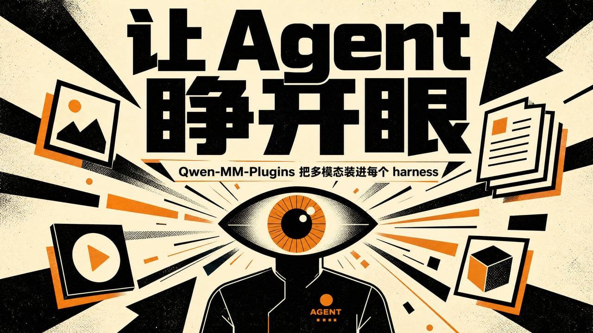

## TL;DR,三分钟读完

**一句话**:[Qwen-MM-Plugins](https://github.com/QwenLM/Qwen-MM-Plugins) 把多模态能力做成 **skill + MCP server 双件套**,不换模型、不改 harness,让任何 agent 原生看图、看视频、开文档。

一个背景,三个难题:

| # | 问题 | 一句话答案 | 章节 |
| --- | --- | --- | --- |
| 背景 | agent 为什么看不见 | 三种凑合做法都有硬伤,所以把能力做成插件 | 架构 |
| 1 | 图怎么喂进上下文而不撑爆 | **token 预算 × 32 × 32 = 像素预算**,超上限缩小、低于下限放大 | 难题一 |
| 2 | 这些图谁来看 | 有视觉的模型自己看;纯文本模型把图外包给云端 VL 模型 | 难题二 |
| 3 | 长视频抽帧装不下 | 先离线建一份**四层图记忆**,再在记忆上检索,细节才回原视频精查 | 难题三 |

> 本文基于 [QwenLM/Qwen-MM-Plugins](https://github.com/QwenLM/Qwen-MM-Plugins) main 分支源码撰写,仓库 2026-07-29 创建,一周多收获 1323 星(Apache-2.0)。文中事实均来自仓库 README、cookbook 和源码。

---

## 架构,为什么是插件,一个能力 = 一个 skill + 一个 MCP server

现在的 agent 有个共同盲区。它们能读文字、写代码、跑命令,但"看"这件事做得很勉强:给它一张图,得转成 base64 塞进上下文;给它一段视频,大多数 harness 直接摇头。

想让 agent 看见东西,现成做法有三种,各有毛病:

- **转 base64 塞进模型上下文**。模型能不能读,取决于它训练时见过多少图像 token——大部分编码模型对图像的理解只到"能描述个大概"。视频更麻烦:自己抽帧、自己定帧数,抽少了漏内容,抽多了上下文爆炸。
- **装一个 OCR 工具**。解决"图片里的字",解决不了"图片里的内容"。产品照片、3D 模型、两小时会议录像,OCR 帮不上忙。
- **直接换多模态模型**。最彻底,但用户被绑死在一个模型上,之前的代码、习惯、harness 全要跟着换。

Qwen-MM-Plugins 走的是**第四条路**:不动模型、不动 harness,把多模态能力做成**插件**,装进任何已有的 agent 环境。装完以后,Claude Code 里的 agent 能读视频,Codex 里的 agent 能驱动 Blender,Qoder 里的 agent 能看 3D 模型。

> **一句话总结**:Qwen-MM-Plugins 不是又一个多模态模型,而是一套能装进任何 agent 的"外挂眼睛"。

**核心逻辑一句话**:每个能力拆成两半,skill 负责让模型知道工具有什么,MCP server 负责真正干活。

```plaintext
skill      = 大脑,告诉模型"你有这些工具,什么时候用哪个"
MCP server = 手,工具本体,由 uvx 按需启动
```


skill 装进 harness 的插件系统,模型看到工具清单和路由规则。MCP server 是标准的 *Model Context Protocol* 服务,任何支持 MCP 的 harness 都能调用。两半都标准化,所以"一次安装,到处能跑"。

**为什么不干脆在 skill 里直接调脚本?** 因为 skill 本身没有执行能力——它只是一段注入上下文的说明文字。要执行脚本,要么让模型用 harness 的 Bash 自己敲,要么走 MCP server。前一条路代价很大:

- 模型每次调用都要**回忆一遍命令怎么拼**,烧 token 还容易敲错
- Bash 是 harness 权限最大的通道,放模型自由敲命令等于**把整台机器交给它**
- 脚本依赖的 Python 库,还得模型自己操心装没装

MCP server 把这些问题一次解决:

- 工具有 **schema**,参数由 harness 校验,模型照着填就行
- 执行是**确定性代码**,不经过模型推理
- 输出是**结构化 content block**,图片、文本、时间戳分开返回
- 授权粒度从"放不放 Bash"细到**允许或拒绝某个工具**
- uvx 按需拉起时**自动装依赖**

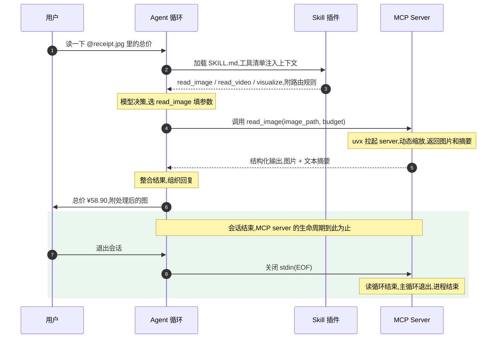

安装器 `install.sh` 覆盖 7 个 harness\(Claude Code、Codex、Qoder、OpenClaw、Qwen Code、Gemini CLI\),底层调各 harness 自己的插件市场,不重造一套安装体系。配置统一写进 `~/.qwen-mm-plugins/config`,终端和 GUI 的 harness 读同一份文件。

这个设计对应一个正在发生的行业事实:**harness 的插件标准正在收敛**——Claude Code 有插件市场,Codex 有插件系统,MCP 是工具协议的事实标准。Qwen 选择站在所有标准之上,而不是再立一个。


仓库里 7 个能力,每个单独安装:

| 能力 | 干什么 |
| --- | --- |
| **core** | 本地读取地基,7 个工具,读图、抽帧、开文档,全程不需要 API key |
| **video-memory** | 长视频记忆,先建四层图记忆再问答,30 分钟以上的视频靠它 |
| **omni-av** | 音视频全模态理解,ASR 带时间戳和说话人、时间标注、事件计数、音乐标签 |
| **video-edit** | 视频编辑工作流,加图像/视频/音频生成 |
| **blender** / **freecad** | thin client 驱动运行中的实例,agent 直接操作已打开的应用,不是生成代码让你自己跑 |
| **edu-agent** | 纯 skill,把一道数学题或题目图片变成中文讲题视频和交互页面 |

本文重点拆前两个:**core**(难题一、二)和 **video-memory**(难题三)。

> **一句话总结**:skill 管"模型知道有哪些工具、什么时候用",MCP 管"机器可靠地把活干完"。两层都标准化,这是插件能装进任何 harness 的原因。

## 难题一,图怎么喂进上下文而不撑爆

多模态模型看图有个硬约束:模型内部把图切成小块,每块算一个视觉 token,**分辨率越高 token 越多,上下文消耗越快**。图太大模型塞不下,图太小细节看不清。

core 的三个读取工具,本质上是三道不同的"预算"题,答案都来自同一套换算:

> **token 预算 × 32 × 32 = 像素预算**

### read_image,把清晰度换算成 token 预算

**预算三档**。read_image 的分辨率由 budget 参数控制:small、normal、large 对应 256、1024、2048 个视觉 token。normal 档的像素预算约 100 万,接近 1024×1024。

**拿到图后做等比缩放**:面积低于下限就放大,高于上限就缩小,最后把长宽对齐到 32 的倍数,正好铺进预算对应的 patch 网格。一张 3840×2160 的 4K 截图约 830 万像素,normal 档会压到约八分之一的面积。

这个 32 是预算换算用的近似常量,源码注释里写明了"just used to compute budgets"。各模型真实的 patch size 并不一样——Qwen2-VL 是 14×14,CLIP 有 16 也有 32。工具用 32 统一管理预算,保证 token 消耗精确可控;模型收到图后用自己的动态分辨率机制再编码。

> **预算归工具管,编码归模型管,两层解耦**——这也是插件能喂任何模型的原因之一。

**为什么小图反而要放大?** 图越小 token 越省,但模型看图有一个下限。视觉模型把图切成 32×32 的 patch,每块算一个视觉 token。一张 64×64 的缩略图只有 2×2 共 4 个 patch,图里的字和细节全挤在一起——模型等于用 4 个 token 看了一团糊。

放大不增加信息量,但把细节铺开到模型能分辨的密度,就像近视眼凑近看字:字没变,看清了。放大只到下限预算,不会无脑放大。

放大之后图还是模糊的,但**模型的瓶颈在 patch 数量,不在分辨率**:

- 64×64 原样给模型:只有 4 个 patch,注意力只能在 4 个位置之间交互,连"物体在图的哪个位置"这种信息都表达不了
- 放大到 512×512:256 个 patch,每个虽然模糊,但模型能在 256 个位置之间分配注意力,提取到图里真实存在的空间结构——字的位置、笔画走向、物体大小和相对位置

4 个 patch 是信息存在但模型够不着,256 个 patch 是信息模糊但模型能提取。

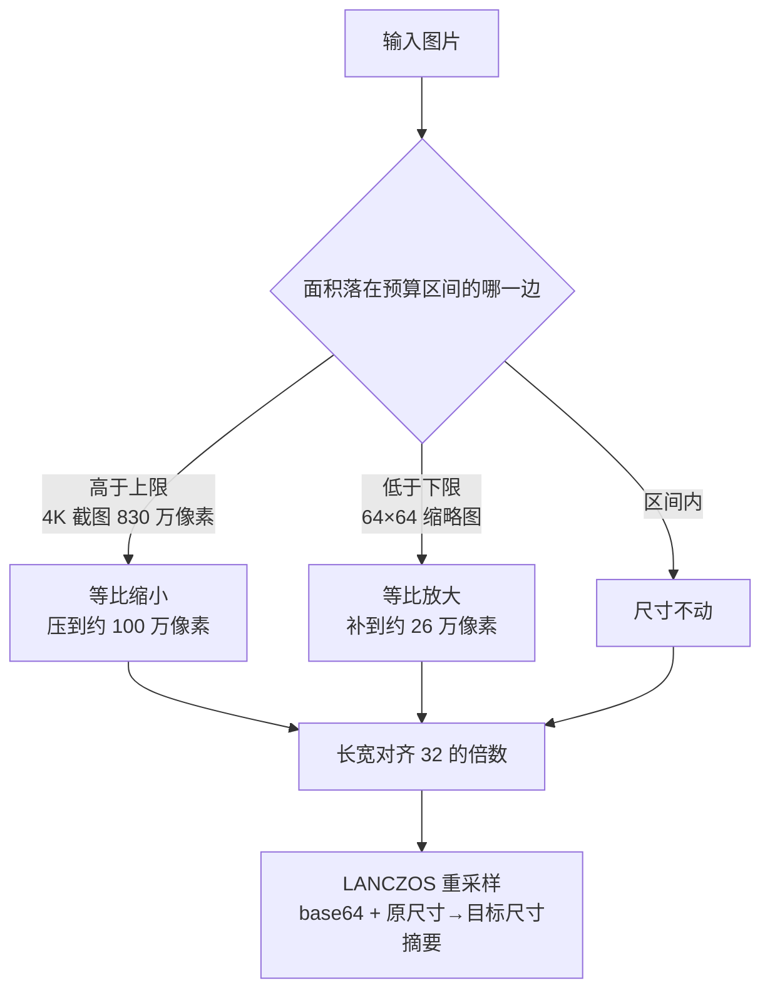

收尾用 **LANCZOS 重采样**:透明图存 PNG,其余存 JPEG 质量 90,base64 塞进回复,附一行"原尺寸 → 目标尺寸"的摘要。模型拿到的是大小受控、对齐好的图,原文件不受影响。

**LANCZOS 是什么?** 重采样算法,负责缩放时重新计算每个像素的值。图片缩小不能直接丢像素——最近邻会留下锯齿,双线性平滑但发糊,LANCZOS 取周围一圈原像素按距离加权,边缘保留最干净。下面这张图是同一张 32×32 图案放大 6 倍的效果,差距一眼能看出来。

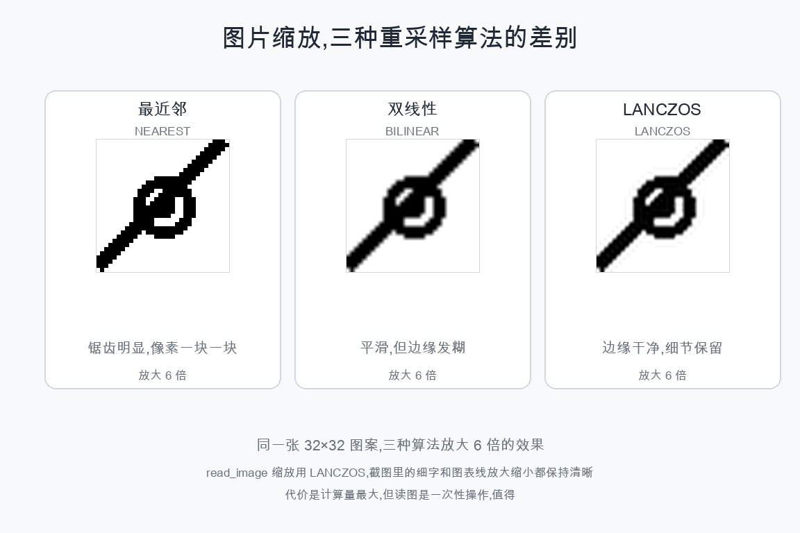

### read_video,帧数和每帧大小相乘,自动权衡

视频的问题是**二维**的:抽多少帧决定时间分辨率,每帧多大决定空间分辨率,**两个维度相乘才是上下文消耗**。read_video 用三层预算把两个维度同时定下来:

1. **帧数预算**——2 FPS × 时长,夹在 2-600 帧
2. **每帧分辨率**——256 token → 672×384
3. **字节预算**——15 MiB ÷ 实测单帧大小 = 最多能放几帧

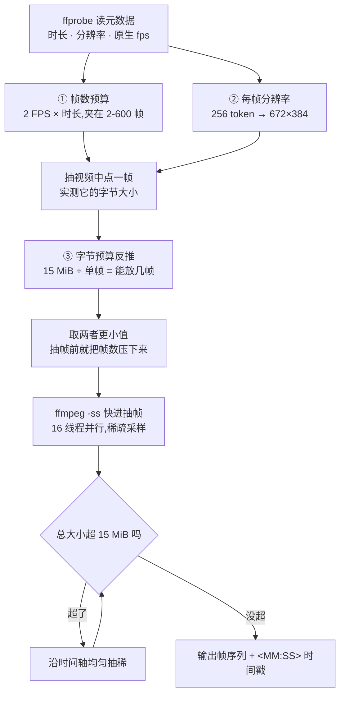

**第一层,帧数**。fps 默认 0,这个 0 是"自动模式"的哨兵值:工具按 2 FPS × 视频时长估算目标帧数,夹在 2 到 600 帧之间,上限可用环境变量 `QWEN_MM_MAX_TOTAL_FRAMES` 调。

2 FPS 只对短视频成立。视频超过 5 分钟就会撞上 600 帧上限,采样率自动往下降:10 分钟的视频实际是 1 FPS,2 小时的视频每 12 秒才抽一帧。上下文消耗被钉死在预算内——和 read_image 的"超上限就缩小"是同一个思想。

**第二层,每帧分辨率**。走和 read_image 同一套 token 换算,但视频每帧给得更省:normal 档 256 token,约 25 万像素。每帧尺寸按视频自身分辨率等比缩放,不是固定值——16:9 的视频在 normal 档实际输出 672×384,1080p、4K 都是同一个结果。原视频比下限还小也会放大,一段 360p 的 640×360 会放大到约 672×384,和 read_image 的"看得清"同一套逻辑。

> **总预算 = 帧数 × 每帧 token**。600 帧摆在那里,单帧必须省着用;需要精查的片段换 large 档重读,一帧约 100 万像素。

**第三层最反直觉:它管的是"装得下多少帧"**。前两层只定了抽多少、每帧多大,但没回答每帧实际多大。同样 672×384 的 JPEG,压缩率天差地别:纯色动画一帧可能 20KB,复杂实拍一帧可能 150KB。600 帧按 150KB 算就是 90MB,而工具响应有 15 MiB 的硬上限。

解法是**先花抽一帧的代价做测量**:抽视频中点的一帧,量出它的字节大小,用 15 MiB 除以单帧大小,反推出最多能放多少帧,提前把帧数压下来。10 分钟视频帧数预算算出 600 帧,实测单帧 100KB,15360 ÷ 100 = 153,帧数直接被压到 153。

> 决策建立在实测上:发现超了的时点,从"抽完 600 帧之后"提前到"抽帧之前",省下大量抽帧时间。

抽完还要兜底——单帧估计可能不准,中点帧恰好简单,其他帧更复杂。所以抽完再量一遍总大小,超了就把帧序列**均匀抽稀**,每隔几帧保留一帧,直到放得下。均匀是关键:抽稀散布在整个时间轴上,不能把某一整段全丢。

抽帧本身走 **seek 路线**:ffmpeg 直接快进到目标时间点抽单帧,16 个线程并行,稀疏采样比从头解码快得多。每帧前面还带一个 `<MM:SS>` 的文本标记,模型能知道每一帧对应视频里的哪个时刻。

**SKILL.md 里配了一套用法**:

- 先 `fps=1`、normal 档,按 5 分钟一段快速浏览
- 再对感兴趣的段落用 `fps=2`、large 档精查
- `start_time` 和 `end_time` 支持秒数或 MM:SS 时钟串,可以精确框定一段

### visualize,按扩展名分发到渲染器

visualize 的输入五花八门,输出只有两种:图或者文本。它按扩展名把文件分发到对应渲染器——图片和视频扩展名直接委托给 read_image 和 read_video,其余走一张渲染器注册表。

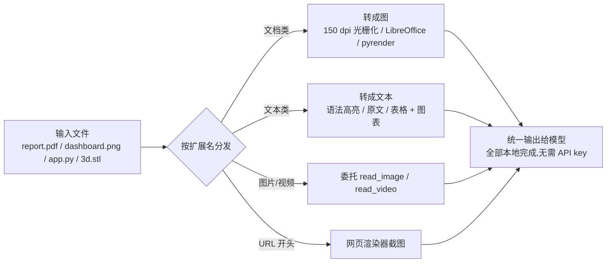

注册表里十来族渲染器,大致分两拨。

**输出是图的**:

- PDF:pypdfium2 以 150 dpi 光栅化
- SVG:resvg 转图
- Office 文档:LibreOffice 先转成 PDF 再光栅化
- 3D 模型(obj、stl、glb、gltf、fbx、ply、step、stp):pyrender 渲染出图
- DrawIO:XML 转成 SVG
- LaTeX:编译成 PDF,失败则回退源码

**输出是文本的**:

- 代码文件:语法高亮后以 markdown 代码块返回
- 字幕和纯文本:直接返回原文
- CSV、XLSX:返回文本表格加图表

`pages` 参数支持 `1-5` 这种页码范围,`max_pages` 默认 20 页封顶。共同点是**所有转换都在本机完成,不需要任何 API key**。

> **一句话总结**:三件套 = 三道预算题,答案都来自"token 预算 × 32² = 像素预算"。超上限缩小、低于下限放大、超载先实测再压帧数,上下文消耗永远钉死在预算内。

## 难题二,这些图谁来看

读完三件套,一个自然的问题冒出来:visualize 把 PDF 变成图,read_video 把视频抽成帧,**这些图最终谁来看?**

答案取决于你跑在 harness 里的模型。

**有视觉能力的模型,走最短链路**:

- read_image 返回的 base64 图,由 harness 直接注入模型上下文
- 模型的视觉编码器把它编码成 token,自己看
- **零 key、零网络、零额外延迟**——这是默认设计,core 的 SKILL.md 里写的 "feeds content directly to you" 说的就是这个

**纯文本模型(比如在 Claude Code 里跑 DeepSeek),图的链路走不通**:

- base64 图对 DeepSeek 是无意义的字节,调 read_image 等于白调
- 正确路径是绕到 **api 能力**,让云端视觉模型替它看

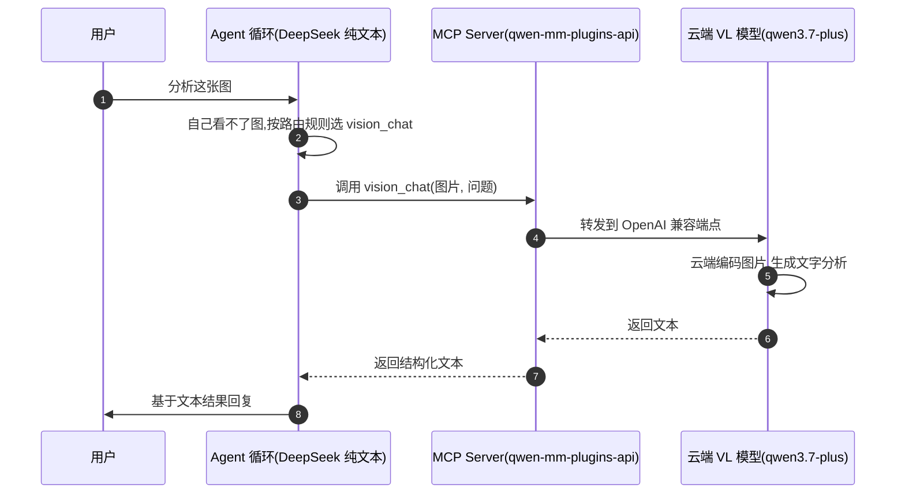

这条链路里,**图片始终没进过 DeepSeek 的上下文**,理解发生在云端,DeepSeek 拿到的是文本。

代价有两个:每次看图都多一轮云端调用;vision_chat 是一次性问答,DeepSeek 没有图片记忆,**追问要重新发图**。

可用性按输出类型分成三档能用、一档不能用:

| 工具 | 纯文本模型能用吗 |
| --- | --- |
| vision_chat / ocr / grounding / transcribe_audio / omni | ✓ 云端理解,返回文本 |
| visualize 的文本渲染(代码、字幕、CSV) | ✓ 直接返回文本 |
| media_info | ✓ 纯文本元数据 |
| read_image / read_video / visualize 的图渲染 | ✗ 返回 base64 图,模型无法消费 |

**一个注意点**:SKILL.md 默认假设模型能看图,没有纯文本模型的检测逻辑。DeepSeek 会不会调错工具,取决于它自己的判断——最好在系统提示里给它一句指引:看图的活全走 vision_chat 和 ocr。

**不接 DashScope 呢?** `DASHSCOPE_BASE_URL` 只是一个可替换的默认端点,vision_chat、ocr、grounding 都是 OpenAI 兼容协议,**端点指向哪,眼睛就在哪**:

- 可以换成别的云 VL API
- 也可以本地部署一个:Ollama 或 vLLM 起 qwen2.5-vl,base_url 指 localhost,数据不出本机
- 什么都不接的话,纯文本模型就只剩 media_info 和文本渲染可用,视觉链路整个断掉

两个例外与 DashScope 无关:segmentation 本来就走自托管 SAM3;transcribe_audio 失败时会 fallback 到自托管 ASR。

**官方 cookbook 里有两个完整实测**,说明装完之后实际是什么样:

1. [Claude Code 里的完整 trace](https://github.com/QwenLM/Qwen-MM-Plugins/tree/main/cookbooks/core):agent 先读完一段宣传视频,再打开一份 35 页的 PDF,按要求提取其中一张图。全程不用人指挥,模型自己选工具。
2. Codex 里的交叉验证:给 agent 一张图片,让它定位图片里的蛋糕、给每个蛋糕画编号框,再通过 DashScope 的视觉模型识别地点,最后用联网搜索交叉验证——定位、识别、验证三步都用不同工具。

> **一句话总结**:有眼睛的模型自己看;没眼睛的模型雇人看——图片外包给云端 VL 模型,自己只拿文本结果。

## 难题三,长视频抽帧根本不够

前面的预算机制有个天花板。read_video 最多抽 600 帧:

- 一段 2 小时的视频,摊下来每 12 秒才抽一帧
- 一段 100 小时的录像,每 10 分钟才抽一帧

中间发生的事全部丢失,而且丢的方式最糟糕:**模型不知道自己漏了什么**,会基于残缺的帧序列自信作答。

问题的根子在抽帧是**均匀无差别**的采样——它不知道哪一段重要,不知道场景什么时候切换,也不保留任何跨段的关系。

> 想在长视频上做问答,需要的是另一种东西:一份**结构化的、可检索的记忆**,而不是一堆帧。

video-memory 的做法分两步走:

1. **离线建**:跑一条流水线,把整段视频加工成一套四层图记忆,落盘成文件
2. **在线查**:agent 每次提问都在记忆上检索,需要看细节时再回原视频抽那一小段的帧

**建一次,反复查。**

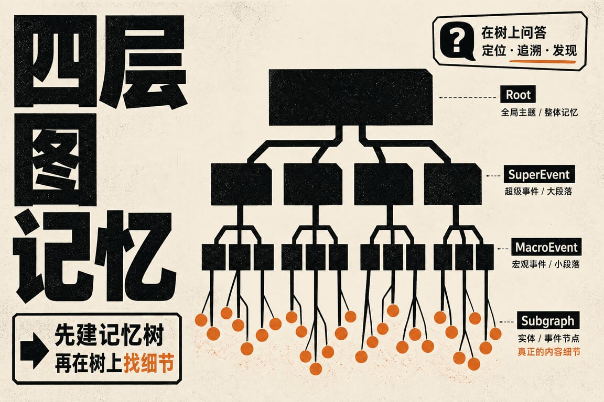

### 记忆长什么样,四层树加六种关系边

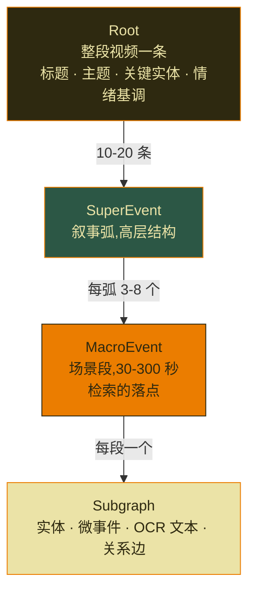

四层各管一个粒度:

- **Root**:整段视频一条,给标题、3 到 5 个主题标签、5 到 10 个规范化的关键实体名、2 到 3 个情绪基调形容词
- **SuperEvent**:叙事弧,10 到 20 条,每条覆盖 3 到 8 个 MacroEvent
- **MacroEvent**:场景段,时长 30 到 300 秒,**这一层是检索的落点**,agent 定位到某个 macro_id 之后才下钻
- **Subgraph**:真正的内容,四类东西——

  - **实体节点**:PERSON / OBJECT / LOCATION / GROUP 四型,带属性和 visual_grounding(最清楚出现的时刻加 2 到 4 条辨识特征)
  - **微事件节点**:带秒级时间范围、主语、宾语、动作和描述
  - **OCR 文本节点**:记录屏幕上的每一处文字——比分板、字幕、标题卡
  - **关系边**:连接以上三类节点,六种类型

| 关系类型 | 具体标签 | 连接方向 |
| --- | --- | --- |
| SEMANTIC | PERFORMS / RECEIVES / USES_TOOL / CONTEXT_FOR / HAPPENS_IN | 实体与事件之间 |
| CAUSAL | CAUSES / PREVENTS | 事件到事件 |
| TEMPORAL | BEFORE / OVERLAP | 事件到事件 |
| HIERARCHICAL | SUBEVENT_OF | 事件到事件 |
| SPATIAL | PART_OF / LOCATED_IN / NEXT_TO / ATTACHED_TO | 实体之间 |
| IDENTITY | IS_SAME_AS / ANNOTATES | 实体之间 |

有了 CAUSAL 这一层,"爆炸是什么引起的"这类因果问题才有得查——纯帧序列答不了。IS_SAME_AS 用来做同指消解:同一个人在不同段被识别成不同实体时,靠它合并。

### 怎么建,三个阶段加一条并行的 ASR

构建流水线全部离线跑,脚本是 `build_graph.py`。三个阶段分工很清楚,而且有**两处刻意做的并行**。

```mermaid
%%{init: {"gantt": {"useWidth": 820, "barHeight": 24, "fontSize": 13}}}%%
gantt
    title 构建流水线的时间重叠
    dateFormat  s
    axisFormat %S s
    section Phase 1
    场景检测,零 API 调用 :p1, 0, 12
    section ASR
    分块转写,与 P1 同时启动 :asr, 0, 16
    section Phase 2
    子图抽取,轮询到新段就开工 :p2, 4, 26
    section Phase 3
    层级聚合与 root 合成 :p3, 26, 34
```

**Phase 1,场景切分,全程不调 API**:

- 按 0.25 FPS 抽帧(每 4 秒一帧),缩到 360p,并行 seek 取出来
- 每帧转到 HLS 色彩空间,相邻两帧算色相、亮度、饱和度三个通道的平均绝对差,等权相加得到一个变化分数——分数越高越可能是场景切换
- 阈值不是写死的,用**二分搜索**找:目标是让切出来的段时长中位数落在 (30+300)/2 = 165 秒附近
- 超过阈值的时刻成为边界;间隔小于 30 秒的边界合并;超过 300 秒的段再切分
- 产出 `macro_0000`、`macro_0001`……每条带时间范围

这一层完全靠像素统计,不花一次模型调用,所以极快,也是整条流水线**唯一不依赖网络**的阶段。

**ASR 和 Phase 1 同时启动**:

- 音频按 30 秒切块,8 线程并行送 `qwen3-asr-flash` 转写,ffmpeg 抽的是 16kHz 单声道 WAV
- 转写结果按时间范围重叠合并进对应的 MacroEvent,成为它的 `asr_text`
- 这段文字后面会跟视频一起喂给视觉模型——画面里看不出的信息(谁在说什么、提到了哪个名字)靠它补上
- ASR 失败不影响主流程,捕获异常打个日志继续走

**Phase 2,逐段抽子图——最花钱的阶段,默认并发 60**:

每个 MacroEvent 单独调一次视觉模型,prompt 里带三样东西:这一段在全片中的**绝对时间**、一条"你输出的时间戳必须是相对本段的、第 0 秒就是本段开头"的硬性要求、这一段的 ASR 文本。

视觉模型看到的内容有两种模式:

- **配了 OSS**:ffmpeg 切出这一段、上传、把签名 URL 给模型——模型看的是真实视频片段
- **没配**:退回抽帧模式,0.5 FPS、最多 250 帧的 base64

两个工程细节值得说:

- **渐进降级**:OSS 模式按 1280 → 1024 → 768 → 512 → 384 五档往下退,只要模型返回 400 Bad Request 就降一档重试,直到成功或退完
- **失败不中断**:抽子图失败写入一个空 Subgraph,继续跑下一段

prompt 里还有一条**针对模型偷懒的约束:重复动作必须计数,不许合并**:

- 同一个动作出现多次:能分开就每次一个微事件、描述里带出现序号("第 3 口")
- 分不开就写确切数字("连续旋转 6 圈")
- 明确禁止写"多次""反复"这类模糊说法
- 可见物体的数量也要数("沙发上 4 只猫")

**第二处并行藏在这里**:`pipeline_worker.py` **不等 Phase 1 全部跑完**,它轮询 Phase 1 的检查点文件 `01_macros.json`,发现新的 macro 就立刻提交给线程池开工。Phase 1 还在切后面的场景,Phase 2 已经在处理前面的段了——长视频省下的是分钟级的等待。

**Phase 3,往上聚合**。把所有 MacroEvent 的摘要、关键实体、事件类型、OCR 文本按时间顺序排好,交给模型做三件事:聚成 SuperEvent、连 Macro 之间的逻辑边、合成 Root。

聚类规则写得很硬:

- 一条 SuperEvent 必须是**时间上连续**的一串 Macro,同时满足**场景话题相近**和**目标一致**,三个条件任一断掉就切一刀
- 判断信号给了三个:相邻 Macro 的关键实体重叠度、事件类型的连续性、OCR 文本的线索(比分递增说明还在同一阶段,转场图形说明该切了)
- 每个 Macro **必须且只能**属于一条 SuperEvent

Macro 之间的边只允许 CAUSES / PREVENTS / ENABLES 三种,而且必须在同一条 SuperEvent 内,每条边要给一句理由,**拿不准就不连**,明确禁止用 BEFORE/AFTER 这种时序关系凑数。SuperEvent 之间的边是 LEADS_TO / RESOLVES / CONTRASTS_WITH,允许跨距离连。

Macro 数量太多时单次调用装不下,切换到**滑动窗口**模式,一窗一窗处理,最后单独调一次合成 Root。实体名在这一步做跨全片规范化——同一个人的多种叫法收敛到一个规范名。聚合彻底失败还有 `_fallback_aggregation` 兜底,保证流水线有输出。

**最后落盘**。产出目录是 `<video_path>.memory/`,里面两个关键文件:

- `graph_memory.json`:整棵树和所有边
- `embeddings.npz`:节点向量——走 DashScope 的多模态 embedding 接口,模型 `qwen3-vl-embedding`,2560 维;原生端点拒绝大批量,每批最多 10 条;遇 429 指数退避,最多重试 80 次

每个阶段都写检查点(`01_macros.json` + `01_done` 标记、`subgraphs/` 目录下每段一个 JSON、`02_done`、`02_macros_with_subgraphs.json`),由此得到三个能力:

- 中断后重跑会**跳过已完成的部分**
- 也可以只跑某一阶段(`--phase1-only`、`--phase3-only`)
- `merge-chunks` 命令支持把长视频切成几块分别建记忆再合并,进一步并行

### 怎么查,九个工具和一套混合检索

记忆建好之后,agent 手里有 9 个查询工具,按用途分三组。

**导航组——顺着树往下钻**:

- `get_summary`:Root 的视频级概览
- `get_super_events`:列出所有叙事弧
- `get_macro_events`:列某条弧下的场景段
- `get_subgraph`:拿某个 macro 的全部细节

**检索组——直接定位**:

- `search_nodes`:按语义搜实体和事件节点
- `search_ocr_text`:搜屏幕文字
- `search_asr_text`:搜语音转写
- `search_by_time`:按时间范围找

**枚举组——只有一个 `enumerate_events`,专门服务计数类问题("一共进了几个球")**:

- 把匹配结果按时间排序全部列出,最多 300 条,余弦相似度低于 0.5 的滤掉
- 返回结果里还附了一句诚实的提示:相邻时间范围的条目可能是同一件事的重复、也可能是误报,**拿不准的用 read_video 回去核验再定数**

**检索的实现是混合检索**:

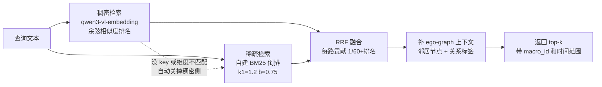

- **稠密侧**:查询文本嵌入成向量,和所有节点向量算余弦相似度
- **稀疏侧**:自建 BM25 倒排索引(k1=1.2、b=0.75,带停用词过滤)
- **RRF 融合**:每一路贡献 1/(60+排名),相加后重排

RRF 这个选择有实际好处:

- 只用排名不用分数,**两路的分数量纲不同也能融**,天然抗某一路的异常值
- 更实际的一点是**降级路径**:稠密侧需要 API key,没配 key 或维度不匹配时会自动关掉稠密、退成纯 BM25 检索,日志里打一行提示

> 也就是说:记忆建好之后,**查询侧可以完全离线跑**,只是召回质量下降。

命中节点之后还会补一圈 **ego-graph 上下文**,把这个节点的邻居和关系标签一起返回:搜到一个"进球"事件,顺带能看到执行者是谁(PERFORMS)、发生在哪(HAPPENS_IN)、由什么导致(CAUSES)。图结构在这里体现价值——**检索命中的是点,返回的是点周围的一小片子图**。

`search_nodes` 的工具描述里还写了一段**查询构造指南**,值得一提:

- 要求 agent 写**陈述句而不是问句**,因为嵌入匹配的是事件描述,问句的向量和描述的向量对不上。正例:"A player scores with an alley-oop dunk";反例:"Which player scored the alley-oop?"
- 选择题场景还有一条:提取所有选项**共有**的信息,排除各选项分歧的细节——分歧处押错一个就会带偏检索

这是把提示工程写进工具描述里,让模型照着用。

### 路由规则,粗定位加精查

SKILL.md 把用法固化成了规则:

- **视频超过 30 分钟,必须走 video-memory** 建记忆再查,不许直接 read_video——抽的帧太少必然漏内容
- 在记忆里定位到具体片段之后,再用 read_video 带上 `start_time` 和 `end_time` 做帧级精查——记忆是模型生成的粗粒度摘要,可能不准

检索流程也给了个决策树,大部分问题都是两步:

1. **第一步,选一个入口工具定位到 macro_id**:
   - 问时间 → `search_by_time`
   - 问人和动作 → `search_nodes`
   - 问屏幕文字和比分 → `search_ocr_text`
   - 已知在哪一段 → `get_macro_events`
2. **第二步**,对最相关的一两个 macro_id 调 `get_subgraph` 拿全部细节,答案从这份数据里出

这套"粗记忆定位 + 精帧检查"的分工,和前面 read_video 那条"先 fps=1 浏览再 large 档精查"的建议是同一个习惯:**先用便宜的方式缩小范围,再在小范围里花贵的预算**。

> **一句话总结**:长视频靠"建一次、查多次"——离线花一次钱把视频加工成可检索的图记忆,之后每次提问都在记忆上定位,细节才回原视频抽帧。

## 上手,三分钟

装之前,先花十秒过一遍这张检查清单:

- [ ] 装好 uv\(MCP server 靠它拉起）
- [ ] 装好 ffmpeg(视频和音频处理用)
- [ ] 想要联网搜索或 DashScope 的视觉工具,准备好 `DASHSCOPE_API_KEY` 和 `SERPER_API_KEY`
- [ ] 只想体验原生读图、读视频、开文档,上面两个 key 都可以不要

然后按顺序走三步:

**1. 安装**——一行命令,覆盖 7 个 harness:

```bash
curl -fsSL https://raw.githubusercontent.com/QwenLM/Qwen-MM-Plugins/main/install.sh | bash
```

脚本处理 install、configure、verify、uninstall 四件事,底层调各 harness 自己的插件系统。

**2. 手动装也行**(以 Claude Code 为例),加市场再装能力,两条命令:

```bash
claude plugin marketplace add https://github.com/QwenLM/Qwen-MM-Plugins.git
claude plugin install qwen-mm-plugins-core@qwen-mm-plugins
```

**3. 验证**——跑 `bash install.sh verify`,脚本会检查密钥和缺失的系统工具,缺什么它告诉你。

三个实际体验里的细节,值得先知道:

1. **安全建议来自第三方教程而不是官方**:先 clone 仓库、用 `less` 审一遍 install.sh 再执行。装第三方脚本前先看内容,这条建议对任何项目都成立。
2. **最省事的安装方式其实不用跑命令**:在支持插件的 GUI harness 里,直接对 agent 说"帮我装一下 Qwen-MM-Plugins 的 core 和 edu 插件",它自己会走完市场添加和安装流程。
3. **依赖是自动的**:MCP server 由 uvx 按需拉起,首次调用时自动处理 Python 依赖。系统层面要准备 uv 和 ffmpeg,可选的还有 libreoffice\(Office 文档可视化)、blender\(3D 渲染)、texlive\(LaTeX\)、chromium(网页截图)。

按需只装你需要的能力就行,不需要 7 个全装——**工具面越小,权限审查越省事**。

## 结语

回头看,一个背景加三个难题,答案连成了一条线:

- 怎么让任何 harness 看见 → **skill + MCP 双件套**
- 图不撑爆上下文 → **三道预算题**
- 模型没眼睛 → **把视觉外包给云端**
- 长视频装不下 → **先建一份可检索的图记忆**

每一步都是同一个思路:**不改模型也不改 harness,在中间层把问题解决掉**。

Qwen 这次的动作值得注意:它没有只服务自家 harness,而是把能力做进 Claude Code、Codex、OpenClaw 这些竞品的插件市场。效果是,任何一个在用主流 harness 的人,都能让自家 agent 获得 Qwen 的多模态能力,而能力背后连着 DashScope 的模型调用。**这是把"能力"当入口的生态策略**。

几个疑问也得摆出来:

- **成本不透明**:video-memory 的建记忆阶段,Phase 2 每段一次视觉模型调用、默认并发 60,一段长视频切出几十上百段就是几十上百次调用,官方没给出时间和费用的量级参考
- **质量依赖模型**:记忆质量完全取决于模型在 Phase 2、Phase 3 的输出,聚合出的因果边可信到什么程度,需要实测
- **维护成本**:harness 的插件标准和 MCP 都在快速变化,今天支持 7 个 harness,明天插件市场改格式,维护成本会一直跟着

---

参考资料

1. [QwenLM/Qwen-MM-Plugins 仓库](https://github.com/QwenLM/Qwen-MM-Plugins)

2. [cookbooks/core/usage.md(工具清单与用例)](https://github.com/QwenLM/Qwen-MM-Plugins/tree/main/cookbooks/core)

3. [video-memory 的 SKILL.md(路由规则与检索决策树)](https://github.com/QwenLM/Qwen-MM-Plugins/blob/main/src/capabilities/video-memory/skill/SKILL.md)

4. [build_graph.py(三阶段构建流水线)](https://github.com/QwenLM/Qwen-MM-Plugins/blob/main/src/capabilities/video-memory/skill/script/build_memory/build_graph.py)

5. [embeddings.py(混合检索与 RRF 融合)](https://github.com/QwenLM/Qwen-MM-Plugins/blob/main/src/capabilities/video-memory/skill/script/build_memory/embeddings.py)
