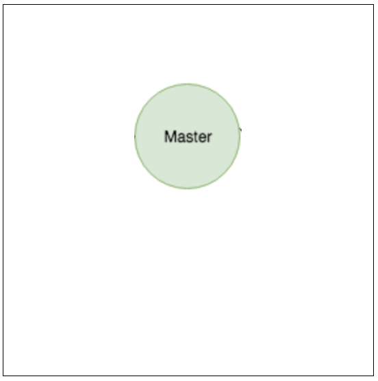
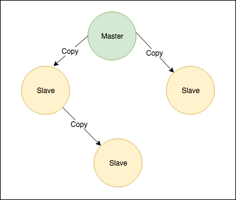
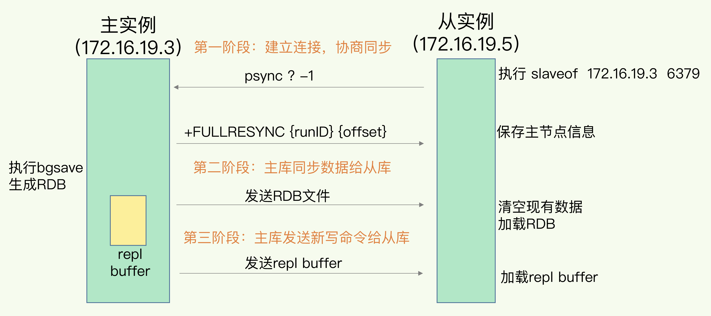
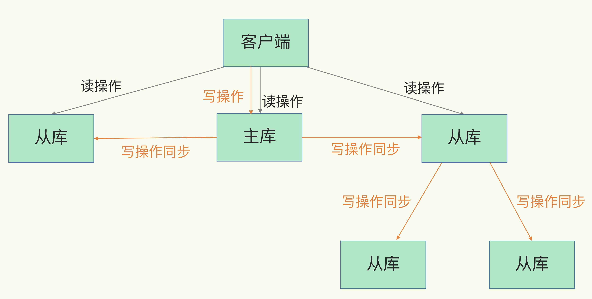
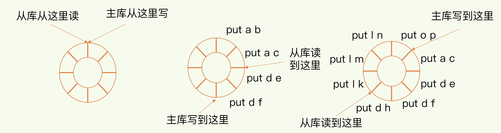
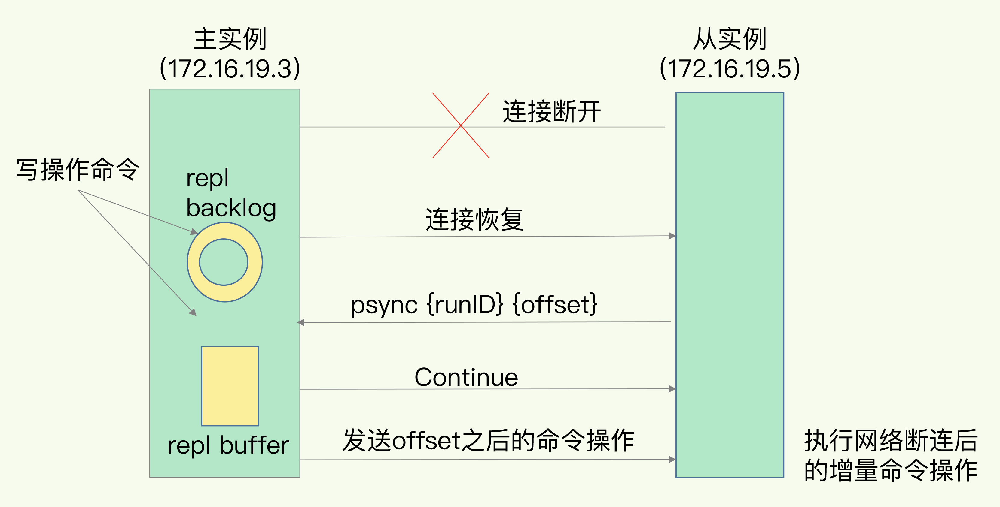

## Table of Contents

## 单点模式(standalone)

缺点：

1. 无故障转移
2. 不能读写分离
3. 不能应对高吞吐量

## 主从模式(master-slave)

### 解决

1. 数据冗余：主从复制实现了数据的热备份
2. 故障恢复：当主节点出现问题时，可以由从节点提供服务
3. 负载均衡：通过读写分离提高读写吞吐量

### 主要配置

1. slaveof

### 原理

1. 从服务器向主服务器发送SYNC命令
2. 主服务器收到SYNC命令后，执行BGSAVE命令，在后台生成RDB文件，使用缓冲区记录从现在开始执行的所有的写命令。
3. 当主服务器的BGSAVE命令执行完毕后，主服务器后将BGSAVE命令生成的RDB文件发送给从服务器，从服务器接收并载入这个RDB文件，将自己的数据库状态更新至主服务器执行BGSAVE命令时的数据库状态。
4. 主服务器将记录在缓冲区里面的所有写命令发送给从服务器，从服务器执行这些写命令，将自己的数据库状态更新至主服务器数据库当前所处的状态。

## 主从库第一次同步

### 主从级联模式分担全量复制时的主库压力

全量复制操作中的耗时操作：生成 RDB 文件（fork 子进程阻塞主线程）和传输 RDB 文件（占用主库的网络带宽）

完成同步后，主从之间会一直维护一个网络连接，主库通过这个连接将后续收到的命令再同步给从库，称为**基于长连接的命令传播**

### 网络断连

Redis 2.8 之前：主从之间重新进行一次全量复制

Redis 2.8 及以后：增量复制，将断连期间主库收到的命令同步给从库

当主从库断连后，主库会把断连期间收到的写操作命令，写入 replication buffer，同时也会把这些操作命令也写入 repl_backlog_buffer 这个缓冲区

主库写入位置的偏移量为 master_repl_offset

从库读取位置的偏移量为 slave_repl_offset，由从库自己记录

连接恢复后主库只用把 master_repl_offset 和 slave_repl_offset 之间的命令操作同步给从库

**风险：**

如果从库的读取速度比较慢，就有可能导致从库还未读取的操作被主库新写的操作覆盖了，这会导致主从库间的数据不一致。
