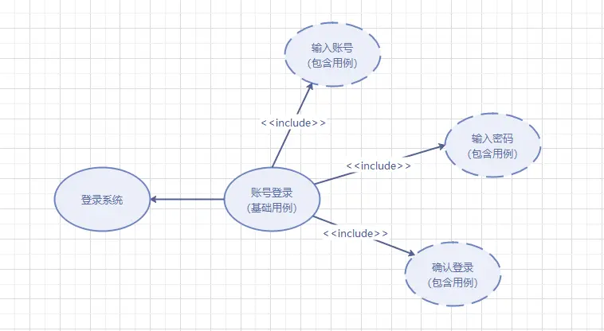

## Table of contents

## 架构决策记录

> 通过架构决策记录（ADRs）是记录架构决策最有效的方法之一。

ADRs 由一个简短的文件文本组成，描述特定的架构决策。ADR 的格式如下：

* ADR：包含架构决策的简短名词短语。
* 用一个简短的一到两句话的问题描述问题，并列出备选解决方案。
* 说明架构决策并提供决策的详细理由。
* 描述决策应用后的任何后果，并讨论所考虑的权衡。

## 架构健康函数

> 架构健康函数（Architecture Health Metrics）是一组用于评估和量化软件架构健康状况的指标或函数。它们旨在提供对软件架构当前状态的洞察，帮助识别潜在的问题区域，以及指导架构的维护和改进决策。

我们可以通过**架构健康函数**来实现确保实现者遵守项目的**编码规范**

例如我们可以写一个适应性函数来避免代码中出现组件循环的情况：

```java
public class CycleTest {

    private JDepend jdepend;

    @BeforeEach
    void init() {
      jdepend = new JDepend();

      jdepend.addDirectory("/path/to/project/persistence/classes");
      jdepend.addDirectory("/path/to/project/web/classes");
      jdepend.addDirectory("/path/to/project/thirdpartyjars");
    }

    @Test
    void testAllPackages() {
      Collection packages = jdepend.analyze();
      assertEquals("Cycles exist", false,
      jdepend.containsCycles());
  }
}
```

架构健康函数和单元测试函数不太一样，它们是用来检查架构的健康状况，而不是检查代码的正确性。他们有这些区别：

| 特性       | 架构健康函数                                         | 单元测试函数                          |
|------------|---------------------------------------------------|-----------------------------------|
| **目标**     | 评估整个软件架构的健康状况                               | 验证代码最小单元的正确性与功能性             |
| **关注点**   | 软件架构的质量，包括代码质量、性能、安全性等                 | 具体代码逻辑的正确性                        |
| **范围**     | 整个系统的架构层面                                       | 单个函数或方法                           |
| **方法**     | 监控关键架构指标，数据分析                                 | 编写和执行测试用例，检查特定功能             |
| **执行频率** | 根据项目需求定期执行，可能不如单元测试频繁                     | 开发过程中频繁执行，通常随代码一起更新         |
| **输出**     | 架构状态的量化报告，包含潜在问题的指示                       | 通过或失败的测试结果，直接指出问题所在位置     |

## 架构图

> 架构图是一种图形化工具，用于描述和理解系统的架构。它可以帮助我们更好地理解系统的结构，评估系统的健康状况，并提供一些指导性的建议。架构图通常会标明系统的主要组件以及这些组件之间的关系。例如，它可能会显示出数据流，或者显示出哪些组件依赖于其他组件。

画架构图的步骤：

1. 搞清楚要画的架构图的类型
1. 确认架构图中的关键要素（比如产品、技术、服务）
1. 梳理关键要素之间的关联：包含、支撑、同级并列等
1. 输出关联关系清晰的架构图

### 确定架构图类型

架构图的类型有很多种，比如：

* 业务架构
* 应用架构
* 数据架构
* 技术架构

我们可以根据场景选择对应的架构类型

| 架构类型   | 使用场景 |
|------------|---------------------------------------------------|
| 业务架构   | 当需要理解和描述组织的业务策略、业务流程、角色和职责时使用。这有助于识别业务需求和业务改进的机会。 |
| 应用架构   | 当需要理解和描述系统的功能组件以及这些组件之间的交互时使用。这有助于设计和实现满足特定业务需求的软件应用。 |
| 数据架构   | 当需要理解和描述组织的数据资产以及这些数据如何被存储、访问和使用时使用。这有助于确保数据的一致性、安全性和有效性。 |
| 技术架构   | 当需要理解和描述系统的硬件、软件和网络环境以及这些环境如何支持应用和数据架构时使用。这有助于选择和配置适当的技术解决方案。 |

## 4+1 视图

**4+1视图**是一种复杂系统的架构设计方法，让设计人员将一个系统进行自顶向下的设计分解


### 用例视图（User-Case View）

用例视图是一种需求分析技术，通常采用UML的用例图进行设计。通过用例视图的设计过程，可以正确的识别系统的用户和其它系统（Actor）、系统边界（Boundary）和用例（Use Case），并对系统的功能场景进行充分的分析，以确定系统提供的功能可以满足用户需求。它确定了以下信息：

* 系统边界：确定系统的设计范围，通过边界能够识别出系统需要与用户或其它系统进行交互
* 系统用户：明确的用户定义是系统需求分析的先决条件
* 功能和场景：通过识别出系统与用户或其它系统的交互，可以分析出系统需要提供哪些功能，以及这些功能存在哪些应用场景



### 逻辑视图（Logical View）

用于描述系统的功能需求，即系统给用户提供哪些服务；以及描述系统软件功能拆解后的组件关系、组件约束和边界，反映系统整体组成与系统如何构建的过程。

下面springcloud微服务的逻辑视图示例，就描述了spring cloud 中各个功能组件。


### 实现视图（Implementation View）

实现视图关注软件开发环境下实际模块的组织，反映系统开发实施过程。

在一个良好的实现视图中，通过一个逻辑架构元素，能够找到它所有代码和所有的二进制交付件。

每一个代码源文件，都能够找到它所属的逻辑架构元素 每一个二进制交付件，都能够找到它集成了哪些逻辑架构元素


### 部署视图（Deployment View）

开发出的软件系统，最终是要运行在物理或软件环境上。物理环境可能是服务器、PC机、移动终端等物理设备；软件环境可以是虚拟机、容器、进程或线程。部署视图就是对这个部署信息进行描述。在UML中通常由部署图表示。


### 过程视图（Process View）

用于描述系统软件组件之间的通信时序，数据的输入输出。在UML中通常由时序图和流程图表示，如下图所示：


## 参考

* [架构决策记录](https://adr.github.io/)
* [Software Architecture: The Hard Parts](https://book.douban.com/subject/35587139/)
* [架构设计4+1视图的作用与关系](https://zhuanlan.zhihu.com/p/112531852)
