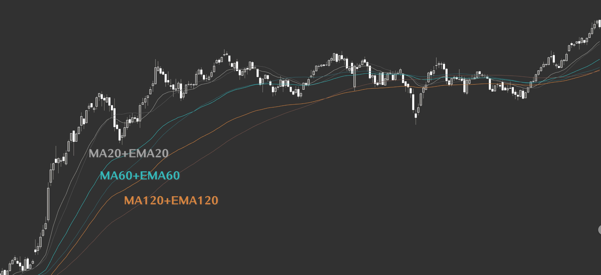

## Table of contents

## 趋势类型

按时钟方向归纳趋势：

* 1 点 ～ 12 点，斜率加速上升
* 1 点 ～ 2 点半，稳定上涨趋势
* 2 点半 ～ 3 点半，横向整理姿态
* 3 点半 ～ 5 点，稳定下跌趋势
* 5 点 ～ 6 点，斜率加速下跌

观察斜率的要点：

* 斜率 = 高度（涨跌幅） / 长度（时间）；用 5 年的长度来观察长期的趋势斜率，用 1 年的长度来观察短期的趋势斜率
* 使用对数坐标观察，对数坐标表示比率的概念

## 细说趋势

### 横向波动趋势

2 点半 ～ 3 点半，又称为密集成交区，价格在一个明显有天花板和地板的区间内来回震荡

出现的时机：通常出现在一波较大的涨幅或者跌幅之后出现的斜率修正的形态。
出现的原因：交易双方在这里进行密集的筹码换手，因此对应一个巨大的**筹码峰**。
结果：统一市场的平均交易成本，均线密集。大周期结构不被破坏的情况下，密集成交区结束后大概率沿着大周期趋势继续走

入场时机：

* 结束前入场埋伏
* 假突破后快速反转

#### 如何判断密集成交区是否接近尾声?

* 时间：不少于 6 个月
* 均线：高度密集，短期、中期、长期均线靠的很近（最高的均线与最低的均线之间的距离小于 2%）
* 排列：形成逐渐张嘴的多头排列或者空头排列，并形成突破的格局

> 短期：MA20 + EMA20（一个月左右的趋势），MA60 + EMA60（三个月左右的趋势），MA120 + EMA120（半年左右的趋势）

交易要点：多头排列，埋伏，等待突破
底线：多头形态被破坏，20 均线组与 60 均线组完成了交叉或者不可避免的交叉，则要止损。

#### 如何判断假突破

出现以下两个动作时最好先离场或者做空：

* 最近一个波峰突破然后迅速跌回
* 随后形成跌破 20 均线组且 20 均线组往下弯曲

同理，如果向下突破，那么当价格站上 20 均线组并且 20 均线组向上弯曲应该空单止损或者做多

### 斜率加速行情

1 点 ～ 12 点 和 5 点 ～ 6 点

出现的时机：趋势刚开始或者将要结束时
结果：价格大幅偏离市场平均成本，引发市场分歧，出现大量

### 稳定趋势  

2 点半 ～ 1 点 和 3 点半 ～ 5 点

基本特征：

* 在多头市场中，市场平均成本呈现多头排列姿态。短期成本 > 中期成本 > 长期成本
* 中长期均线几乎呈现平行排列

多头交易策略：

* 中长期均线平行向上，2 点方向运行
* 价格回撤到中期均线组或者长期均线组附近，但不该面 MA 均线运行方向
* 出现底部构造和低一级别的多头排列时入场

#### 抵扣价原理

通过抵扣价原理可以知道 MA 均线是否会改变方向。当前价格高于响应的抵扣价，MA 均线就会往上走

## 参考

* [趨勢交易全攻略｜THE ULTIMATE TREND TRADING STRATEGY](https://youtu.be/MTmz6OLCykc?si=1bLwbA4SB9YA7NrG)
